# HW01 – QA/QC Jobs · 20 Defects · Test a Physical Product

## Cover Page

| Field                           | Value                                             |
| ------------------------------- | ------------------------------------------------- |
| **Student Name**                | Ngô Nguyễn Thế Khoa                               |
| **Student ID**                  | 23127065                                          |
| **Course**                      | Software Testing                                  |
| **Assignment**                  | HW01-AI                                           |
| **Submission Date**             | <!-- TODO: Fill submission date -->               |
| **Submission Deadline**         | 08/06/2026                                        |
| **60-Day Recency Window Start** | 04/06/2026                                        |
| **AI Tools Used**               | GitHub Copilot, Antigravity, Gemini               |
| **GitHub Repository**           | https://github.com/yuran1811/hcmus-sw-testing--hw |
| **Pandoc Version**              | <!-- TODO: Fill after export -->                  |

---

## Section 1 — R1: QA/QC Job Market 2026+

### 1.1 Job Postings

#### 1.1.1 [QA Engineer (Motorola Solutions)](https://www.linkedin.com/jobs/view/4390332055/):

- **Linkedin Post Link**: [QA Engineer (Motorola Solutions)](https://www.linkedin.com/jobs/view/4390332055/)
- **Screenshots (2026-06-04)**:
  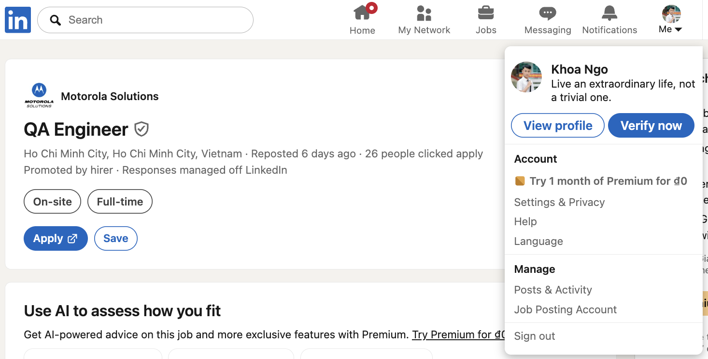
  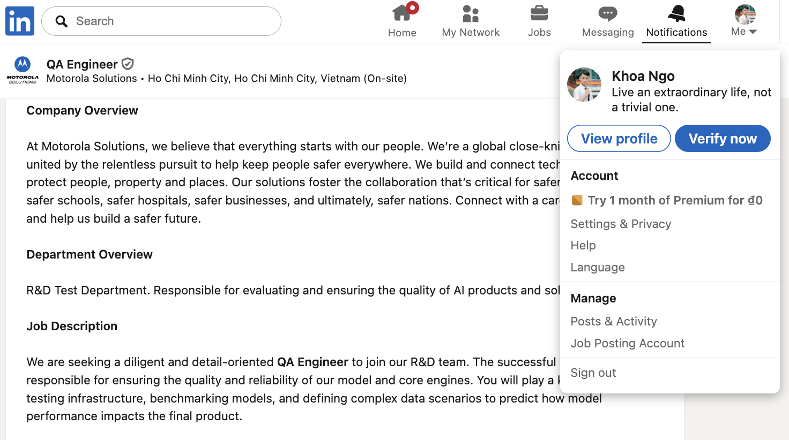
  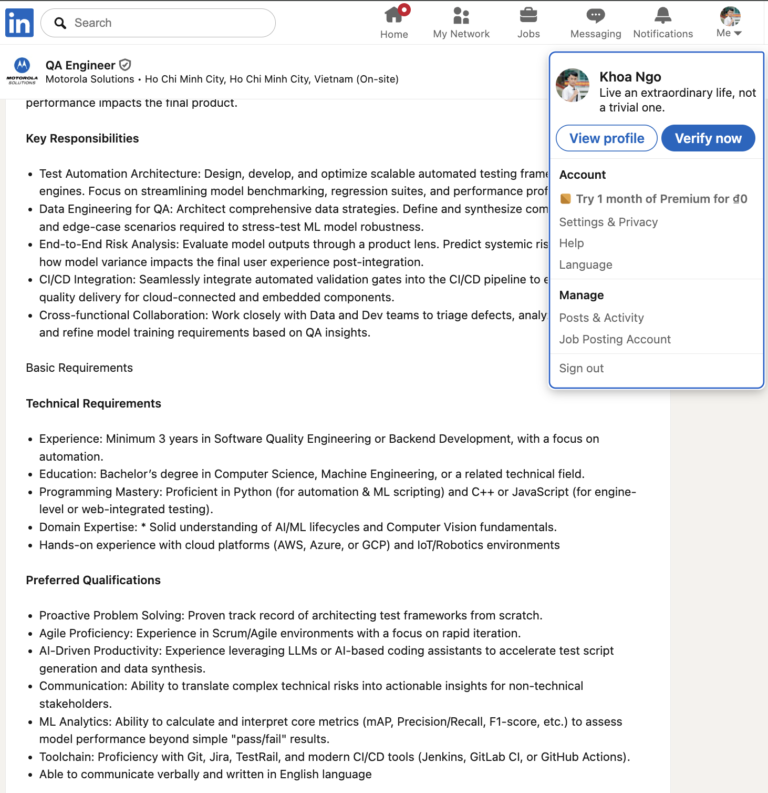
- **Job Description**:
  ```
  We are seeking a diligent and detail-oriented QA Engineer to join our R&D team. The successful candidate will be responsible for ensuring the quality and reliability of our model and core engines. You will play a key role in building testing infrastructure, benchmarking models, and defining complex data scenarios to predict how model performance impacts the final product.
  ```
- **Skills Required**:
  ```
  Technical Requirements:
  - Experience: Minimum 3 years in Software Quality Engineering or Backend Development, with a focus on automation.
  - Education: Bachelor’s degree in Computer Science, Machine Engineering, or a related technical field.
  - Programming Mastery: Proficient in Python (for automation & ML scripting) and C++ or JavaScript (for engine-level or web-integrated testing).
  - Domain Expertise: * Solid understanding of AI/ML lifecycles and Computer Vision fundamentals.
  - Hands-on experience with cloud platforms (AWS, Azure, or GCP) and IoT/Robotics environments
  ```
- **Salary Range**: Not specified in the posting.
- **AI Impact Analysis**: AI tools cannot easily replace the highly specialized task of validating machine learning models, core engines, and IoT environments, though they will assist engineers by generating synthetic test datasets. The role shifts from manual test script creation to managing complex validation pipelines and model benchmarking.

#### 1.1.2 [Quality Engineer (Zalopay)](https://www.linkedin.com/jobs/view/4409679195/):

- **Linkedin Post Link**: [Quality Engineer (Zalopay)](https://www.linkedin.com/jobs/view/4409679195/)
- **Screenshots (2026-06-04)**:
  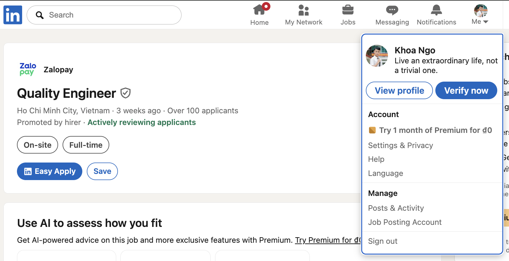
  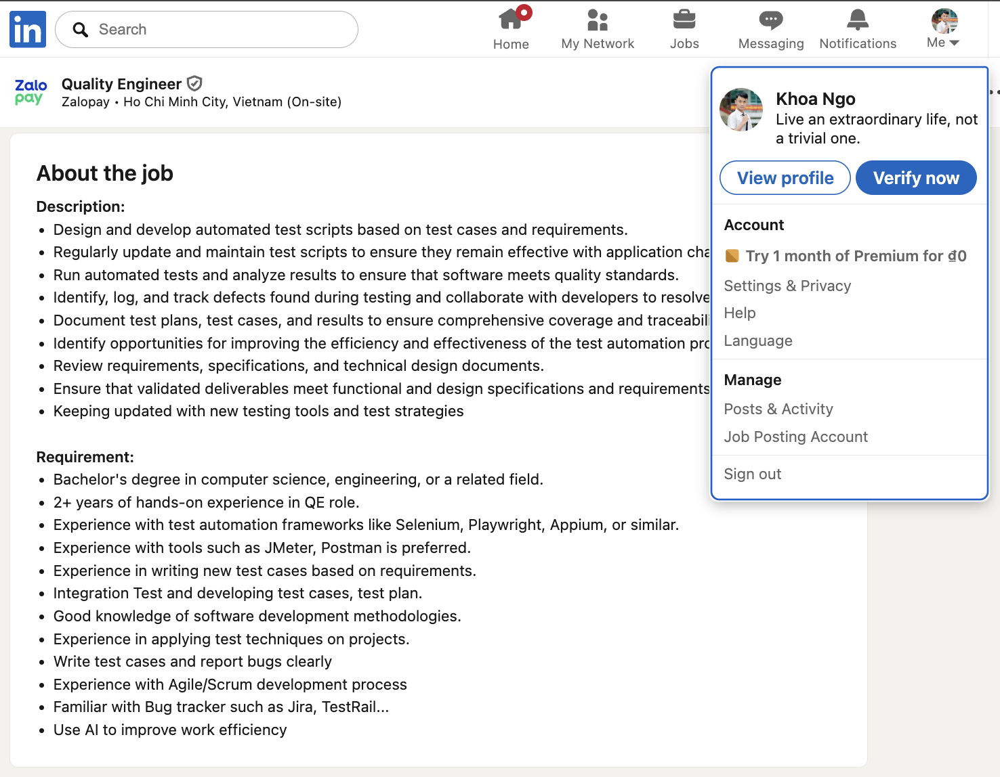
- **Job Description**:
  ```
  - Design and develop automated test scripts based on test cases and requirements.
  - Regularly update and maintain test scripts to ensure they remain effective with application changes.
  - Run automated tests and analyze results to ensure that software meets quality standards.
  - Identify, log, and track defects found during testing and collaborate with developers to resolve them.
  - Document test plans, test cases, and results to ensure comprehensive coverage and traceability.
  - Identify opportunities for improving the efficiency and effectiveness of the test automation process.
  - Review requirements, specifications, and technical design documents.
  - Ensure that validated deliverables meet functional and design specifications and requirements.
  - Keeping updated with new testing tools and test strategies
  ```
- **Skills Required**:
  ```
  - Bachelor's degree in computer science, engineering, or a related field.
  - 2+ years of hands-on experience in QE role.
  - Experience with test automation frameworks like Selenium, Playwright, Appium, or similar.
  - Experience with tools such as JMeter, Postman is preferred.
  - Experience in writing new test cases based on requirements.
  - Integration Test and developing test cases, test plan.
  - Good knowledge of software development methodologies.
  - Experience in applying test techniques on projects.
  - Write test cases and report bugs clearly
  - Experience with Agile/Scrum development process
  - Familiar with Bug tracker such as Jira, TestRail...
  - Use AI to improve work efficiency
  ```
- **Salary Range**: Not specified in the posting.
- **AI Impact Analysis**: AI significantly assists this role by generating boilerplate UI test scripts and test data, but cannot replace the human oversight needed to design complex end-to-end user journeys and maintain framework integrity. Incorporating AI tools directly increases productivity, freeing the engineer to focus on strategic edge cases.

#### 1.1.3 [Quality Assurance Specialist (DXC Technology Vietnam)](https://www.linkedin.com/jobs/view/4340770395/):

- **Linkedin Post Link**: [Quality Assurance Specialist (DXC Technology Vietnam)](https://www.linkedin.com/jobs/view/4340770395/)
- **Screenshots (2026-06-04)**:
  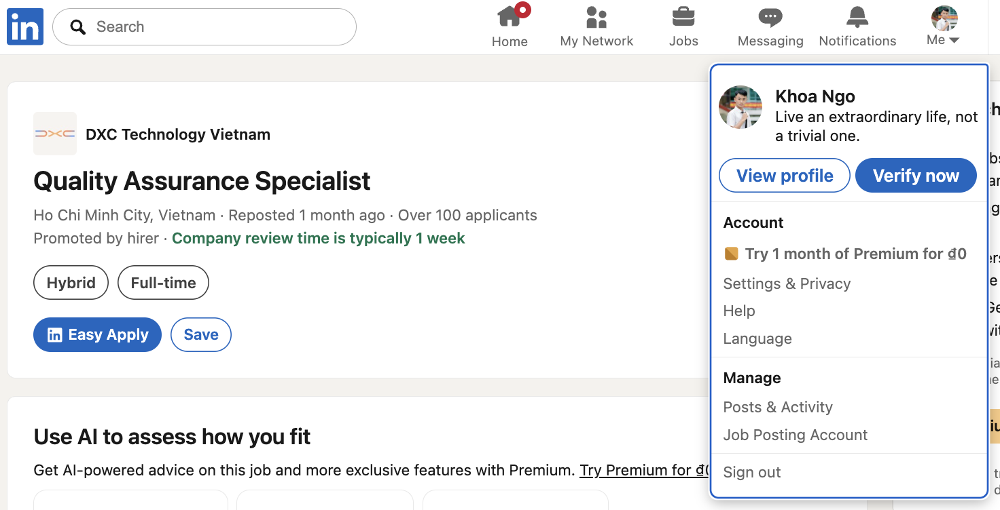
  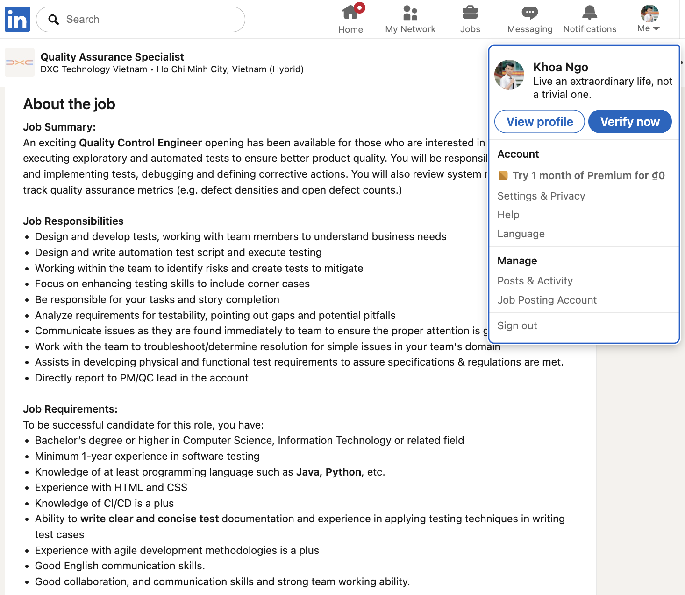
  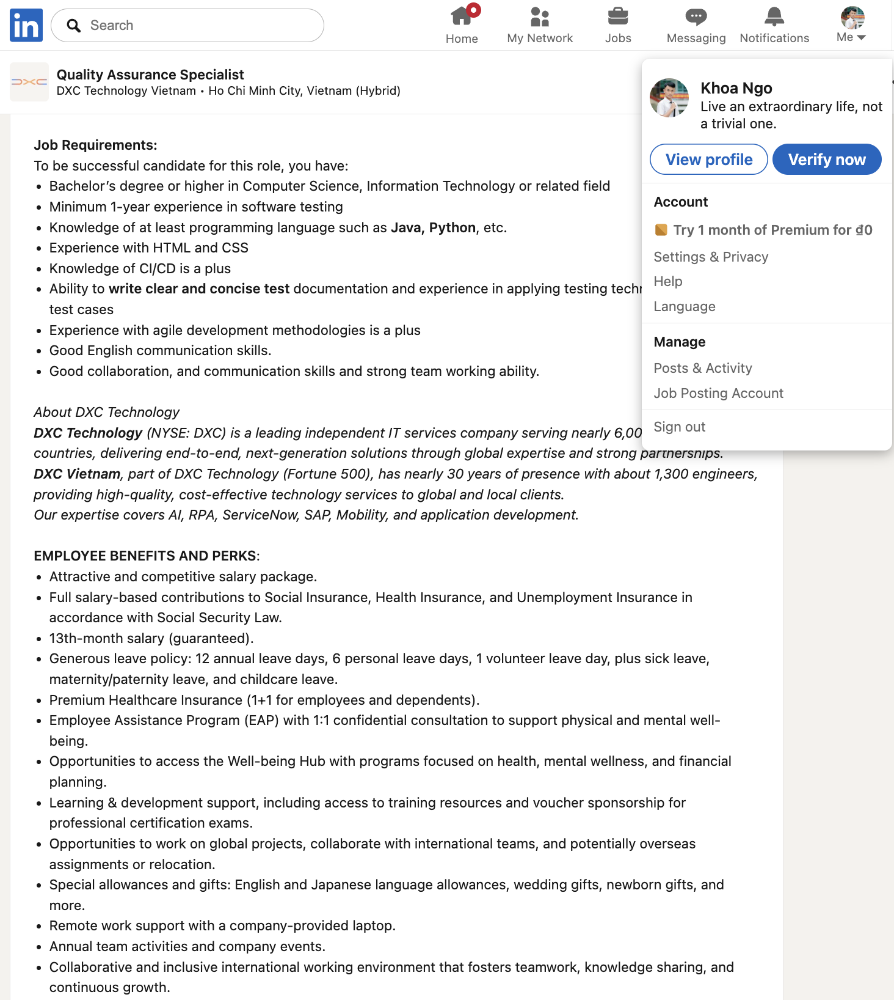
- **Job Description**:
  ```
  An exciting Quality Control Engineer opening has been available for those who are interested in developing and executing exploratory and automated tests to ensure better product quality. You will be responsible for developing and implementing tests, debugging and defining corrective actions. You will also review system requirements and track quality assurance metrics (e.g. defect densities and open defect counts.)
  ```
- **Skills Required**:
  ```
  To be successful candidate for this role, you have:
  - Bachelor’s degree or higher in Computer Science, Information Technology or related field
  - Minimum 1-year experience in software testing
  - Knowledge of at least programming language such as Java, Python, etc.
  - Experience with HTML and CSS
  - Knowledge of CI/CD is a plus
  - Ability to write clear and concise test documentation and experience in applying testing techniques in writing test cases
  - Experience with agile development methodologies is a plus
  - Good English communication skills.
  - Good collaboration, and communication skills and strong team working ability.
  ```
- **Salary Range**: Not specified in the posting.
- **AI Impact Analysis**: While AI can draft standard test cases and write basic functional scripts in Java/Python, it cannot replace the manual analysis required to review requirements and coordinate with cross-functional teams. Human critical thinking is still essential to identify complex integration errors and lead exploratory testing sessions.

#### 1.1.4 [Test Engineer (Manual/QA/QC) (KMS Technology)](https://www.linkedin.com/jobs/view/4403217406/):

- **Linkedin Post Link**: [Test Engineer (Manual/QA/QC) (KMS Technology)](https://www.linkedin.com/jobs/view/4403217406/)
- **Screenshots (2026-06-04)**:
  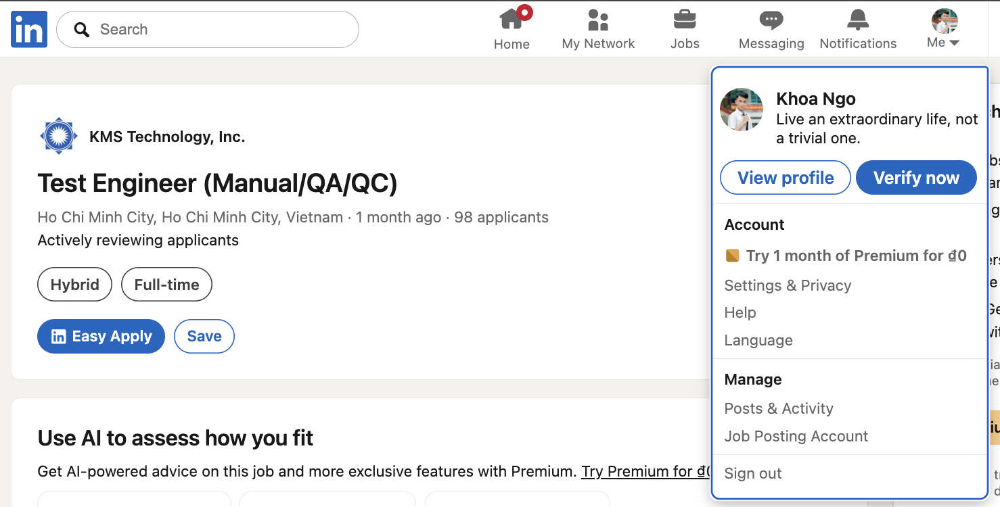
  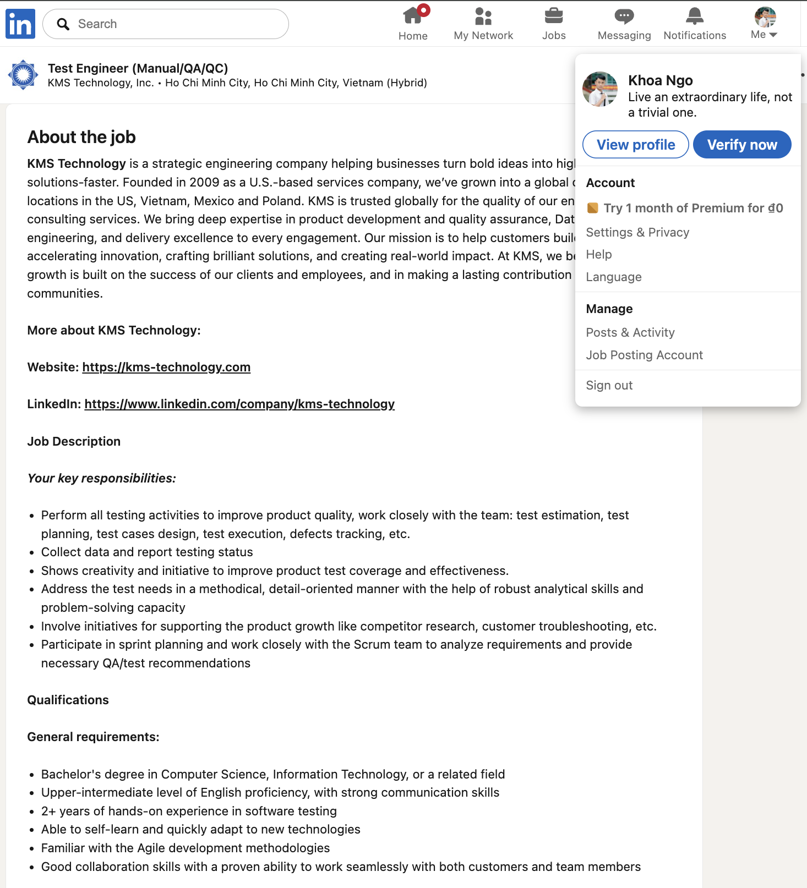
  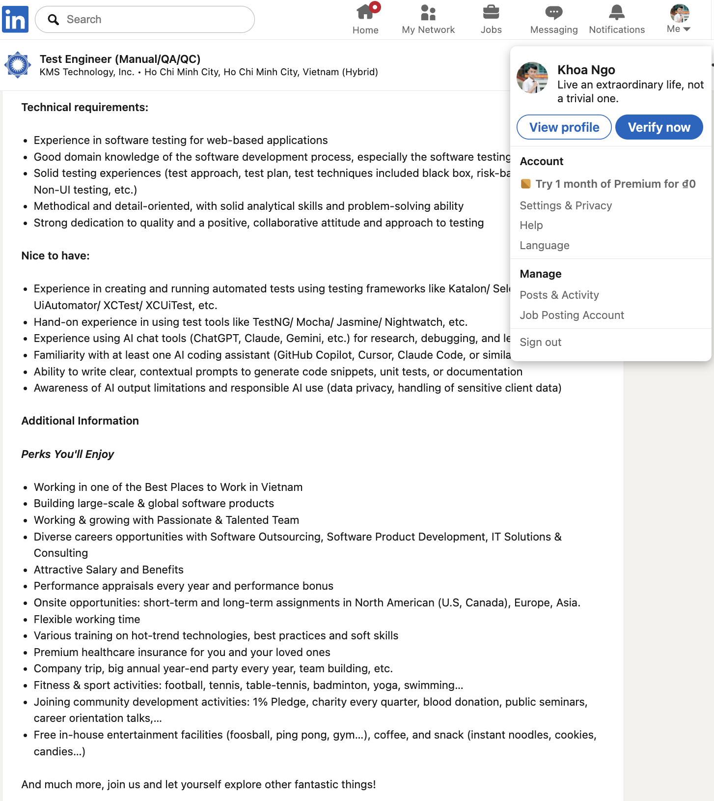
- **Job Description**:
  ```
  Your key responsibilities:
  - Perform all testing activities to improve product quality, work closely with the team: test estimation, test planning, test cases design, test execution, defects tracking, etc.
  - Collect data and report testing status
  - Shows creativity and initiative to improve product test coverage and effectiveness.
  - Address the test needs in a methodical, detail-oriented manner with the help of robust analytical skills and problem-solving capacity
  - Involve initiatives for supporting the product growth like competitor research, customer troubleshooting, etc.
  - Participate in sprint planning and work closely with the Scrum team to analyze requirements and provide necessary QA/test recommendations
  ```
- **Skills Required**:
  ```
  General requirements:
  - Bachelor's degree in Computer Science, Information Technology, or a related field
  - Upper-intermediate level of English proficiency, with strong communication skills
  - 2+ years of hands-on experience in software testing
  - Able to self-learn and quickly adapt to new technologies
  - Familiar with the Agile development methodologies
  - Good collaboration skills with a proven ability to work seamlessly with both customers and team members
  Technical requirements:
  - Experience in software testing for web-based applications
  - Good domain knowledge of the software development process, especially the software testing process
  - Solid testing experiences (test approach, test plan, test techniques included black box, risk-based, exploratory, Non-UI testing, etc.)
  - Methodical and detail-oriented, with solid analytical skills and problem-solving ability
  - Strong dedication to quality and a positive, collaborative attitude and approach to testing
  Nice to have:
  - Experience in creating and running automated tests using testing frameworks like Katalon/ Selenium/ Robotium/ UiAutomator/ XCTest/ XCUiTest, etc.
  - Hand-on experience in using test tools like TestNG/ Mocha/ Jasmine/ Nightwatch, etc.
  - Experience using AI chat tools (ChatGPT, Claude, Gemini, etc.) for research, debugging, and learning
  - Familiarity with at least one AI coding assistant (GitHub Copilot, Cursor, Claude Code, or similar)
  - Ability to write clear, contextual prompts to generate code snippets, unit tests, or documentation
  - Awareness of AI output limitations and responsible AI use (data privacy, handling of sensitive client data)
  ```
- **Salary Range**: Not specified in the posting.
- **AI Impact Analysis**: AI acts as a powerful assistant for drafting test plans and brainstorming test designs, but cannot replace human empathy and UX assessment during exploratory web testing. The requirement to use AI coding assistants and write contextual prompts shows that KMS expects engineers to co-pilot with AI rather than be replaced by it.

#### 1.1.5 [Senior Quality Control Engineer (VNGGames)](https://www.linkedin.com/jobs/view/4422332694/):

- **Linkedin Post Link**: [Senior Quality Control Engineer (VNGGames)](https://www.linkedin.com/jobs/view/4422332694/)
- **Screenshots (2026-06-04)**:
  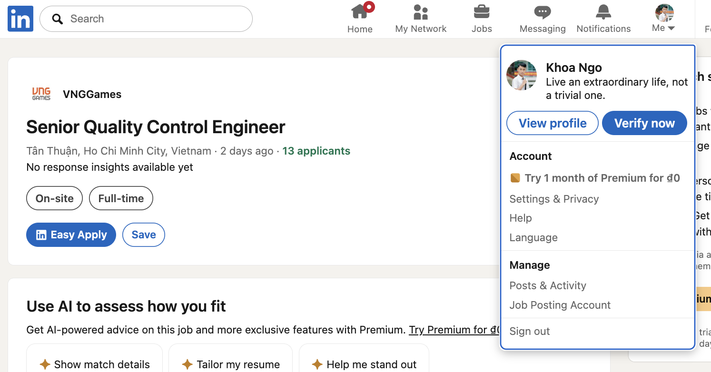
  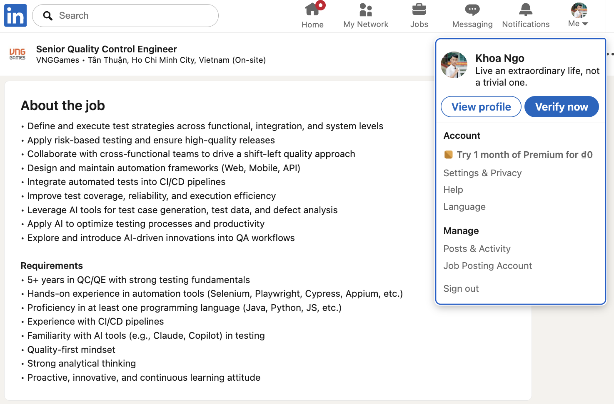
- **Job Description**:
  ```
  - Define and execute test strategies across functional, integration, and system levels
  - Apply risk-based testing and ensure high-quality releases
  - Collaborate with cross-functional teams to drive a shift-left quality approach
  - Design and maintain automation frameworks (Web, Mobile, API)
  - Integrate automated tests into CI/CD pipelines
  - Improve test coverage, reliability, and execution efficiency
  - Leverage AI tools for test case generation, test data, and defect analysis
  - Apply AI to optimize testing processes and productivity
  - Explore and introduce AI-driven innovations into QA workflows
  ```
- **Skills Required**:
  ```
  - 5+ years in QC/QE with strong testing fundamentals
  - Hands-on experience in automation tools (Selenium, Playwright, Cypress, Appium, etc.)
  - Proficiency in at least one programming language (Java, Python, JS, etc.)
  - Experience with CI/CD pipelines
  - Familiarity with AI tools (e.g., Claude, Copilot) in testing
  - Quality-first mindset
  - Strong analytical thinking
  - Proactive, innovative, and continuous learning attitude
  ```
- **Salary Range**: Not specified in the posting.
- **AI Impact Analysis**: The mandate to leverage AI for test generation and defect analysis means this senior role requires orchestrating AI-driven QA workflows rather than just manual script writing. Human expertise is critical for high-level strategy and risk management, which AI cannot autonomously handle.

#### 1.1.6 [QA - Software / Device Specialist (Middle Level) (OptiSigns)](https://www.linkedin.com/jobs/view/4383708007/):

- **Linkedin Post Link**: [QA - Software / Device Specialist (Middle Level) (OptiSigns)](https://www.linkedin.com/jobs/view/4383708007/)
- **Screenshots (2026-06-04)**:
  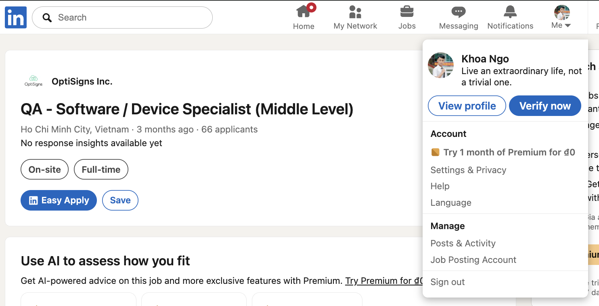
  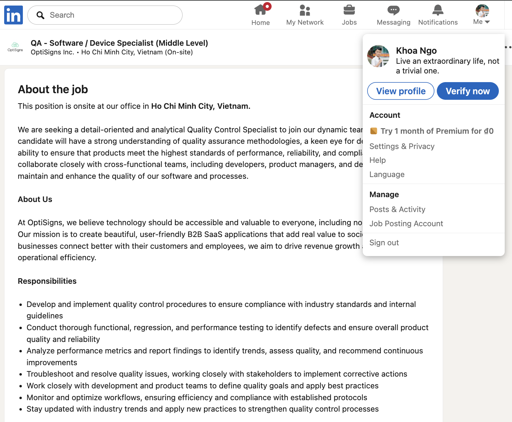
  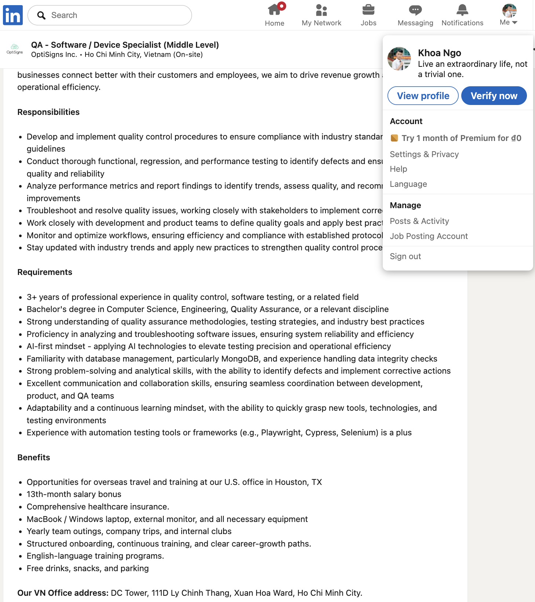
- **Job Description**:
  ```
  We are seeking a detail-oriented and analytical Quality Control Specialist to join our dynamic team. The ideal candidate will have a strong understanding of quality assurance methodologies, a keen eye for detail, and the ability to ensure that products meet the highest standards of performance, reliability, and compliance. You will collaborate closely with cross-functional teams, including developers, product managers, and designers, to maintain and enhance the quality of our software and processes.
  ```
- **Skills Required**:
  ```
  - 3+ years of professional experience in quality control, software testing, or a related field
  - Bachelor's degree in Computer Science, Engineering, Quality Assurance, or a relevant discipline
  - Strong understanding of quality assurance methodologies, testing strategies, and industry best practices
  - Proficiency in analyzing and troubleshooting software issues, ensuring system reliability and efficiency
  - AI-first mindset - applying AI technologies to elevate testing precision and operational efficiency
  - Familiarity with database management, particularly MongoDB, and experience handling data integrity checks
  - Strong problem-solving and analytical skills, with the ability to identify defects and implement corrective actions
  - Excellent communication and collaboration skills, ensuring seamless coordination between development, product, and QA teams
  - Adaptability and a continuous learning mindset, with the ability to quickly grasp new tools, technologies, and testing environments
  - Experience with automation testing tools or frameworks (e.g., Playwright, Cypress, Selenium) is a plus
  ```
- **Salary Range**: Not specified in the posting.
- **AI Impact Analysis**: Having an "AI-first mindset" means the engineer must use AI to optimize testing precision and operational efficiency. However, physical hardware/device testing and database integrity checks remain highly dependent on manual setup and human validation.

#### 1.1.7 [Software QA Engineer (Corsair)](https://www.linkedin.com/jobs/view/4384558629/):

- **Linkedin Post Link**: [Software QA Engineer (Corsair)](https://www.linkedin.com/jobs/view/4384558629/)
- **Screenshots (2026-06-04)**:
  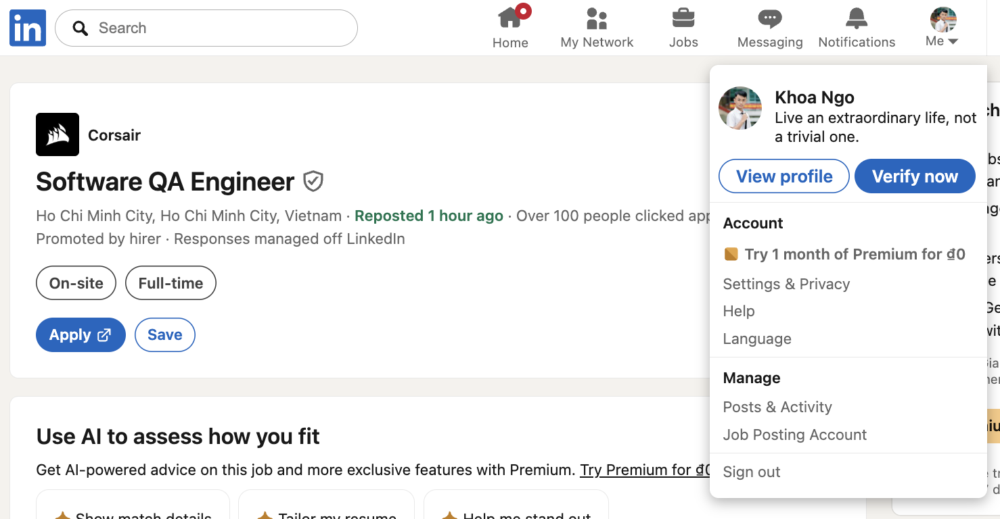
  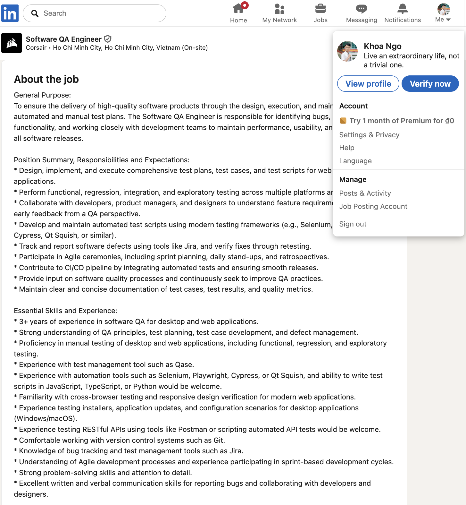
- **Job Description**:

  ```
  General Purpose:
  To ensure the delivery of high-quality software products through the design, execution, and maintenance of automated and manual test plans. The Software QA Engineer is responsible for identifying bugs, verifying functionality, and working closely with development teams to maintain performance, usability, and stability across all software releases.

  Position Summary, Responsibilities and Expectations:
  * Design, implement, and execute comprehensive test plans, test cases, and test scripts for web and software applications.
  * Perform functional, regression, integration, and exploratory testing across multiple platforms and environments.
  * Collaborate with developers, product managers, and designers to understand feature requirements and provide early feedback from a QA perspective.
  * Develop and maintain automated test scripts using modern testing frameworks (e.g., Selenium, Playwright, Cypress, Qt Squish, or similar).
  * Track and report software defects using tools like Jira, and verify fixes through retesting.
  * Participate in Agile ceremonies, including sprint planning, daily stand-ups, and retrospectives.
  * Contribute to CI/CD pipeline by integrating automated tests and ensuring smooth releases.
  * Provide input on software quality processes and continuously seek to improve QA practices.
  * Maintain clear and concise documentation of test cases, test results, and quality metrics.
  ```

- **Skills Required**:
  ```
  Essential Skills and Experience:
  * 3+ years of experience in software QA for desktop and web applications.
  * Strong understanding of QA principles, test planning, test case development, and defect management.
  * Proficiency in manual testing of desktop and web applications, including functional, regression, and exploratory testing.
  * Experience with test management tool such as Qase.
  * Experience with automation tools such as Selenium, Playwright, Cypress, or Qt Squish, and ability to write test scripts in JavaScript, TypeScript, or Python would be welcome.
  * Familiarity with cross-browser testing and responsive design verification for modern web applications.
  * Experience testing installers, application updates, and configuration scenarios for desktop applications (Windows/macOS).
  * Experience testing RESTful APIs using tools like Postman or scripting automated API tests would be welcome.
  * Comfortable working with version control systems such as Git.
  * Knowledge of bug tracking and test management tools such as Jira.
  * Understanding of Agile development processes and experience participating in sprint-based development cycles.
  * Strong problem-solving skills and attention to detail.
  * Excellent written and verbal communication skills for reporting bugs and collaborating with developers and designers.
  ```
- **Salary Range**: Not specified in the posting.
- **AI Impact Analysis**: AI assists by generating UI scripts for web pages, but testing desktop installers, application updates, and custom UI components like Qt Squish requires local environment configuration that AI cannot autonomously execute. Human testers remain central to validating the end-to-end desktop user experience.

#### 1.1.8 [Automation QC Engineer (All level) (Datalogic)](https://www.linkedin.com/jobs/view/4298999735/):

- **Linkedin Post Link**: [Automation QC Engineer (All level) (Datalogic)](https://www.linkedin.com/jobs/view/4298999735/)
- **Screenshots (2026-06-04)**:
  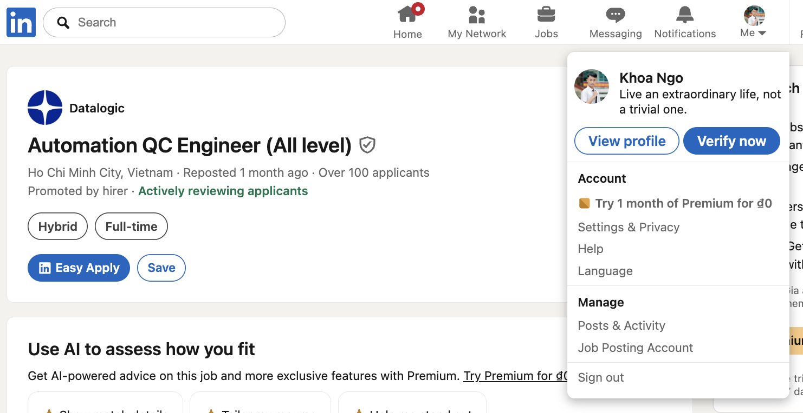
  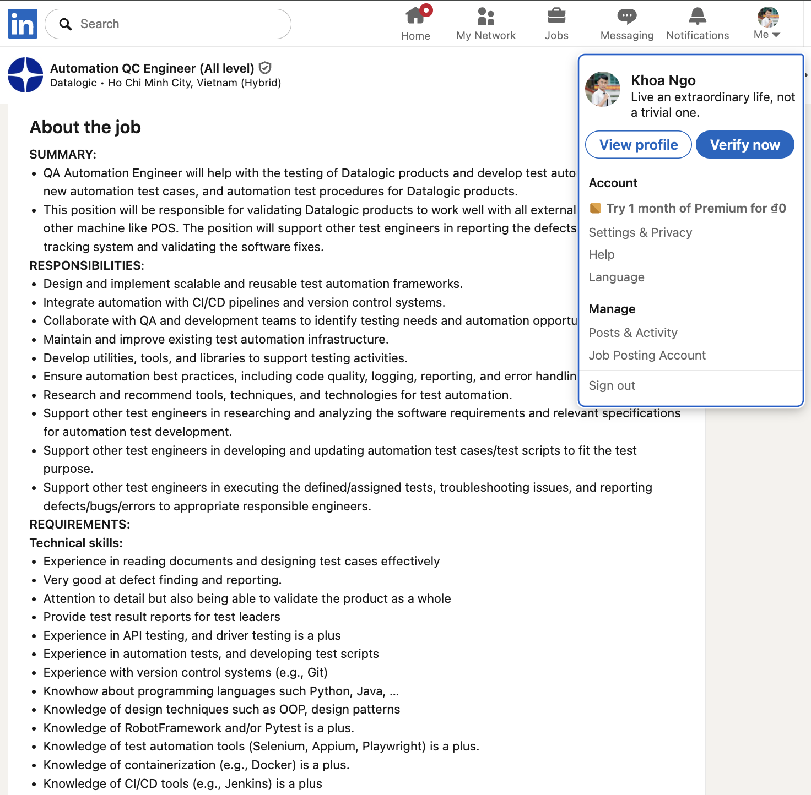
  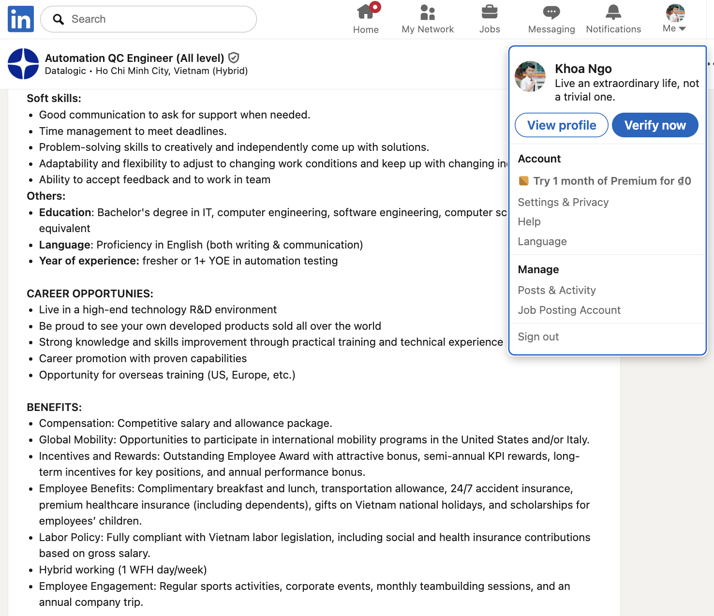
- **Job Description**:
  ```
  SUMMARY:
  - QA Automation Engineer will help with the testing of Datalogic products and develop test automation framework, new automation test cases, and automation test procedures for Datalogic products.
  - This position will be responsible for validating Datalogic products to work well with all external accessories and other machine like POS. The position will support other test engineers in reporting the defects in the defect tracking system and validating the software fixes.
  ```
- **Skills Required**:
  ```
  Technical skills:
  - Experience in reading documents and designing test cases effectively
  - Very good at defect finding and reporting.
  - Attention to detail but also being able to validate the product as a whole
  - Provide test result reports for test leaders
  - Experience in API testing, and driver testing is a plus
  - Experience in automation tests, and developing test scripts
  - Experience with version control systems (e.g., Git)
  - Knowhow about programming languages such Python, Java, …
  - Knowledge of design techniques such as OOP, design patterns
  - Knowledge of RobotFramework and/or Pytest is a plus.
  - Knowledge of test automation tools (Selenium, Appium, Playwright) is a plus.
  - Knowledge of containerization (e.g., Docker) is a plus.
  - Knowledge of CI/CD tools (e.g., Jenkins) is a plus
  ```
- **Salary Range**: Not specified in the posting.
- **AI Impact Analysis**: Testing driver interfaces and physical POS terminal integrations requires physical hardware-in-the-loop validation, which AI cannot replicate. AI will primarily assist by drafting unit tests and automation scripts in Python, but human QA engineers are required for hardware validation.

#### 1.1.9 [Test Engineer – Failure Analysis & Lab Validation (Specialized Bicycle Components)](https://www.linkedin.com/jobs/view/4416671108/):

- **Linkedin Post Link**: [Test Engineer – Failure Analysis & Lab Validation (Specialized Bicycle Components)](https://www.linkedin.com/jobs/view/4416671108/)
- **Screenshots (2026-06-04)**:
  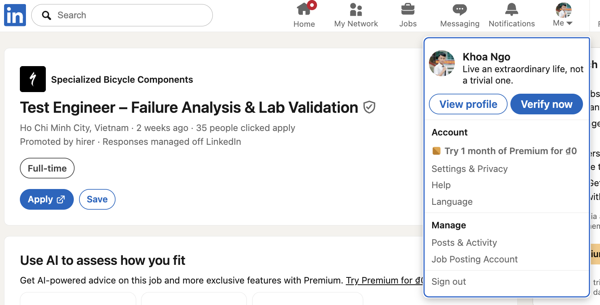
  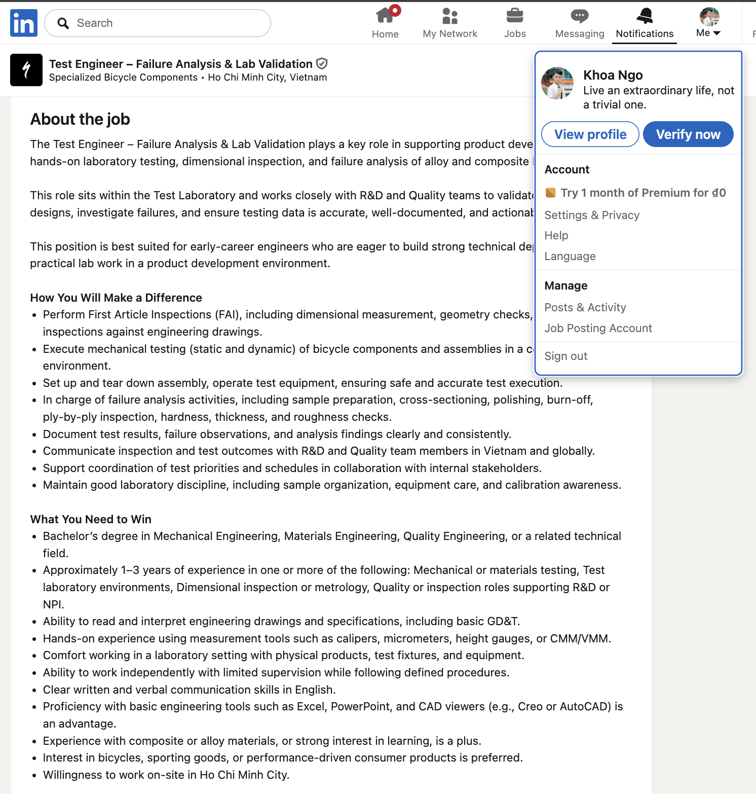
- **Job Description**:
  ```
  - The Test Engineer – Failure Analysis & Lab Validation plays a key role in supporting product development through hands‑on laboratory testing, dimensional inspection, and failure analysis of alloy and composite bicycle products.
  - This role sits within the Test Laboratory and works closely with R&D and Quality teams to validate new product designs, investigate failures, and ensure testing data is accurate, well‑documented, and actionable.
  - This position is best suited for early‑career engineers who are eager to build strong technical depth through practical lab work in a product development environment.
  ```
- **Skills Required**:

  ```
  How You Will Make a Difference:
  - Perform First Article Inspections (FAI), including dimensional measurement, geometry checks, and cosmetic inspections against engineering drawings.
  - Execute mechanical testing (static and dynamic) of bicycle components and assemblies in a controlled lab environment.
  - Set up and tear down assembly, operate test equipment, ensuring safe and accurate test execution.
  - In charge of failure analysis activities, including sample preparation, cross‑sectioning, polishing, burn‑off, ply‑by‑ply inspection, hardness, thickness, and roughness checks.
  - Document test results, failure observations, and analysis findings clearly and consistently.
  - Communicate inspection and test outcomes with R&D and Quality team members in Vietnam and globally.
  - Support coordination of test priorities and schedules in collaboration with internal stakeholders.
  - Maintain good laboratory discipline, including sample organization, equipment care, and calibration awareness.

  What You Need to Win:
  - Bachelor’s degree in Mechanical Engineering, Materials Engineering, Quality Engineering, or a related technical field.
  - Approximately 1–3 years of experience in one or more of the following: Mechanical or materials testing, Test laboratory environments, Dimensional inspection or metrology, Quality or inspection roles supporting R&D or NPI.
  - Ability to read and interpret engineering drawings and specifications, including basic GD&T.
  - Hands‑on experience using measurement tools such as calipers, micrometers, height gauges, or CMM/VMM.
  - Comfort working in a laboratory setting with physical products, test fixtures, and equipment.
  - Ability to work independently with limited supervision while following defined procedures.
  - Clear written and verbal communication skills in English.
  - Proficiency with basic engineering tools such as Excel, PowerPoint, and CAD viewers (e.g., Creo or AutoCAD) is an advantage.
  - Experience with composite or alloy materials, or strong interest in learning, is a plus.
  - Interest in bicycles, sporting goods, or performance‑driven consumer products is preferred.
  - Willingness to work on‑site in Ho Chi Minh City.
  ```

- **Salary Range**: Not specified in the posting.
- **AI Impact Analysis**: This role is highly resilient against AI automation because it requires physical laboratory work, mechanical test setups, and failure analysis of composite materials. AI can only assist with data compilation and trend analysis, but cannot perform physical metrology or material inspections.

#### 1.1.10 [Quality Assurance Specialist (Hardgoods) (Li & Fung)](https://www.linkedin.com/jobs/view/4400723166/):

- **Linkedin Post Link**: [Quality Assurance Specialist (Hardgoods) (Li & Fung)](https://www.linkedin.com/jobs/view/4400723166/)
- **Screenshots (2026-06-04)**:
  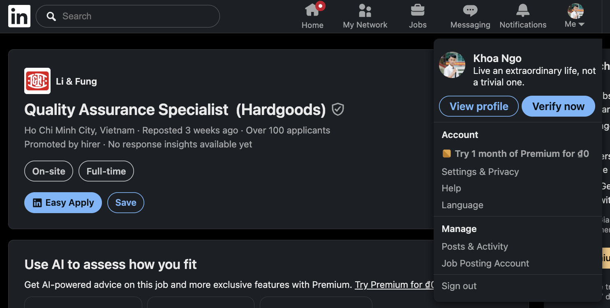
  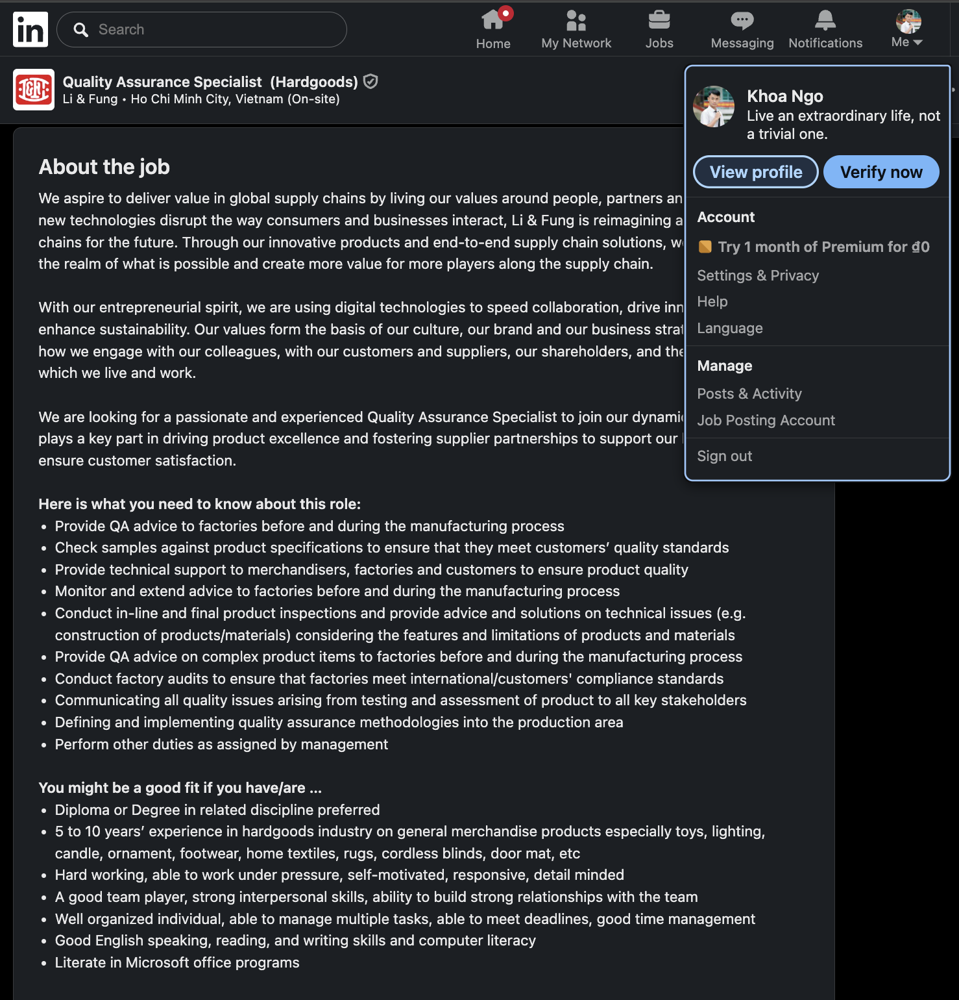
- **Job Description**:

  ```
  We aspire to deliver value in global supply chains by living our values around people, partners and the planet. As new technologies disrupt the way consumers and businesses interact, Li & Fung is reimagining and creating supply chains for the future. Through our innovative products and end-to-end supply chain solutions, we aim to expand the realm of what is possible and create more value for more players along the supply chain.

  With our entrepreneurial spirit, we are using digital technologies to speed collaboration, drive innovation and enhance sustainability. Our values form the basis of our culture, our brand and our business strategies. They define how we engage with our colleagues, with our customers and suppliers, our shareholders, and the communities in which we live and work.

  We are looking for a passionate and experienced Quality Assurance Specialist to join our dynamic team. This role plays a key part in driving product excellence and fostering supplier partnerships to support our business and ensure customer satisfaction.
  ```

- **Skills Required**:
  ```
  - Diploma or Degree in related discipline preferred
  - 5 to 10 years’ experience in hardgoods industry on general merchandise products especially toys, lighting, candle, ornament, footwear, home textiles, rugs, cordless blinds, door mat, etc
  - Hard working, able to work under pressure, self-motivated, responsive, detail minded
  - A good team player, strong interpersonal skills, ability to build strong relationships with the team
  - Well organized individual, able to manage multiple tasks, able to meet deadlines, good time management
  - Good English speaking, reading, and writing skills and computer literacy
  - Literate in Microsoft office programs
  ```
- **Salary Range**: Not specified in the posting.
- **AI Impact Analysis**: AI is incapable of replacing the physical quality inspections of hardgoods (like toys and lighting) or the relational coordination required with global factories. AI can assist in organizing schedules or checking compliance documentation, but the physical verification remains 100% human-driven.

#### Summary

<!-- TODO: 10 job posting entries following data-model.md Entity 1 schema -->
<!-- Each entry: Job-NN format with URL, screenshot, skills, salary, AI Impact Analysis -->
<!-- At least 3 must have AI/LLM Skills Required: Yes -->

### 1.2 ISTQB Mindmap Audit

<!-- TODO: AI-generated mindmap + 3 identified mistakes with ISTQB citations -->
<!-- Follow data-model.md Entity 2 schema -->

---

## Section 2 — R2: 20 Software Defects 2022–2026

<!-- TODO: 20 defect entries following data-model.md Entity 3 schema -->
<!-- Each entry: Defect-NN format with source, severity, consequences, solution, AI bias -->
<!-- At least 5 must be AI/LLM-related -->

---

## Section 3 — R3: Stand Fan Test Design & Execution

### 3.1 Device Declaration

<!-- TODO: Brand, model, year, serial number (mask middle 4 chars) -->
<!-- Reference device-photo.jpg showing stand fan + student ID card in same frame -->

### 3.2 Test Cases (15 ISTQB-structured)

<!-- TODO: 15 test case entries following data-model.md Entity 4 schema -->
<!-- Each: TC-NN format with Objective/Input/Steps/Expected/Actual/Verdict -->
<!-- At least 3 must be AI-missed edge cases with proof screenshots -->
<!-- Design techniques: Equivalence Partitioning, Boundary Value Analysis, Error Guessing -->

### 3.3 Execution Results & Videos

<!-- TODO: Fill Actual/Verdict for TC-01 through TC-05 (minimum) -->
<!-- Include YouTube Unlisted links for each executed test case -->
<!-- Videos must contain student voice narration (≤60s each) -->

### 3.4 Defect Log

<!-- TODO: ≥5 defect entries following data-model.md Entity 5 schema -->
<!-- Each: Defect-R3-NN format with TC reference, severity, GitHub Issue link -->

---

## Section 4 — AI Collaboration

### 4.1 AI Critique (200–300 words)

<!-- TODO: Exactly ONE paragraph, 200–300 words -->
<!-- Must address: where AI got it wrong/biased/incomplete, WHY it failed, -->
<!-- and the principle(s) learned for collaborating with AI on this HW -->

### 4.2 AI Accuracy Summary

<!-- TODO: Count VALID/INVALID/INCOMPLETE verdicts from all Audit Report entries -->
<!-- Calculate percentages (must sum to 100%) -->
<!-- Conclude: WHEN should AI be used / not used for this type of work? -->

### 4.3 Mandatory Disclosure

<!-- TODO: Fill using standard template below -->
<!--
"[Test cases / script / dataset / report] was initially generated by [AI tool name];
I reviewed and modified [section X], added [edge cases Y, Z];
[section W] was written entirely by me.
The detailed AI Audit Report is attached as Appendix A.
I confirm I did not use AI to generate any artifact listed in the prohibited category below."
-->

---

## Section 5 — Self-Assessment

| No.  | Criteria                                                | Max Points | Self-Assessed Grade | Justification |
| ---- | ------------------------------------------------------- | ---------- | ------------------: | ------------- |
| 1    | Job Market 2026+ (10 jobs × 3 pts + AI Impact)          | 40         |       <!-- TODO --> | <!-- TODO --> |
| 2    | Software Defects 2022–2026 (20 defects)                 | 20         |       <!-- TODO --> | <!-- TODO --> |
| 3    | Physical-product test design (15 TCs + 5 videos)        | 25         |       <!-- TODO --> | <!-- TODO --> |
| AI-1 | [AI-02] AI Audit Report (5-section) attached            | 8          |       <!-- TODO --> | <!-- TODO --> |
| AI-2 | AI Critique 200–300 words + [AI-03] Disclosure attached | 4          |       <!-- TODO --> | <!-- TODO --> |
| AI-3 | [AI-05] Checklist signed + anti-cheat artifacts         | 3          |       <!-- TODO --> | <!-- TODO --> |
|      | **Total**                                               | **100**    |       <!-- TODO --> |               |

---

## Appendix A — AI Audit Reports [AI-02]

See [`hw01/ai-artifacts/audit-reports.md`](ai-artifacts/audit-reports.md) for all 5-section AI Audit Report entries.

## Appendix B — AI Disclosure Form [AI-03]

<!-- TODO: Attach signed [AI-03] AI Disclosure Form -->

## Appendix C — AI Privacy Checklist [AI-05]

<!-- TODO: Attach signed [AI-05] Privacy & Responsible Use Checklist -->

## Appendix D — Prompt Log

See [`hw01/ai-artifacts/prompt-log.md`](ai-artifacts/prompt-log.md) for the complete timestamped prompt log.
