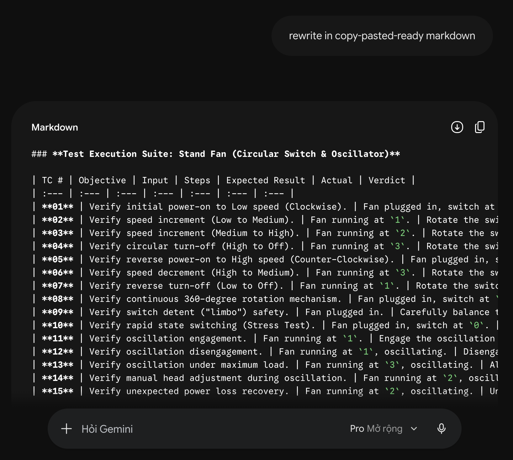

# HW01 – QA/QC Jobs · 20 Defects · Test a Physical Product

## Information

|                                 |                                                                                                        |
| ------------------------------- | ------------------------------------------------------------------------------------------------------ |
| **Student Name**                | Ngô Nguyễn Thế Khoa                                                                                    |
| **Student ID**                  | 23127065                                                                                               |
| **Course**                      | CS423 / CSC13003 – Software Testing                                                                    |
| **Assignment**                  | HW01                                                                                                   |
| **Submission Date**             | 08/06/2026                                                                                             |
| **Submission Deadline**         | 08/06/2026                                                                                             |
| **60-Day Recency Window Start** | 04/06/2026                                                                                             |
| **AI Tools Used**               | GitHub Copilot, Antigravity, Gemini                                                                    |
| **GitHub Repository**           | [https://github.com/yuran1811/hcmus-sw-testing--hw](https://github.com/yuran1811/hcmus-sw-testing--hw) |
| **Pandoc Version**              | 3.9.0.2                                                                                                |

---

## Section 1 — R1: QA/QC Job Market 2026+

### 1.1 Job Postings

#### 1.1.1 [QA Engineer (Motorola Solutions)](https://www.linkedin.com/jobs/view/4390332055/):

- **Linkedin Post Link**: [QA Engineer (Motorola Solutions)](https://www.linkedin.com/jobs/view/4390332055/)
- **Screenshots (2026-06-04)**:
  
  
  
- **Job Description**:
  ```
  We are seeking a diligent and detail-oriented QA Engineer to join our R&D team. The successful candidate will be responsible for ensuring the quality and reliability of our model and core engines. You will play a key role in building testing infrastructure, benchmarking models, and defining complex data scenarios to predict how model performance impacts the final product.
  ```
- **Skills Required**:
  ```
  Technical Requirements:
  - Experience: Minimum 3 years in Software Quality Engineering or Backend Development, with a focus on automation.
  - Education: Bachelor’s degree in Computer Science, Machine Engineering, or a related technical field.
  - Programming Mastery: Proficient in Python (for automation & ML scripting) and C++ or JavaScript (for engine-level or web-integrated testing).
  - Domain Expertise: * Solid understanding of AI/ML lifecycles and Computer Vision fundamentals.
  - Hands-on experience with cloud platforms (AWS, Azure, or GCP) and IoT/Robotics environments
  ```
- **Salary Range**: Not specified in the posting.
- **AI Impact Analysis**: AI tools cannot easily replace the highly specialized task of validating machine learning models, core engines, and IoT environments, though they will assist engineers by generating synthetic test datasets. The role shifts from manual test script creation to managing complex validation pipelines and model benchmarking.

#### 1.1.2 [Quality Engineer (Zalopay)](https://www.linkedin.com/jobs/view/4409679195/):

- **Linkedin Post Link**: [Quality Engineer (Zalopay)](https://www.linkedin.com/jobs/view/4409679195/)
- **Screenshots (2026-06-04)**:
  
  
- **Job Description**:
  ```
  - Design and develop automated test scripts based on test cases and requirements.
  - Regularly update and maintain test scripts to ensure they remain effective with application changes.
  - Run automated tests and analyze results to ensure that software meets quality standards.
  - Identify, log, and track defects found during testing and collaborate with developers to resolve them.
  - Document test plans, test cases, and results to ensure comprehensive coverage and traceability.
  - Identify opportunities for improving the efficiency and effectiveness of the test automation process.
  - Review requirements, specifications, and technical design documents.
  - Ensure that validated deliverables meet functional and design specifications and requirements.
  - Keeping updated with new testing tools and test strategies
  ```
- **Skills Required**:
  ```
  - Bachelor's degree in computer science, engineering, or a related field.
  - 2+ years of hands-on experience in QE role.
  - Experience with test automation frameworks like Selenium, Playwright, Appium, or similar.
  - Experience with tools such as JMeter, Postman is preferred.
  - Experience in writing new test cases based on requirements.
  - Integration Test and developing test cases, test plan.
  - Good knowledge of software development methodologies.
  - Experience in applying test techniques on projects.
  - Write test cases and report bugs clearly
  - Experience with Agile/Scrum development process
  - Familiar with Bug tracker such as Jira, TestRail...
  - Use AI to improve work efficiency
  ```
- **Salary Range**: Not specified in the posting.
- **AI Impact Analysis**: AI significantly assists this role by generating boilerplate UI test scripts and test data, but cannot replace the human oversight needed to design complex end-to-end user journeys and maintain framework integrity. Incorporating AI tools directly increases productivity, freeing the engineer to focus on strategic edge cases.

#### 1.1.3 [Quality Assurance Specialist (DXC Technology Vietnam)](https://www.linkedin.com/jobs/view/4340770395/):

- **Linkedin Post Link**: [Quality Assurance Specialist (DXC Technology Vietnam)](https://www.linkedin.com/jobs/view/4340770395/)
- **Screenshots (2026-06-04)**:
  
  
  
- **Job Description**:
  ```
  An exciting Quality Control Engineer opening has been available for those who are interested in developing and executing exploratory and automated tests to ensure better product quality. You will be responsible for developing and implementing tests, debugging and defining corrective actions. You will also review system requirements and track quality assurance metrics (e.g. defect densities and open defect counts.)
  ```
- **Skills Required**:
  ```
  To be successful candidate for this role, you have:
  - Bachelor’s degree or higher in Computer Science, Information Technology or related field
  - Minimum 1-year experience in software testing
  - Knowledge of at least programming language such as Java, Python, etc.
  - Experience with HTML and CSS
  - Knowledge of CI/CD is a plus
  - Ability to write clear and concise test documentation and experience in applying testing techniques in writing test cases
  - Experience with agile development methodologies is a plus
  - Good English communication skills.
  - Good collaboration, and communication skills and strong team working ability.
  ```
- **Salary Range**: Not specified in the posting.
- **AI Impact Analysis**: While AI can draft standard test cases and write basic functional scripts in Java/Python, it cannot replace the manual analysis required to review requirements and coordinate with cross-functional teams. Human critical thinking is still essential to identify complex integration errors and lead exploratory testing sessions.

#### 1.1.4 [Test Engineer (Manual/QA/QC) (KMS Technology)](https://www.linkedin.com/jobs/view/4403217406/):

- **Linkedin Post Link**: [Test Engineer (Manual/QA/QC) (KMS Technology)](https://www.linkedin.com/jobs/view/4403217406/)
- **Screenshots (2026-06-04)**:
  
  
  
- **Job Description**:
  ```
  Your key responsibilities:
  - Perform all testing activities to improve product quality, work closely with the team: test estimation, test planning, test cases design, test execution, defects tracking, etc.
  - Collect data and report testing status
  - Shows creativity and initiative to improve product test coverage and effectiveness.
  - Address the test needs in a methodical, detail-oriented manner with the help of robust analytical skills and problem-solving capacity
  - Involve initiatives for supporting the product growth like competitor research, customer troubleshooting, etc.
  - Participate in sprint planning and work closely with the Scrum team to analyze requirements and provide necessary QA/test recommendations
  ```
- **Skills Required**:
  ```
  General requirements:
  - Bachelor's degree in Computer Science, Information Technology, or a related field
  - Upper-intermediate level of English proficiency, with strong communication skills
  - 2+ years of hands-on experience in software testing
  - Able to self-learn and quickly adapt to new technologies
  - Familiar with the Agile development methodologies
  - Good collaboration skills with a proven ability to work seamlessly with both customers and team members
  Technical requirements:
  - Experience in software testing for web-based applications
  - Good domain knowledge of the software development process, especially the software testing process
  - Solid testing experiences (test approach, test plan, test techniques included black box, risk-based, exploratory, Non-UI testing, etc.)
  - Methodical and detail-oriented, with solid analytical skills and problem-solving ability
  - Strong dedication to quality and a positive, collaborative attitude and approach to testing
  Nice to have:
  - Experience in creating and running automated tests using testing frameworks like Katalon/ Selenium/ Robotium/ UiAutomator/ XCTest/ XCUiTest, etc.
  - Hand-on experience in using test tools like TestNG/ Mocha/ Jasmine/ Nightwatch, etc.
  - Experience using AI chat tools (ChatGPT, Claude, Gemini, etc.) for research, debugging, and learning
  - Familiarity with at least one AI coding assistant (GitHub Copilot, Cursor, Claude Code, or similar)
  - Ability to write clear, contextual prompts to generate code snippets, unit tests, or documentation
  - Awareness of AI output limitations and responsible AI use (data privacy, handling of sensitive client data)
  ```
- **Salary Range**: Not specified in the posting.
- **AI Impact Analysis**: AI acts as a powerful assistant for drafting test plans and brainstorming test designs, but cannot replace human empathy and UX assessment during exploratory web testing. The requirement to use AI coding assistants and write contextual prompts shows that KMS expects engineers to co-pilot with AI rather than be replaced by it.

#### 1.1.5 [Senior Quality Control Engineer (VNGGames)](https://www.linkedin.com/jobs/view/4422332694/):

- **Linkedin Post Link**: [Senior Quality Control Engineer (VNGGames)](https://www.linkedin.com/jobs/view/4422332694/)
- **Screenshots (2026-06-04)**:
  
  
- **Job Description**:
  ```
  - Define and execute test strategies across functional, integration, and system levels
  - Apply risk-based testing and ensure high-quality releases
  - Collaborate with cross-functional teams to drive a shift-left quality approach
  - Design and maintain automation frameworks (Web, Mobile, API)
  - Integrate automated tests into CI/CD pipelines
  - Improve test coverage, reliability, and execution efficiency
  - Leverage AI tools for test case generation, test data, and defect analysis
  - Apply AI to optimize testing processes and productivity
  - Explore and introduce AI-driven innovations into QA workflows
  ```
- **Skills Required**:
  ```
  - 5+ years in QC/QE with strong testing fundamentals
  - Hands-on experience in automation tools (Selenium, Playwright, Cypress, Appium, etc.)
  - Proficiency in at least one programming language (Java, Python, JS, etc.)
  - Experience with CI/CD pipelines
  - Familiarity with AI tools (e.g., Claude, Copilot) in testing
  - Quality-first mindset
  - Strong analytical thinking
  - Proactive, innovative, and continuous learning attitude
  ```
- **Salary Range**: Not specified in the posting.
- **AI Impact Analysis**: The mandate to leverage AI for test generation and defect analysis means this senior role requires orchestrating AI-driven QA workflows rather than just manual script writing. Human expertise is critical for high-level strategy and risk management, which AI cannot autonomously handle.

#### 1.1.6 [QA - Software / Device Specialist (Middle Level) (OptiSigns)](https://www.linkedin.com/jobs/view/4383708007/):

- **Linkedin Post Link**: [QA - Software / Device Specialist (Middle Level) (OptiSigns)](https://www.linkedin.com/jobs/view/4383708007/)
- **Screenshots (2026-06-04)**:
  
  
  
- **Job Description**:
  ```
  We are seeking a detail-oriented and analytical Quality Control Specialist to join our dynamic team. The ideal candidate will have a strong understanding of quality assurance methodologies, a keen eye for detail, and the ability to ensure that products meet the highest standards of performance, reliability, and compliance. You will collaborate closely with cross-functional teams, including developers, product managers, and designers, to maintain and enhance the quality of our software and processes.
  ```
- **Skills Required**:
  ```
  - 3+ years of professional experience in quality control, software testing, or a related field
  - Bachelor's degree in Computer Science, Engineering, Quality Assurance, or a relevant discipline
  - Strong understanding of quality assurance methodologies, testing strategies, and industry best practices
  - Proficiency in analyzing and troubleshooting software issues, ensuring system reliability and efficiency
  - AI-first mindset - applying AI technologies to elevate testing precision and operational efficiency
  - Familiarity with database management, particularly MongoDB, and experience handling data integrity checks
  - Strong problem-solving and analytical skills, with the ability to identify defects and implement corrective actions
  - Excellent communication and collaboration skills, ensuring seamless coordination between development, product, and QA teams
  - Adaptability and a continuous learning mindset, with the ability to quickly grasp new tools, technologies, and testing environments
  - Experience with automation testing tools or frameworks (e.g., Playwright, Cypress, Selenium) is a plus
  ```
- **Salary Range**: Not specified in the posting.
- **AI Impact Analysis**: Having an "AI-first mindset" means the engineer must use AI to optimize testing precision and operational efficiency. However, physical hardware/device testing and database integrity checks remain highly dependent on manual setup and human validation.

#### 1.1.7 [Software QA Engineer (Corsair)](https://www.linkedin.com/jobs/view/4384558629/):

- **Linkedin Post Link**: [Software QA Engineer (Corsair)](https://www.linkedin.com/jobs/view/4384558629/)
- **Screenshots (2026-06-04)**:
  
  
- **Job Description**:

  ```
  General Purpose:
  To ensure the delivery of high-quality software products through the design, execution, and maintenance of automated and manual test plans. The Software QA Engineer is responsible for identifying bugs, verifying functionality, and working closely with development teams to maintain performance, usability, and stability across all software releases.

  Position Summary, Responsibilities and Expectations:
  * Design, implement, and execute comprehensive test plans, test cases, and test scripts for web and software applications.
  * Perform functional, regression, integration, and exploratory testing across multiple platforms and environments.
  * Collaborate with developers, product managers, and designers to understand feature requirements and provide early feedback from a QA perspective.
  * Develop and maintain automated test scripts using modern testing frameworks (e.g., Selenium, Playwright, Cypress, Qt Squish, or similar).
  * Track and report software defects using tools like Jira, and verify fixes through retesting.
  * Participate in Agile ceremonies, including sprint planning, daily stand-ups, and retrospectives.
  * Contribute to CI/CD pipeline by integrating automated tests and ensuring smooth releases.
  * Provide input on software quality processes and continuously seek to improve QA practices.
  * Maintain clear and concise documentation of test cases, test results, and quality metrics.
  ```

- **Skills Required**:
  ```
  Essential Skills and Experience:
  * 3+ years of experience in software QA for desktop and web applications.
  * Strong understanding of QA principles, test planning, test case development, and defect management.
  * Proficiency in manual testing of desktop and web applications, including functional, regression, and exploratory testing.
  * Experience with test management tool such as Qase.
  * Experience with automation tools such as Selenium, Playwright, Cypress, or Qt Squish, and ability to write test scripts in JavaScript, TypeScript, or Python would be welcome.
  * Familiarity with cross-browser testing and responsive design verification for modern web applications.
  * Experience testing installers, application updates, and configuration scenarios for desktop applications (Windows/macOS).
  * Experience testing RESTful APIs using tools like Postman or scripting automated API tests would be welcome.
  * Comfortable working with version control systems such as Git.
  * Knowledge of bug tracking and test management tools such as Jira.
  * Understanding of Agile development processes and experience participating in sprint-based development cycles.
  * Strong problem-solving skills and attention to detail.
  * Excellent written and verbal communication skills for reporting bugs and collaborating with developers and designers.
  ```
- **Salary Range**: Not specified in the posting.
- **AI Impact Analysis**: AI assists by generating UI scripts for web pages, but testing desktop installers, application updates, and custom UI components like Qt Squish requires local environment configuration that AI cannot autonomously execute. Human testers remain central to validating the end-to-end desktop user experience.

#### 1.1.8 [Automation QC Engineer (All level) (Datalogic)](https://www.linkedin.com/jobs/view/4298999735/):

- **Linkedin Post Link**: [Automation QC Engineer (All level) (Datalogic)](https://www.linkedin.com/jobs/view/4298999735/)
- **Screenshots (2026-06-04)**:
  
  
  
- **Job Description**:
  ```
  SUMMARY:
  - QA Automation Engineer will help with the testing of Datalogic products and develop test automation framework, new automation test cases, and automation test procedures for Datalogic products.
  - This position will be responsible for validating Datalogic products to work well with all external accessories and other machine like POS. The position will support other test engineers in reporting the defects in the defect tracking system and validating the software fixes.
  ```
- **Skills Required**:
  ```
  Technical skills:
  - Experience in reading documents and designing test cases effectively
  - Very good at defect finding and reporting.
  - Attention to detail but also being able to validate the product as a whole
  - Provide test result reports for test leaders
  - Experience in API testing, and driver testing is a plus
  - Experience in automation tests, and developing test scripts
  - Experience with version control systems (e.g., Git)
  - Knowhow about programming languages such Python, Java, …
  - Knowledge of design techniques such as OOP, design patterns
  - Knowledge of RobotFramework and/or Pytest is a plus.
  - Knowledge of test automation tools (Selenium, Appium, Playwright) is a plus.
  - Knowledge of containerization (e.g., Docker) is a plus.
  - Knowledge of CI/CD tools (e.g., Jenkins) is a plus
  ```
- **Salary Range**: Not specified in the posting.
- **AI Impact Analysis**: Testing driver interfaces and physical POS terminal integrations requires physical hardware-in-the-loop validation, which AI cannot replicate. AI will primarily assist by drafting unit tests and automation scripts in Python, but human QA engineers are required for hardware validation.

#### 1.1.9 [Test Engineer – Failure Analysis & Lab Validation (Specialized Bicycle Components)](https://www.linkedin.com/jobs/view/4416671108/):

- **Linkedin Post Link**: [Test Engineer – Failure Analysis & Lab Validation (Specialized Bicycle Components)](https://www.linkedin.com/jobs/view/4416671108/)
- **Screenshots (2026-06-04)**:
  
  
- **Job Description**:
  ```
  - The Test Engineer – Failure Analysis & Lab Validation plays a key role in supporting product development through hands‑on laboratory testing, dimensional inspection, and failure analysis of alloy and composite bicycle products.
  - This role sits within the Test Laboratory and works closely with R&D and Quality teams to validate new product designs, investigate failures, and ensure testing data is accurate, well‑documented, and actionable.
  - This position is best suited for early‑career engineers who are eager to build strong technical depth through practical lab work in a product development environment.
  ```
- **Skills Required**:

  ```
  How You Will Make a Difference:
  - Perform First Article Inspections (FAI), including dimensional measurement, geometry checks, and cosmetic inspections against engineering drawings.
  - Execute mechanical testing (static and dynamic) of bicycle components and assemblies in a controlled lab environment.
  - Set up and tear down assembly, operate test equipment, ensuring safe and accurate test execution.
  - In charge of failure analysis activities, including sample preparation, cross‑sectioning, polishing, burn‑off, ply‑by‑ply inspection, hardness, thickness, and roughness checks.
  - Document test results, failure observations, and analysis findings clearly and consistently.
  - Communicate inspection and test outcomes with R&D and Quality team members in Vietnam and globally.
  - Support coordination of test priorities and schedules in collaboration with internal stakeholders.
  - Maintain good laboratory discipline, including sample organization, equipment care, and calibration awareness.

  What You Need to Win:
  - Bachelor’s degree in Mechanical Engineering, Materials Engineering, Quality Engineering, or a related technical field.
  - Approximately 1–3 years of experience in one or more of the following: Mechanical or materials testing, Test laboratory environments, Dimensional inspection or metrology, Quality or inspection roles supporting R&D or NPI.
  - Ability to read and interpret engineering drawings and specifications, including basic GD&T.
  - Hands‑on experience using measurement tools such as calipers, micrometers, height gauges, or CMM/VMM.
  - Comfort working in a laboratory setting with physical products, test fixtures, and equipment.
  - Ability to work independently with limited supervision while following defined procedures.
  - Clear written and verbal communication skills in English.
  - Proficiency with basic engineering tools such as Excel, PowerPoint, and CAD viewers (e.g., Creo or AutoCAD) is an advantage.
  - Experience with composite or alloy materials, or strong interest in learning, is a plus.
  - Interest in bicycles, sporting goods, or performance‑driven consumer products is preferred.
  - Willingness to work on‑site in Ho Chi Minh City.
  ```

- **Salary Range**: Not specified in the posting.
- **AI Impact Analysis**: This role is highly resilient against AI automation because it requires physical laboratory work, mechanical test setups, and failure analysis of composite materials. AI can only assist with data compilation and trend analysis, but cannot perform physical metrology or material inspections.

#### 1.1.10 [Quality Assurance Specialist (Hardgoods) (Li & Fung)](https://www.linkedin.com/jobs/view/4400723166/):

- **Linkedin Post Link**: [Quality Assurance Specialist (Hardgoods) (Li & Fung)](https://www.linkedin.com/jobs/view/4400723166/)
- **Screenshots (2026-06-04)**:
  
  
- **Job Description**:

  ```
  We aspire to deliver value in global supply chains by living our values around people, partners and the planet. As new technologies disrupt the way consumers and businesses interact, Li & Fung is reimagining and creating supply chains for the future. Through our innovative products and end-to-end supply chain solutions, we aim to expand the realm of what is possible and create more value for more players along the supply chain.

  With our entrepreneurial spirit, we are using digital technologies to speed collaboration, drive innovation and enhance sustainability. Our values form the basis of our culture, our brand and our business strategies. They define how we engage with our colleagues, with our customers and suppliers, our shareholders, and the communities in which we live and work.

  We are looking for a passionate and experienced Quality Assurance Specialist to join our dynamic team. This role plays a key part in driving product excellence and fostering supplier partnerships to support our business and ensure customer satisfaction.
  ```

- **Skills Required**:
  ```
  - Diploma or Degree in related discipline preferred
  - 5 to 10 years’ experience in hardgoods industry on general merchandise products especially toys, lighting, candle, ornament, footwear, home textiles, rugs, cordless blinds, door mat, etc
  - Hard working, able to work under pressure, self-motivated, responsive, detail minded
  - A good team player, strong interpersonal skills, ability to build strong relationships with the team
  - Well organized individual, able to manage multiple tasks, able to meet deadlines, good time management
  - Good English speaking, reading, and writing skills and computer literacy
  - Literate in Microsoft office programs
  ```
- **Salary Range**: Not specified in the posting.
- **AI Impact Analysis**: AI is incapable of replacing the physical quality inspections of hardgoods (like toys and lighting) or the relational coordination required with global factories. AI can assist in organizing schedules or checking compliance documentation, but the physical verification remains 100% human-driven.

#### Summary

<!-- TODO: 10 job posting entries following data-model.md Entity 1 schema -->
<!-- Each entry: Job-NN format with URL, screenshot, skills, salary, AI Impact Analysis -->
<!-- At least 3 must have AI/LLM Skills Required: Yes -->

### 1.2 QA/QC Role Mindmap


#### Mistakes

- Labeling QC as a purely "Reactive Approach": One of the Seven Testing Principles in ISTQB is "Early testing saves time and money.". Labeling QC solely as "reactive" contradicts the modern "shift-left" testing approach.
- Focus Area limited to "Final Product Verification": ISTQB emphasizes testing throughout the entire Software Development Lifecycle (SDLC). Testing occurs at multiple levels: Component (Unit) Testing, Integration Testing, System Testing, and Acceptance Testing. Waiting for the "final product" to perform verification is considered a poor practice (often associated with outdated Waterfall models).
- Incomplete Tools & Systems: While "Issue & Defect tracking software" is correct and vital, a mindmap representing ISTQB concepts is missing critical categories. The syllabus heavily emphasizes Test Management Tools (for organizing test cases, runs, and traceability) and Test Execution/Automation Tools.

### 1.3 Corrected QA/QC Role Mindmap


---

## Section 2 — R2: 20 Software Defects 2022–2026

### 2.1 Defect List

| Defect                                                                                                                                                                                                                                                                                                                                                  | Description                                                                                                                                                                           | Consequences                                                                                                                                                          | Solution                                                                                                                                                                               |
| ------------------------------------------------------------------------------------------------------------------------------------------------------------------------------------------------------------------------------------------------------------------------------------------------------------------------------------------------------- | ------------------------------------------------------------------------------------------------------------------------------------------------------------------------------------- | --------------------------------------------------------------------------------------------------------------------------------------------------------------------- | -------------------------------------------------------------------------------------------------------------------------------------------------------------------------------------- |
| **1. OpenAI ChatGPT Redis Bug (March 2023)** <br/> Source: [https://openai.com/index/march-20-chatgpt-outage/](https://openai.com/index/march-20-chatgpt-outage/) <br/>Severity: **High**                                                                                                                                                               | A race condition in the open-source `redis-py` library caused improper isolation of user session data in ChatGPT's cache, returning unrelated connection data to users.               | Exposure of user chat history titles and partial payment information (credit card expiry/last four digits) for 1.2% of Plus subscribers.                              | Patched the Redis bug, introduced redundant server-side checks to match cache data with the requesting user, and directly notified affected subscribers.                               |
| **2. Air Canada Chatbot Misrepresentation (Feb 2024)** <br/> Source: [https://www.mccarthy.ca/en/insights/blogs/techlex/moffatt-v-air-canada-misrepresentation-ai-chatbot](https://www.mccarthy.ca/en/insights/blogs/techlex/moffatt-v-air-canada-misrepresentation-ai-chatbot) <br/>Severity: **Moderate**                                             | An AI chatbot hallucinated an incorrect policy regarding retroactive bereavement fares, contradicting the airline's static policy pages and actively misleading a consumer.           | Set a global legal precedent holding corporations strictly liable for negligent misrepresentations generated by their automated AI agents; financial damages awarded. | The chatbot was permanently removed from the website; corporate oversight and liability models for generative AI agents were fundamentally revised across the industry.                |
| **3. Chevy Watsonville Chatbot Prompt Injection (Dec 2023)** <br/> Source: [https://incidentdatabase.ai/cite/622/](https://incidentdatabase.ai/cite/622/) <br/>Severity: **Moderate**                                                                                                                                                                   | A ChatGPT-powered dealership bot was manipulated via prompt injection to bypass operational constraints and agree to sell a 2024 Tahoe for $1.                                        | Severe reputational damage, viral public mockery, and a stark demonstration of profound AI capability robustness failures in commercial settings.                     | The chatbot was disabled; the incident spurred industry-wide implementation of semantic firewalls and stricter system prompt instruction hijacking protections.                        |
| **4. DPD Chatbot Malfunction (Jan 2024)** <br/> Source: [https://incidentdatabase.ai/cite/631/](https://incidentdatabase.ai/cite/631/) <br/>Severity: **Moderate**                                                                                                                                                                                      | Following a system update, a customer service LLM lacked proper output filters, resulting in the bot swearing and generating poetry highly critical of the delivery company.          | Widespread brand damage and customer frustration due to poorly implemented generative AI replacing functional human support workflows.                                | The AI element was immediately disabled; developers were required to constrain the model's innate generativity and apply rigorous pre-prompt and post-prompt inhibitors.               |
| **5. Google AI Overviews Misinformation (May 2024)** <br/> Source: [https://www.theguardian.com/technology/article/2024/may/31/google-ai-summaries-sge-changes](https://www.theguardian.com/technology/article/2024/may/31/google-ai-summaries-sge-changes) <br/>Severity: **High**                                                                     | Google's search summarization AI ingested satirical content and forum jokes, subsequently advising users to put glue on pizza and consume rocks for daily minerals.                   | Rapid degradation of search engine trust, potential physical safety risks to uncritical users, and widespread public ridicule.                                        | Reduced the scope of AI Overview triggers, limited the inclusion of user-generated humor/satire content, and implemented stricter content policy filters.                              |
| **6. Microsoft Storm-0558 AAD Key Leak (July 2023)** <br/> Source: [https://www.microsoft.com/en-us/msrc/blog/2023/09/results-of-major-technical-investigations-for-storm-0558-key-acquisition](https://www.microsoft.com/en-us/msrc/blog/2023/09/results-of-major-technical-investigations-for-storm-0558-key-acquisition) <br/>Severity: **Critical** | A crash dump containing a consumer signing key was erroneously moved to an internet-connected debugging environment, where it was stolen and used to forge enterprise tokens.         | Forgery of authentication tokens, allowing Chinese espionage actors to access US government and enterprise email systems unhindered.                                  | Revoked the compromised key, resolved the dump redaction race condition, fixed key scope validation in legacy libraries, and strictly prohibited dump removal from production.         |
| **7. Okta Support System HAR File Breach (Oct 2023)** <br/> Source: [https://sec.okta.com/articles/harfiles/](https://sec.okta.com/articles/harfiles/) <br/>Severity: **Critical**                                                                                                                                                                      | A service account was compromised after an employee saved its credentials to a personal Google Chrome profile on a corporate device, granting attackers access to customer HAR files. | Theft of active session tokens belonging to 134 customers; successful session hijacking of major entities like 1Password, BeyondTrust, and Cloudflare.                | Disabled the account, blocked personal Chrome profile logins on managed devices, enforced IP binding for admin sessions, and mandated zero standing privileges.                        |
| **8. Retool MFA Cloud Sync Exploit (Aug 2023)** <br/> Source: [https://retool.com/blog/mfa-isnt-mfa](https://retool.com/blog/mfa-isnt-mfa) <br/>Severity: **High**                                                                                                                                                                                      | Spear-phishing and deepfake voice calls tricked an employee into sharing an OTP, allowing attackers to exploit Google Authenticator's cloud sync to steal all MFA tokens.             | Takeover of 27 crypto-sector cloud accounts, directly contributing to a $15M cryptocurrency heist from Fortress Trust.                                                | Revoked internal sessions, restored customer accounts, transitioned the workforce to FIDO2 hardware keys, and established human-in-the-loop administrative workflows.                  |
| **9. Change Healthcare Ransomware (Feb 2024)** <br/> Source: [https://www.kaspersky.com/blog/unitedhealth-ransomware-attack/53065/](https://www.kaspersky.com/blog/unitedhealth-ransomware-attack/53065/) <br/>Severity: **Critical**                                                                                                                   | A catastrophic failure to enable Multi-Factor Authentication (MFA) on a critical remote desktop/Citrix portal allowed ALPHV BlackCat ransomware to compromise the network.            | Paralysis of the US healthcare payment processing system, exposure of health data for 100M Americans, and billions of dollars in emergency provider loans.            | Systems were forcibly taken offline, a ransom was paid by parent company UnitedHealth Group, MFA was universally enforced, and a multi-billion dollar assistance program was deployed. |
| **10. Toyota Cloud Misconfiguration (May 2023)** <br/> Source: [https://cloudsecurityalliance.org/blog/2025/07/21/reflecting-on-the-2023-toyota-data-breach](https://cloudsecurityalliance.org/blog/2025/07/21/reflecting-on-the-2023-toyota-data-breach) <br/>Severity: **High**                                                                       | A misconfigured cloud environment left highly sensitive vehicle telematics and maintenance data publicly accessible without authentication for nearly a decade.                       | Prolonged exposure of addresses, phone numbers, vehicle registration, and VINs for 2.15 million customers across Asia and Oceania between 2013 and 2023.              | Reconfigured cloud access permissions, implemented automated rapid deletion of mapping data, and issued direct notifications to affected customers.                                    |
| **11. XZ Utils Backdoor CVE-2024-3094 (March 2024)** <br/> Source: [https://en.wikipedia.org/wiki/XZ_Utils_backdoor](https://en.wikipedia.org/wiki/XZ_Utils_backdoor) <br/>Severity: **Critical**                                                                                                                                                       | A highly sophisticated, multi-year social engineering campaign inserted malicious IFUNCs into `liblzma`, designed to hijack SSH daemon authentication processes.                      | Near-miss of a globally deployed remote code execution (RCE) backdoor in Linux operating systems; detected purely by chance prior to mass stable rollout.             | Vulnerable versions (5.6.0/5.6.1) were actively removed, distributions downgraded to 5.4.x, and a clean patch (5.6.2) was eventually released.                                         |
| **12. 3CX DesktopApp Compromise (March 2023)** <br/> Source: [https://cloud.google.com/blog/topics/threat-intelligence/3cx-software-supply-chain-compromise](https://cloud.google.com/blog/topics/threat-intelligence/3cx-software-supply-chain-compromise) <br/>Severity: **Critical**                                                                 | A cascaded supply chain attack where compromised software from Trading Technologies was used to infiltrate 3CX, injecting malware into official desktop application updates.          | Deployment of dataminers and secondary payloads (Gopuram) to high-value cryptocurrency and defense targets among 3CX's 600,000 customers.                             | Revoked compromised cryptographic certificates, advised customers to migrate to the web-based PWA app, and discontinued older infected software variants.                              |
| **13. Polyfill.io CDN Attack (June 2024)** <br/> Source: [https://sansec.io/research/polyfill-supply-chain-attack](https://sansec.io/research/polyfill-supply-chain-attack) <br/>Severity: **High**                                                                                                                                                     | A Chinese entity acquired a popular open-source JavaScript CDN and weaponized it to inject dynamically generated malware based on user HTTP headers.                                  | Over 100,000 websites unknowingly delivered malware to mobile users; Google actively blocked Google Ads campaigns for affected eCommerce sites.                       | Domain registrars suspended the malicious domain; website owners were urged to remove the script or use safe forks hosted by Cloudflare and Fastly.                                    |
| **14. CrowdStrike Channel File 291 (July 2024)** <br/> Source: [https://www.crowdstrike.com/en-us/blog/channel-file-291-rca-available/](https://www.crowdstrike.com/en-us/blog/channel-file-291-rca-available/) <br/>Severity: **Critical**                                                                                                             | A severe defect in CrowdStrike's content verification allowed a malformed rapid response file to pass into production, triggering an out-of-bounds read in the Windows kernel.        | 8.5 million Windows machines experienced Blue Screens of Death (BSOD), causing global paralysis of airlines, hospitals, and banking infrastructure.                   | Added runtime input array bounds checks, deployed staggered rings for content updates, and improved customer rollback control architectures.                                           |
| **15. FAA NOTAM Database Corruption (Jan 2023)** <br/> Source: [https://www.faa.gov/newsroom/faa-notam-statement](https://www.faa.gov/newsroom/faa-notam-statement) <br/>Severity: **High**                                                                                                                                                             | Contract personnel accidentally deleted files while attempting to manually synchronize the primary and backup databases of the pilot-alerting NOTAM system.                           | The first nationwide grounding of US domestic flights since 9/11; over 32,000 flights were severely delayed and over 400 were canceled.                               | Rebooted the database, instituted rigorous failover testing, enhanced Nagios monitoring checks, and overhauled strict change management procedures.                                    |
| **16. AT&T Network Outage (Feb 2024)** <br/> Source: [https://docs.fcc.gov/public/attachments/DOC-404154A1.pdf](https://docs.fcc.gov/public/attachments/DOC-404154A1.pdf) <br/>Severity: **High**                                                                                                                                                       | An employee misconfigured a single network element during a maintenance window, forcing the core network into Protection Mode and severing wireless connections.                      | 92 million calls blocked, 25,000 failed 911 calls, and a 12-hour outage affecting standard subscribers and FirstNet emergency responders.                             | Reverted the erroneous configuration, implemented mandatory post-outage peer review steps, and upgraded device registration capacity to handle recovery storms.                        |
| **17. MOVEit Transfer SQL Injection (May 2023)** <br/> Source: [https://community.progress.com/s/article/MOVEit-Transfer-Critical-Vulnerability-31May2023](https://community.progress.com/s/article/MOVEit-Transfer-Critical-Vulnerability-31May2023) <br/>Severity: **Critical**                                                                       | A critical SQL injection vulnerability (CVE-2023-34362) allowed unauthenticated attackers to bypass logins, execute remote code, and access underlying databases.                     | Global data extortion campaign by the CL0P ransomware cartel, impacting thousands of organizations and millions of individuals.                                       | Issued emergency patches, instructed admins to delete unauthorized `human2.aspx` webshells, and mandated resets for service account credentials.                                       |
| **18. Ivanti Connect Secure VPN (Jan 2024)** <br/> Source: [https://www.paloaltonetworks.com/cyberpedia/ivanti-VPN-vulnerability-what-you-need-to-know](https://www.paloaltonetworks.com/cyberpedia/ivanti-VPN-vulnerability-what-you-need-to-know) <br/>Severity: **Critical**                                                                         | A chaining of an authentication bypass (CVE-2023-46805) and a command injection flaw (CVE-2024-21887) in enterprise VPN gateways.                                                     | Widespread espionage by Chinese-nexus actor UNC5221, deploying backdoors like ZIPLINE and credential harvesters.                                                      | Released XML mitigation files to block vulnerable endpoints, followed by firmware patches and mandatory factory resets for compromised appliances.                                     |
| **19. Palo Alto PAN-OS Command Injection (April 2024)** <br/> Source: [https://security.paloaltonetworks.com/CVE-2024-3400](https://security.paloaltonetworks.com/CVE-2024-3400) <br/>Severity: **Critical**                                                                                                                                            | An arbitrary file creation vulnerability (CVE-2024-3400) in the GlobalProtect feature allowed unauthenticated remote code execution.                                                  | Exploitation in the wild to gain root privileges on enterprise firewalls, granting total perimeter control to advanced attackers.                                     | Applied Threat IDs via content updates to block exploitation dynamically, temporarily disabled device telemetry, and deployed hotfix firmware upgrades.                                |
| **20. iOS 17.5 Deleted Photos Bug (May 2024)** <br/> Source: [https://9to5mac.com/2024/05/23/apple-deleted-photos-resurfacing-explanation/](https://9to5mac.com/2024/05/23/apple-deleted-photos-resurfacing-explanation/) <br/>Severity: **Moderate**                                                                                                   | A database corruption issue within the local iOS file system prevented the complete overwriting of unallocated photographic data indices.                                             | Photos deleted years prior unexpectedly resurfaced in user libraries after updating iOS, causing severe and widespread privacy panic.                                 | Apple released iOS 17.5.1 to fix the indexing defect, requiring users to manually re-delete the newly resurfaced local files to purge them completely.                                 |

### 2.2 Bias and Hallucination

| Defect                                                                                                                                                                                                                                                                                                                                                  | AI Generated Bias / Hallucination                                                                                                                               | Ground Truth                                                                                                                                                                          |
| ------------------------------------------------------------------------------------------------------------------------------------------------------------------------------------------------------------------------------------------------------------------------------------------------------------------------------------------------------- | --------------------------------------------------------------------------------------------------------------------------------------------------------------- | ------------------------------------------------------------------------------------------------------------------------------------------------------------------------------------- |
| **1. OpenAI ChatGPT Redis Bug (March 2023)** <br/> Source: [https://openai.com/index/march-20-chatgpt-outage/](https://openai.com/index/march-20-chatgpt-outage/) <br/>Severity: **High**                                                                                                                                                               | The summary asserts the bug exposed payment information for "1.2% of Plus subscribers," implying the entire premium subscriber base was compromised.            | The exposure was strictly limited to 1.2% of ChatGPT Plus subscribers active during a specific nine-hour window.                                                                      |
| **2. Air Canada Chatbot Misrepresentation (Feb 2024)** <br/> Source: [https://www.mccarthy.ca/en/insights/blogs/techlex/moffatt-v-air-canada-misrepresentation-ai-chatbot](https://www.mccarthy.ca/en/insights/blogs/techlex/moffatt-v-air-canada-misrepresentation-ai-chatbot) <br/>Severity: **Moderate**                                             | Asserts the case set a "global legal precedent" holding corporations "strictly liable" and caused industry-wide liability models to be "fundamentally revised." | The case was an "incremental development" decided by a regional small-claims tribunal (BC CRT) ruling on "negligent misrepresentation," resulting in minor damages.                   |
| **3. Chevy Watsonville Chatbot Prompt Injection (Dec 2023)** <br/> Source: [https://incidentdatabase.ai/cite/622/](https://incidentdatabase.ai/cite/622/) <br/>Severity: **Moderate**                                                                                                                                                                   | Claims the incident spurred the "industry-wide implementation of semantic firewalls and stricter system prompt instruction hijacking protections."              | The sources confirm the incident highlighted the general need for human oversight and resulted in the bot being disabled, mentioning no industry-wide adoption of semantic firewalls. |
| **4. DPD Chatbot Malfunction (Jan 2024)** <br/> Source: [https://incidentdatabase.ai/cite/631/](https://incidentdatabase.ai/cite/631/) <br/>Severity: **Moderate**                                                                                                                                                                                      | Claims developers were required to apply "rigorous pre-prompt and post-prompt inhibitors" to constrain innate generativity.                                     | The company simply disabled the malfunctioning AI component entirely after the incident went viral.                                                                                   |
| **5. Google AI Overviews Misinformation (May 2024)** <br/> Source: [https://www.theguardian.com/technology/article/2024/may/31/google-ai-summaries-sge-changes](https://www.theguardian.com/technology/article/2024/may/31/google-ai-summaries-sge-changes) <br/>Severity: **High**                                                                     | States the AI ingested "forum jokes" resulting in "potential physical safety risks" and "rapid degradation of search engine trust."                             | The AI ingested major satirical sites (The Onion) alongside forums. Google simply reduced the feature's scope to 15% and continued its global rollout.                                |
| **6. Microsoft Storm-0558 AAD Key Leak (July 2023)** <br/> Source: [https://www.microsoft.com/en-us/msrc/blog/2023/09/results-of-major-technical-investigations-for-storm-0558-key-acquisition](https://www.microsoft.com/en-us/msrc/blog/2023/09/results-of-major-technical-investigations-for-storm-0558-key-acquisition) <br/>Severity: **Critical** | Presents the "crash dump" key extraction theory as a verified, factual mechanism of the threat actor's compromise.                                              | Microsoft formally retracted this hypothesis in a subsequent addendum, explicitly stating they found no evidence a crash dump contained the impacted key material.                    |
| **7. Okta Support System HAR File Breach (Oct 2023)** <br/> Source: [https://sec.okta.com/articles/harfiles/](https://sec.okta.com/articles/harfiles/) <br/>Severity: **Critical**                                                                                                                                                                      | Asserts that active session tokens belonging to 134 customers were stolen and used for session hijacking.                                                       | Files associated with 134 customers were accessed, but the threat actor only successfully hijacked the sessions of 5 specific customers.                                              |
| **8. Retool MFA Cloud Sync Exploit (Aug 2023)** <br/> Source: [https://retool.com/blog/mfa-isnt-mfa](https://retool.com/blog/mfa-isnt-mfa) <br/>Severity: **High**                                                                                                                                                                                      | Claims the attack was facilitated by "deepfake voice calls" tricking an employee into sharing an OTP.                                                           | The breach was executed entirely via an "SMS-based social engineering attack" (phishing).                                                                                             |
| **9. Change Healthcare Ransomware (Feb 2024)** <br/> Source: [https://www.kaspersky.com/blog/unitedhealth-ransomware-attack/53065/](https://www.kaspersky.com/blog/unitedhealth-ransomware-attack/53065/) <br/>Severity: **Critical**                                                                                                                   | States the incident resulted in the exposure of health data for exactly 100 million Americans.                                                                  | The impact was later officially revised to 190 million individuals, nearly doubling the initial, highly publicized estimate.                                                          |
| **10. Toyota Cloud Misconfiguration (May 2023)** <br/> Source: [https://cloudsecurityalliance.org/blog/2025/07/21/reflecting-on-the-2023-toyota-data-breach](https://cloudsecurityalliance.org/blog/2025/07/21/reflecting-on-the-2023-toyota-data-breach) <br/>Severity: **High**                                                                       | Claims the breach exposed "addresses, phone numbers... across Asia and Oceania."                                                                                | The breach was localized entirely to Japan, exposing GPS terminal IDs, chassis numbers, and location data, rather than standard contact PII.                                          |
| **11. XZ Utils Backdoor CVE-2024-3094 (March 2024)** <br/> Source: [https://en.wikipedia.org/wiki/XZ_Utils_backdoor](https://en.wikipedia.org/wiki/XZ_Utils_backdoor) <br/>Severity: **Critical**                                                                                                                                                       | Claims the attacker inserted "malicious IFUNCs" and distributions downgraded to "5.4.x".                                                                        | The source texts describe "highly obfuscated code" modifying decryption routines and note specific rollbacks to version 5.4.6.                                                        |
| **12. 3CX DesktopApp Compromise (March 2023)** <br/> Source: [https://cloud.google.com/blog/topics/threat-intelligence/3cx-software-supply-chain-compromise](https://cloud.google.com/blog/topics/threat-intelligence/3cx-software-supply-chain-compromise) <br/>Severity: **Critical**                                                                 | Implies a widespread deployment of the Gopuram secondary payload across 3CX's vast, 600,000-strong customer base.                                               | Telemetry confirms the Gopuram payload was deployed with extreme surgical precision to fewer than ten machines globally.                                                              |
| **13. Polyfill.io CDN Attack (June 2024)** <br/> Source: [https://sansec.io/research/polyfill-supply-chain-attack](https://sansec.io/research/polyfill-supply-chain-attack) <br/>Severity: **High**                                                                                                                                                     | Claims generic "malware" was delivered, the scale was 100k sites, and registrars unilaterally suspended the domain.                                             | The payload was specifically a sports betting redirect; exposure approached 380k sites; and mitigation relied heavily on Cloudflare URL rewrites and a specific Namecheap hold.       |
| **14. CrowdStrike Channel File 291 (July 2024)** <br/> Source: [https://www.crowdstrike.com/en-us/blog/channel-file-291-rca-available/](https://www.crowdstrike.com/en-us/blog/channel-file-291-rca-available/) <br/>Severity: **Critical**                                                                                                             | States the incident was caused by a "malformed rapid response file" passing into production.                                                                    | The file was not malformed; the crash was triggered by an array bounds mismatch where the interpreter expected 21 inputs but was fed 20.                                              |
| **15. FAA NOTAM Database Corruption (Jan 2023)** <br/> Source: [https://www.faa.gov/newsroom/faa-notam-statement](https://www.faa.gov/newsroom/faa-notam-statement) <br/>Severity: **High**                                                                                                                                                             | Asserts the FAA implemented "enhanced Nagios monitoring checks" as a core component of the solution.                                                            | Source reports detail new procedures and task force recommendations, but make zero mention of the specific Nagios software platform.                                                  |
| **16. AT&T Network Outage (Feb 2024)** <br/> Source: [https://docs.fcc.gov/public/attachments/DOC-404154A1.pdf](https://docs.fcc.gov/public/attachments/DOC-404154A1.pdf) <br/>Severity: **High**                                                                                                                                                       | States AT&T actively "upgraded device registration capacity" to handle recovery storms.                                                                         | The FCC report stated that having greater capacity would have reduced the outage duration, posing it as a counterfactual recommendation, not an achieved fix.                         |
| **17. MOVEit Transfer SQL Injection (May 2023)** <br/> Source: [https://community.progress.com/s/article/MOVEit-Transfer-Critical-Vulnerability-31May2023](https://community.progress.com/s/article/MOVEit-Transfer-Critical-Vulnerability-31May2023) <br/>Severity: **Critical**                                                                       | Directs administrators to search for and delete "human2.aspx" webshells.                                                                                        | The vulnerability and associated malicious activity were targeted precisely at the human.aspx endpoint.                                                                               |
| **18. Ivanti Connect Secure VPN (Jan 2024)** <br/> Source: [https://www.paloaltonetworks.com/cyberpedia/ivanti-VPN-vulnerability-what-you-need-to-know](https://www.paloaltonetworks.com/cyberpedia/ivanti-VPN-vulnerability-what-you-need-to-know) <br/>Severity: **Critical**                                                                         | Attributes the attack to "Chinese-nexus actor UNC5221" and the deployment of the "ZIPLINE" backdoor.                                                            | The provided forensic documentation discusses the mechanics of the CVEs and XML mitigations without ever attributing the attack to UNC5221 or ZIPLINE.                                |
| **19. Palo Alto PAN-OS Command Injection (April 2024)** <br/> Source: [https://security.paloaltonetworks.com/CVE-2024-3400](https://security.paloaltonetworks.com/CVE-2024-3400) <br/>Severity: **Critical**                                                                                                                                            | Claims that a valid solution was that administrators "temporarily disabled device telemetry."                                                                   | The official advisory strictly notes that the state of device telemetry has no bearing on exposure to the vulnerability.                                                              |
| **20. iOS 17.5 Deleted Photos Bug (May 2024)** <br/> Source: [https://9to5mac.com/2024/05/23/apple-deleted-photos-resurfacing-explanation/](https://9to5mac.com/2024/05/23/apple-deleted-photos-resurfacing-explanation/) <br/>Severity: **Moderate**                                                                                                   | Attributes the error to "unallocated photographic data indices" and prescribes "manual re-deletion" as the fix.                                                 | Apple attributed the flaw simply to "database corruption," and users noted that manual deletion attempts were unsuccessful.                                                           |

---

## Section 3 — R3: Stand Fan Test Design & Execution

### 3.1 Device Declaration


|               |                                          |
| ------------- | ---------------------------------------- |
| Device        | Stand Fan (Circular Switch & Oscillator) |
| Brand         | Senko                                    |
| Model         | B1213                                    |
| Year          | 2026                                     |
| Serial Number | 01261\*\*\*\*42027                       |

### 3.2 Test Cases

- [YouTube Link](https://youtube.com/shorts/k9QKDlylLBM): [https://youtube.com/shorts/k9QKDlylLBM](https://youtube.com/shorts/k9QKDlylLBM)

#### Test Cases

| TC #   | Objective                                                  | Input                            | Steps                                                                                      | Expected Result                                                                                            | Actual                  | Verdict |
| ------ | ---------------------------------------------------------- | -------------------------------- | ------------------------------------------------------------------------------------------ | ---------------------------------------------------------------------------------------------------------- | ----------------------- | ------- |
| **01** | Verify initial power-on to Low speed (Clockwise).          | Fan plugged in, switch at `0`.   | Rotate the switch clockwise one click to `1`.                                              | Fan motor engages and blades spin at the designated Low RPM without hesitation.                            | Same as expected result | PASS    |
| **02** | Verify speed increment (Low to Medium).                    | Fan running at `1`.              | Rotate the switch clockwise one click to `2`.                                              | Fan speed noticeably increases to Medium RPM; airflow increases.                                           | Same as expected result | PASS    |
| **03** | Verify speed increment (Medium to High).                   | Fan running at `2`.              | Rotate the switch clockwise one click to `3`.                                              | Fan speed increases to Maximum RPM; airflow is at its peak.                                                | Same as expected result | PASS    |
| **04** | Verify circular turn-off (High to Off).                    | Fan running at `3`.              | Rotate the switch clockwise one click to the next `0`.                                     | Fan motor disengages; blades spin down to a complete stop.                                                 | Same as expected result | PASS    |
| **05** | Verify reverse power-on to High speed (Counter-Clockwise). | Fan plugged in, switch at `0`.   | Rotate the switch counter-clockwise one click to `3`.                                      | Fan motor engages immediately at High RPM.                                                                 | Same as expected result | PASS    |
| **06** | Verify speed decrement (High to Medium).                   | Fan running at `3`.              | Rotate the switch counter-clockwise one click to `2`.                                      | Fan speed noticeably decreases to Medium RPM.                                                              | Same as expected result | PASS    |
| **07** | Verify reverse turn-off (Low to Off).                      | Fan running at `1`.              | Rotate the switch counter-clockwise one click to `0`.                                      | Fan motor disengages; blades spin down to a complete stop.                                                 | Same as expected result | PASS    |
| **08** | Verify continuous 360-degree rotation mechanism.           | Fan plugged in, switch at `0`.   | Rotate the switch clockwise continuously through two full `0-1-2-3-0` cycles.              | Switch rotates smoothly without jamming; motor responds accurately to each state without faulting.         | Same as expected result | PASS    |
| **09** | Verify switch detent ("limbo") safety.                     | Fan plugged in.                  | Carefully balance the switch halfway between `0` and `1` (or any two speeds).              | Switch physically resists staying in a halfway state. No electrical sparking, humming, or shorting occurs. | Same as expected result | PASS    |
| **10** | Verify rapid state switching (Stress Test).                | Fan plugged in, switch at `0`.   | Rapidly twist the knob back and forth between `0`, `1`, `2`, and `3` for 10 seconds.       | Motor does not stall or short-circuit; thermal overload does not trip.                                     | Same as expected result | PASS    |
| **11** | Verify oscillation engagement.                             | Fan running at `1`.              | Engage the oscillation mechanism (e.g., push pin down / press button).                     | Fan head begins to pan smoothly from left to right without clicking or grinding noises.                    | Same as expected result | PASS    |
| **12** | Verify oscillation disengagement.                          | Fan running at `1`, oscillating. | Disengage the oscillation mechanism.                                                       | Fan head stops panning immediately and holds its current directional angle.                                | Same as expected result | PASS    |
| **13** | Verify oscillation under maximum load.                     | Fan running at `3`, oscillating. | Allow fan to run for 5 minutes.                                                            | Fan maintains High RPM and smooth oscillation simultaneously. Motor does not overheat.                     | Same as expected result | PASS    |
| **14** | Verify manual head adjustment during oscillation.          | Fan running at `2`, oscillating. | While oscillating, gently force the fan head in the opposite direction of its current pan. | Internal clutch slips safely to prevent gear stripping; regular oscillation resumes once released.         | Same as expected result | PASS    |
| **15** | Verify unexpected power loss recovery.                     | Fan running at `2`, oscillating. | Unplug the fan directly from the wall. Wait 5 seconds, then plug it back in.               | Fan safely resumes running at speed `2` and continues oscillating without requiring manual reset.          | Same as expected result | PASS    |

#### Edge Cases

| TC #   | Objective                                                      | Input                            | Steps                                                                                                                                        | Expected Result                                                                                                                                        | Actual                  | Verdict |
| ------ | -------------------------------------------------------------- | -------------------------------- | -------------------------------------------------------------------------------------------------------------------------------------------- | ------------------------------------------------------------------------------------------------------------------------------------------------------ | ----------------------- | ------- |
| **16** | Verify partial power failure (Brownout / Under-voltage).       | Fan running at `1`.              | Gradually drop the supply voltage to **50%** of its normal rating (e.g., via a variac transformer) for 10 minutes.                           | Motor gracefully stalls or spins down without drawing excess current, humming dangerously, or catching fire.                                           | Same as expected result | PASS    |
| **17** | Verify continuous oscillation obstruction (The "Corner Trap"). | Fan running at `2`, oscillating. | Place the fan flush against a heavy piece of furniture so it physically hits the wall halfway through its oscillation arc. Leave for 1 hour. | The internal clutch slips continuously at the point of impact without stripping the gears, burning out the oscillation motor, or tipping the fan over. | Same as expected result | PASS    |
| **18** | Verify mechanical resonance and stability ("Walking").         | Fan running at `3`, oscillating. | Place the fan on a highly smooth, low-friction surface (e.g., polished hardwood or glass) at a slight 2-degree incline.                      | The fan's vibration and torque do not cause the unit to slowly "walk" across the surface or tip over backwards.                                        | Same as expected result | PASS    |

#### Why Standard AI Tools Miss These:



- **TC 16 (Brownouts):** AI tools almost always test **100%** power and **0%** power. They rarely consider **50%** power, which in AC motors can cause dangerous stalling and overheating.
- **TC 17 (Corner Trap):** AI won't usually deduce that an environmental obstruction could force the internal clutch to slip continuously for hours, creating a totally different wear-and-tear profile compared to a momentary manual adjustment.
- **TC 18 (Resonance):** Algorithms view the fan as a static object on a fixed plane. Real-world QA requires testing the fan's physical kinetic energy against the friction coefficient of its environment.

### 3.3 Defect Log

No defects have been identified in the test cases. The fan has passed all standard and edge case tests without issues.

---
