# HW02 – Domain Testing on EShop

## Information

|                         |                                     |
| ----------------------- | ----------------------------------- |
| **Student Name**        | Ngo Nguyen The Khoa                 |
| **Student ID**          | 23127065                            |
| **Course**              | CS423 / CSC13003 – Software Testing |
| **Assignment**          | HW02                                |
| **Submission Date**     | 29/06/2026                          |
| **Submission Deadline** | 29/06/2026                          |
| **AI Tools Used**       | GitHub Copilot, Antigravity         |
| **Pandoc Version**      | 3.9.0.2                             |

---

## FR-06

### Domain Testing

#### **Domain Testing Process:**

1. **Identify input variables:** For the product detail feature, two key input variables affecting business logic are:
   - `product_id` (parameter passed in the URL).
   - `quantity` (input field for product quantity to add to cart).
2. **Determine domain rules and Equivalence Partitioning:**
   - For `product_id`:
     - Valid partition: Product ID is a positive integer and exists in the database.
     - Invalid partition: ID is a positive integer but does not exist in the DB, or ID is not a number.
   - For `quantity`:
     - Valid partition: Positive integer greater than or equal to 1.
     - Invalid partition: Equal to 0, negative number, decimal number, left blank, or containing non-numeric characters.
3. **Select representative values:** Select specific values within each partition to design test cases.
4. **Establish test cases:** Use the Single Fault Assumption to combine input values. A total of 9 test cases from TC-PRODUCT-DETAIL-001 to TC-PRODUCT-DETAIL-009 were designed.

#### **Input Domain Analysis:**

##### **Variable 1: product_id (URL Parameter)**

| Partition Code | Partition Type | Partition Description                   | Representative Value |
| :------------- | :------------- | :-------------------------------------- | :------------------- |
| EP-ID-1        | Valid          | Product ID exists in the system         | `1`                  |
| EP-ID-2        | Invalid        | ID is a number but does not exist in DB | `9999`               |
| EP-ID-3        | Invalid        | ID is not an integer (contains letters) | `"abc"`              |

##### **Variable 2: quantity (Add to cart quantity field)**

| Partition Code | Partition Type | Partition Description                   | Representative Value |
| :------------- | :------------- | :-------------------------------------- | :------------------- |
| EP-Q-1         | Valid          | Positive integer >= 1                   | `2`                  |
| EP-Q-2         | Invalid        | Value is 0                              | `0`                  |
| EP-Q-3         | Invalid        | Negative integer                        | `-1`                 |
| EP-Q-4         | Invalid        | Decimal number                          | `1.5`                |
| EP-Q-5         | Invalid        | Empty data field                        | `""`                 |
| EP-Q-6         | Invalid        | String of letters or special characters | `"abc"`              |

#### **List of Test Cases Designed by Domain Testing:**

| Test Case ID          | Test Case Description                                 | Tested Partition(s)       | Expected Result                                                          |
| :-------------------- | :---------------------------------------------------- | :------------------------ | :----------------------------------------------------------------------- |
| TC-PRODUCT-DETAIL-001 | Access product details with a valid ID                | EP-ID-1, EP-Q-1 (default) | Display full product details (image, name, price, category, description) |
| TC-PRODUCT-DETAIL-002 | Access product details with a non-existent ID (9999)  | EP-ID-2                   | Display 404 error page or appropriate error message                      |
| TC-PRODUCT-DETAIL-003 | Access product details with a non-numeric ID ("abc")  | EP-ID-3                   | Return an error page or redirect to homepage                             |
| TC-PRODUCT-DETAIL-004 | Add product to cart with valid quantity (2)           | EP-Q-1, EP-ID-1           | Product added to cart; show success notification and update cart badge   |
| TC-PRODUCT-DETAIL-005 | Add product to cart with quantity = 0                 | EP-Q-2, EP-ID-1           | System rejects, errors with invalid quantity                             |
| TC-PRODUCT-DETAIL-006 | Add product to cart with negative quantity (-1)       | EP-Q-3, EP-ID-1           | System rejects, displays error message                                   |
| TC-PRODUCT-DETAIL-007 | Add product to cart with decimal quantity (1.5)       | EP-Q-4, EP-ID-1           | System rejects, only accepts positive integers                           |
| TC-PRODUCT-DETAIL-008 | Add product to cart with empty quantity               | EP-Q-5, EP-ID-1           | System displays error and prompts for valid quantity                     |
| TC-PRODUCT-DETAIL-009 | Add product to cart with non-numeric quantity ("abc") | EP-Q-6, EP-ID-1           | System rejects and displays input data error                             |

### Boundary Value Analysis (BVA)

#### **Boundary Value Analysis (BVA) Process:**

1. **Identify boundary variables:** The `quantity` variable has a clear lower bound according to the requirements specification (must be >= 1). The `product_id` variable is an identifier in the database, so BVA does not apply.
2. **Identify boundary test points (3-value BVA):**
   - With a minimum boundary $min = 1$ and step size of $1$ (integer):
     - **OFF** (min - 1) = `0` (Invalid value located just outside the boundary).
     - **ON** (min) = `1` (Valid value located exactly on the boundary).
     - **IN** (min + 1) = `2` (Valid value located just inside the boundary).
3. **Map and supplement test cases:**
   - The OFF point (0) has been tested in `TC-PRODUCT-DETAIL-005`.
   - Add `TC-PRODUCT-DETAIL-010` for the ON point (1).
   - Add `TC-PRODUCT-DETAIL-011` for the IN point (2).

#### **Boundary Value Analysis Table:**

- **Boundary B1:** Minimum limit of the `quantity` field (>= 1).
- **Boundary Type:** Closed minimum boundary.
- **Boundary Value:** 1.
- **Step Size:** 1.

| Boundary Test Point | Test Value | Expected Result                 | Linked Test Case      |
| :------------------ | :--------- | :------------------------------ | :-------------------- |
| OFF (min - 1)       | `0`        | Rejected and displays error     | TC-PRODUCT-DETAIL-005 |
| ON (min)            | `1`        | Accepted and successfully added | TC-PRODUCT-DETAIL-010 |
| IN (min + 1)        | `2`        | Accepted and successfully added | TC-PRODUCT-DETAIL-011 |

#### **List of Test Cases Designed by BVA:**

| Test Case ID          | Test Case Description                 | Boundary Point | Value | Expected Result                         |
| :-------------------- | :------------------------------------ | :------------- | :---- | :-------------------------------------- |
| TC-PRODUCT-DETAIL-005 | Add product to cart with quantity = 0 | OFF            | 0     | Rejected (cannot add to cart)           |
| TC-PRODUCT-DETAIL-010 | Add product to cart with quantity = 1 | ON             | 1     | Accepted and successfully added to cart |
| TC-PRODUCT-DETAIL-011 | Add product to cart with quantity = 2 | IN             | 2     | Accepted and successfully added to cart |

### AI Gap Analysis

During the process of using AI tools (GitHub Copilot and Antigravity) to design test cases for the Product Detail feature (FR-06), several shortcomings and logic errors on the AI's part were identified:

- **Equivalence Partitioning logic error:** The AI initially defined the valid partition `EP-Q-1` for the quantity to add to the cart as `> 1`. However, according to the requirements specification, the minimum quantity allowed to add is `1` (i.e., `>= 1`). Defining it as `> 1` missed the crucial boundary ON point of `quantity = 1`.
- **Missing test case implementation:** The AI declared the invalid partition `EP-Q-6` (quantity containing alphabetic characters `"abc"`) in the analysis table, but completely missed designing any test case to execute this partition in the initial test case list.
- **Vague expected results:** For the decimal quantity test case (`quantity = 1.5`), the AI provided a vague expected result: "rejected OR rounded". In contrast, the system specification only accepts positive integers, so the correct expected result must be complete rejection.
- **Duplicate test cases between DT and BVA:** The boundary OFF test case (`quantity = 0`) was generated by the AI as a new BVA test case, which completely duplicated the domain testing case `TC-PRODUCT-DETAIL-005`.
- **Omission of integration and security requirements:** The AI missed navigation test scenarios such as Breadcrumb (FR-23), SEO/UI attribute tests like Image alt text (FR-24), scenarios for adding to cart when not logged in, and security testing against XSS attacks (FR-21/SEC-04) when displaying a product name containing malicious HTML tags.

**Root cause:** The AI designed based on heuristics and common templates of standard product detail pages rather than actually reading, understanding, and strictly adhering to the specific project specifications. The AI also had difficulty maintaining consistency between the variable declaration tables and the actual test case lists.

### Bug Report

| Bug ID    | Title                                                                                                         | Severity   | Detecting Test Case                                                                                                   | GitHub Link                                                                     |
| :-------- | :------------------------------------------------------------------------------------------------------------ | :--------- | :-------------------------------------------------------------------------------------------------------------------- | :------------------------------------------------------------------------------ |
| BUG-06-01 | [BUG][Product Detail] - Missing Category Name                                                                 | Major / P1 | TC-PRODUCT-DETAIL-001                                                                                                 | [Issue #62](https://github.com/yuran1811/hcmus-sw-testing--eshop-sut/issues/62) |
| BUG-06-02 | [BUG][Product Detail] - Must double-click to 'add to cart'; No badge/toast indicates the 'add to cart' action | Major / P1 | TC-PRODUCT-DETAIL-004                                                                                                 | [Issue #63](https://github.com/yuran1811/hcmus-sw-testing--eshop-sut/issues/63) |
| BUG-06-03 | [BUG][Product Detail] - Product with invalid quantity still be added to cart                                  | Major / P1 | TC-PRODUCT-DETAIL-005 / TC-PRODUCT-DETAIL-006 / TC-PRODUCT-DETAIL-007 / TC-PRODUCT-DETAIL-008 / TC-PRODUCT-DETAIL-009 | [Issue #64](https://github.com/yuran1811/hcmus-sw-testing--eshop-sut/issues/64) |
| BUG-06-04 | [BUG][Product Detail] - Un-auth user can add to cart                                                          | Major / P1 | TC-PRODUCT-DETAIL-012                                                                                                 | [Issue #65](https://github.com/yuran1811/hcmus-sw-testing--eshop-sut/issues/65) |
| BUG-06-05 | [BUG][Product Detail] - Missing breadcrumb                                                                    | Minor / P2 | TC-PRODUCT-DETAIL-013                                                                                                 | [Issue #66](https://github.com/yuran1811/hcmus-sw-testing--eshop-sut/issues/66) |

---

#### **BUG-06-01: [BUG][Product Detail] - Missing Category Name**

- **Issue ID**: #62
- **Severity / Priority**: Major / P1
- **Test Case**: TC-PRODUCT-DETAIL-001
- **Environment**: Chrome, macOS, http://localhost:5173/product/1, 85af3ba875c88283615e22cb108f13e2fccaf0e9
- **Steps to Reproduce**:
  1. Open the Product Detail page with a valid product ID.
  2. Observe the category name.

- **Expected Result**:
  Display the category name fully.

- **Actual Result**:
  Missing product category name.

- **Evidence**:
  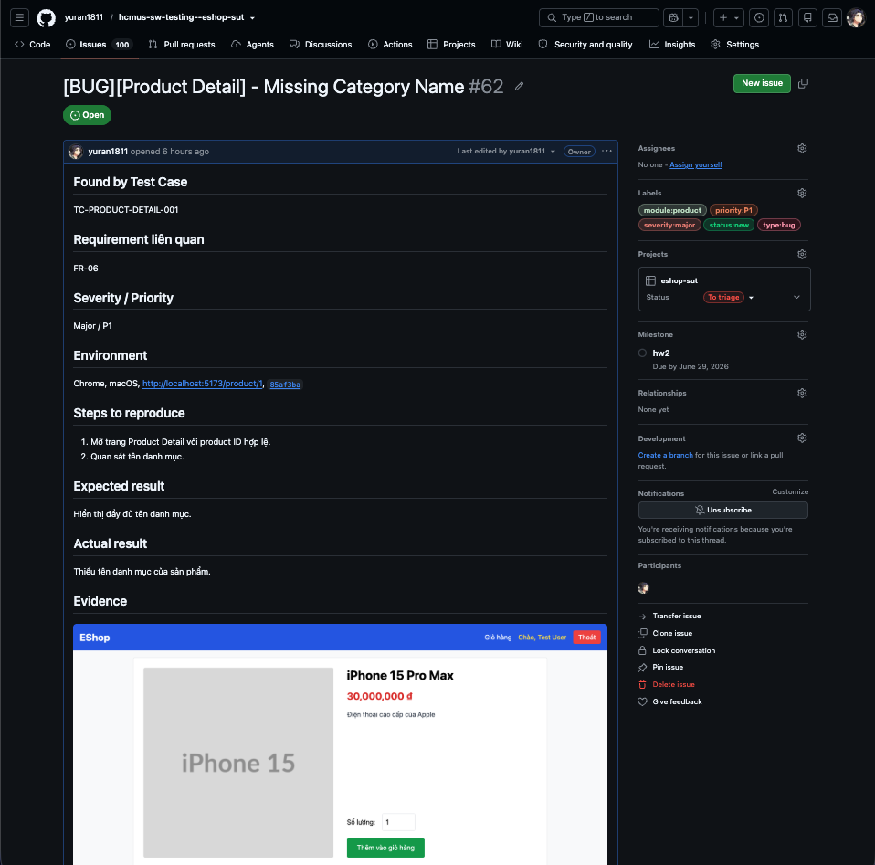

---

#### **BUG-06-02: [BUG][Product Detail] - Must double-click to 'add to cart'; No badge/toast indicates the 'add to cart' action**

- **Issue ID**: #63
- **Severity / Priority**: Major / P1
- **Test Case**: TC-PRODUCT-DETAIL-004
- **Environment**: Chrome, macOS, http://localhost:5173/product/1, 85af3ba875c88283615e22cb108f13e2fccaf0e9
- **Steps to Reproduce**:
  1. Open the Product Detail page.
  2. Enter a valid quantity.
  3. Click "Add to Cart" once.

- **Expected Result**:
  Product added immediately and navbar has a quantity badge.

- **Actual Result**:
  Must double-click to add, and navbar does not display the quantity badge.

- **Evidence**:
  

---

#### **BUG-06-03: [BUG][Product Detail] - Product with invalid quantity still be added to cart**

- **Issue ID**: #64
- **Severity / Priority**: Major / P1
- **Test Case**: TC-PRODUCT-DETAIL-005 / TC-PRODUCT-DETAIL-006 / TC-PRODUCT-DETAIL-007 / TC-PRODUCT-DETAIL-008 / TC-PRODUCT-DETAIL-009
- **Environment**: Chrome, macOS, http://localhost:5173/product/1, 85af3ba875c88283615e22cb108f13e2fccaf0e9
- **Steps to Reproduce**:
  1. Open the Product Detail page.
  2. Enter an invalid quantity, e.g., `0`, `-1`, `1.5`, `e`, `,`, `.` or similar values; or leave the quantity empty.
  3. Click "Add to Cart".

- **Expected Result**:
  System rejects quantity <= 0, non-numeric values, empty quantity, and displays appropriate error.

- **Actual Result**:
  Invalid quantity is still accepted and product is added to cart instead of being rejected.

- **Evidence**:
  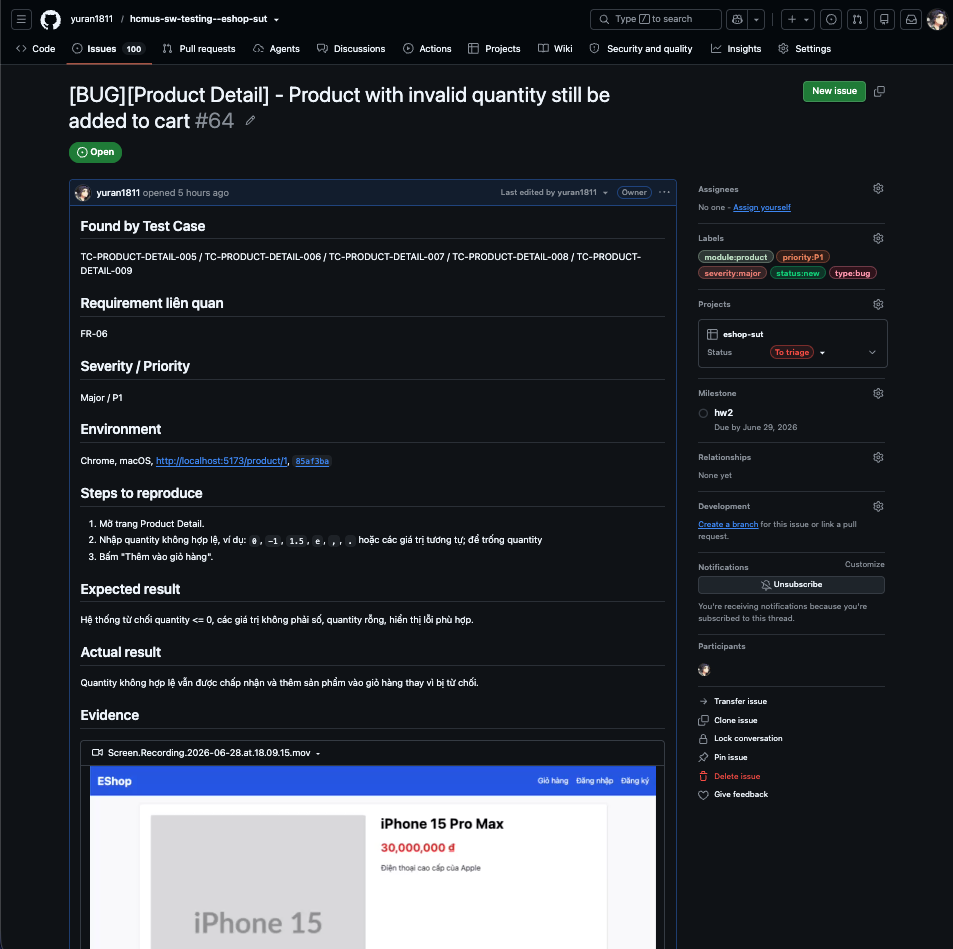

---

#### **BUG-06-04: [BUG][Product Detail] - Un-auth user can add to cart**

- **Issue ID**: #65
- **Severity / Priority**: Major / P1
- **Test Case**: TC-PRODUCT-DETAIL-012
- **Environment**: Chrome, macOS, http://localhost:5173/product/1, 85af3ba875c88283615e22cb108f13e2fccaf0e9
- **Steps to Reproduce**:
  1. Open the Product Detail page when not logged in.
  2. Enter a valid quantity.
  3. Click "Add to Cart".

- **Expected Result**:
  Must prompt login or redirect to the login page.

- **Actual Result**:
  Guest user can still successfully add the product to the cart.

- **Evidence**:
  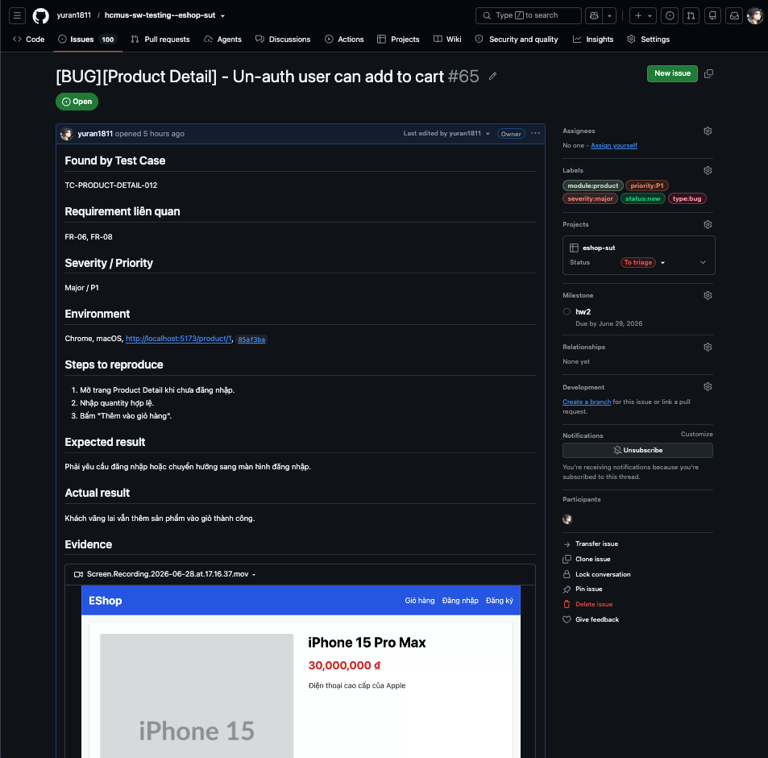

---

#### **BUG-06-05: [BUG][Product Detail] - Missing breadcrumb**

- **Issue ID**: #66
- **Severity / Priority**: Minor / P2
- **Test Case**: TC-PRODUCT-DETAIL-013
- **Environment**: Chrome, macOS, http://localhost:5173/product/1, 85af3ba875c88283615e22cb108f13e2fccaf0e9
- **Steps to Reproduce**:
  1. Open /product/:id page.
  2. Observe the navigation area at the top.

- **Expected Result**:
  Display full breadcrumb.

- **Actual Result**:
  No breadcrumb is present on the page.

- **Evidence**:
  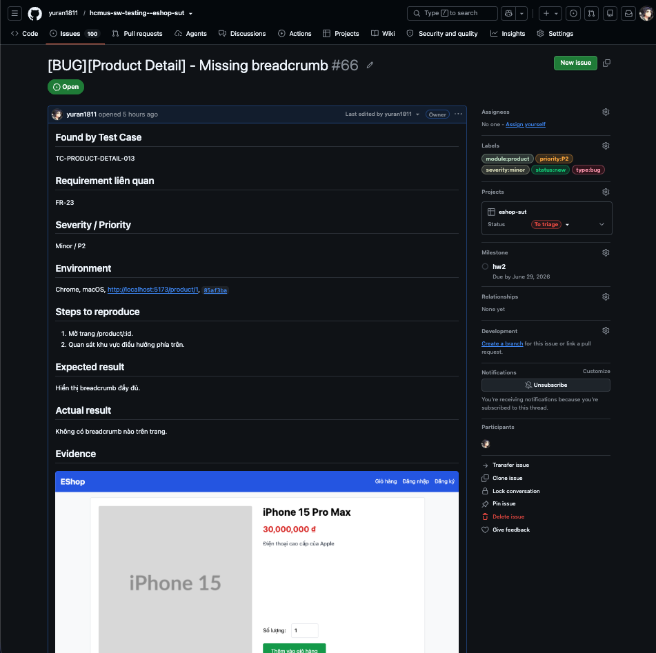

---

## FR-09

### Domain Testing

#### **Domain Testing Process:**

1. **Identify input variables:** For the coupon application feature, the key input variables directly affecting business logic are:
   - `code`: Coupon code entered by the user.
   - `total_amount`: Current total order amount.
   - `Authentication state (JWT Token)`: Indicates whether the user is logged in.
   - `usage_count`: Number of times the current user has used this coupon.
   - `discount_type`: Coupon type (percentage or fixed amount discount).
2. **Determine domain rules and Equivalence Partitioning:**
   - Partition equivalence classes for each variable (as detailed in the analysis tables below).
3. **Select representative values:** Select specific coupons in the system such as `SAVE10` (percentage type, min order 300k, max 1 use), `BIGBUY` (fixed type, min order 500k, max 1 use), and `VIP100` (fixed type, min order 300k, max 2 uses) as test data.
4. **Establish test cases:** Use the Single Fault Assumption to combine values, designing a total of 11 test cases from TC-COUPON-001 to TC-COUPON-011.

#### **Input Domain Analysis:**

##### **Variable 1: code (Entered coupon code)**

| Partition Code | Partition Type | Partition Description                          | Representative Value |
| :------------- | :------------- | :--------------------------------------------- | :------------------- |
| EP-CODE-1      | Valid          | Coupon exists in DB and is active              | `SAVE10`             |
| EP-CODE-2      | Invalid        | Coupon does not exist in DB                    | `NOTEXIST`           |
| EP-CODE-3      | Invalid        | Coupon exists but is deactivated (is_active=0) | `INACTIVE`           |
| EP-CODE-4      | Invalid        | Coupon exists but has expired                  | `EXPIRED`            |

##### **Variable 2: total_amount (Total order amount)**

| Partition Code | Partition Type | Partition Description                                      | Representative Value |
| :------------- | :------------- | :--------------------------------------------------------- | :------------------- |
| EP-TOTAL-1     | Valid          | Greater than the minimum order threshold of the coupon     | `400,000` (SAVE10)   |
| EP-TOTAL-2     | Valid          | Exactly equal to the minimum order threshold of the coupon | `500,000` (BIGBUY)   |
| EP-TOTAL-3     | Invalid        | Less than the minimum order threshold of the coupon        | `299,999` (SAVE10)   |
| EP-TOTAL-4     | Invalid        | Empty order (equal to 0)                                   | `0`                  |

##### **Variable 3: Authentication state (JWT Token)**

| Partition Code | Partition Type | Partition Description                     | Representative Value     |
| :------------- | :------------- | :---------------------------------------- | :----------------------- |
| EP-AUTH-1      | Valid          | User is logged in (has a valid JWT token) | Logged into test account |
| EP-AUTH-2      | Invalid        | User is not logged in (guest user)        | No JWT token sent        |

##### **Variable 4: User usage count (usage_count vs max_uses_per_user)**

| Partition Code | Partition Type | Partition Description               | Representative Value  |
| :------------- | :------------- | :---------------------------------- | :-------------------- |
| EP-USAGE-1     | Valid          | Usage count < maximum coupon limit  | `0` (SAVE10, max = 1) |
| EP-USAGE-2     | Invalid        | Usage count >= maximum coupon limit | `1` (SAVE10, max = 1) |

##### **Variable 5: Coupon type (discount_type)**

| Partition Code | Partition Type | Partition Description              | Representative Value |
| :------------- | :------------- | :--------------------------------- | :------------------- |
| EP-TYPE-1      | Valid          | Discount by percentage (`percent`) | `percent` (SAVE10)   |
| EP-TYPE-2      | Valid          | Discount by fixed amount (`fixed`) | `fixed` (BIGBUY)     |

#### **List of Test Cases Designed by Domain Testing:**

| Test Case ID  | Test Case Description                                          | Tested Partition(s)                                     | Expected Result                                                     |
| :------------ | :------------------------------------------------------------- | :------------------------------------------------------ | :------------------------------------------------------------------ |
| TC-COUPON-001 | Apply coupon SAVE10 (10% discount) to order of 400,000 ₫       | EP-CODE-1, EP-TOTAL-1, EP-AUTH-1, EP-USAGE-1, EP-TYPE-1 | Successfully applied, discount 40,000 ₫, total payment 360,000 ₫    |
| TC-COUPON-002 | Apply coupon BIGBUY (50k discount) to order of 500,000 ₫       | EP-TOTAL-2, EP-TYPE-2, other valid partitions           | Successfully applied, discount 50,000 ₫, total payment 450,000 ₫    |
| TC-COUPON-003 | Enter non-existent coupon in DB ("NOTEXIST")                   | EP-CODE-2                                               | Error: "Coupon code does not exist..."                              |
| TC-COUPON-004 | Enter deactivated coupon (is_active=0)                         | EP-CODE-3                                               | Error: "Coupon code does not exist..." or invalid                   |
| TC-COUPON-005 | Enter expired coupon                                           | EP-CODE-4                                               | Error: "Coupon has expired"                                         |
| TC-COUPON-006 | Apply coupon SAVE10 to order of 299,999 ₫ (min threshold 300k) | EP-TOTAL-3                                              | Error: "Order does not meet minimum threshold"                      |
| TC-COUPON-007 | Apply coupon SAVE10 to order of 0 ₫                            | EP-TOTAL-4                                              | Error: "Order does not meet minimum threshold"                      |
| TC-COUPON-008 | Apply coupon when not logged in                                | EP-AUTH-2                                               | Error: "Authentication required to apply coupon" (401 Unauthorized) |
| TC-COUPON-009 | Apply coupon SAVE10 when usage limit reached (max=1, usage=1)  | EP-USAGE-2                                              | Error: "You have already used this coupon code"                     |
| TC-COUPON-010 | Apply coupon VIP100 for the second time (max=2, usage=1)       | EP-USAGE-1 (below limit)                                | Successfully applied, discount 100,000 ₫                            |
| TC-COUPON-011 | Apply coupon VIP100 for the third time (max=2, usage=2)        | EP-USAGE-2 (limit reached)                              | Error: "You have already used this coupon code"                     |

### Boundary Value Analysis (BVA)

#### **Boundary Value Analysis (BVA) Process:**

1. **Identify boundary variables:** Variables with specific business boundaries include:
   - `total_amount`: Has a minimum boundary (`min_order_amount`) depending on each coupon.
   - `usage_count`: Has a maximum boundary (`max_uses_per_user`) depending on each coupon.
2. **Identify boundary test points (3-value BVA or customized 2-value):**
   - **Boundary B1: total_amount for coupon SAVE10 (min = 300,000 ₫):**
     - OFF (min - 1) = `299,999 ₫` (Rejected).
     - ON (min) = `300,000 ₫` (Accepted).
     - IN (min + 1) = `300,001 ₫` (Accepted).
   - **Boundary B2: total_amount for coupon BIGBUY (min = 500,000 ₫):**
     - OFF (min - 1) = `499,999 ₫` (Rejected).
     - ON (min) = `500,000 ₫` (Accepted).
     - IN (min + 1) = `500,001 ₫` (Accepted).
   - **Boundary B3: usage_count for coupon SAVE10 (max = 1):**
     - ON (max - 1) = `0` uses (Accepted).
     - OFF (max) = `1` uses (Rejected).
   - **Boundary B4: usage_count for coupon VIP100 (max = 2):**
     - ON (max - 1) = `1` uses (Accepted).
     - OFF (max) = `2` uses (Rejected).
3. **Map and supplement test cases:**
   - The OFF boundary points are already tested in the domain testing section (`TC-COUPON-006` and `TC-COUPON-009`).
   - Link the ON/OFF/IN points with the existing test case list or add new cases (from TC-COUPON-012 to TC-COUPON-015) for full coverage.

#### **Boundary Value Analysis Table:**

##### **Boundary B1 & B2: total_amount**

- **SAVE10** (Closed minimum boundary, min = 300,000 ₫, step size = 1 ₫):
  | Boundary Test Point | Test Value | Expected Result | Linked Test Case |
  | :------------------ | :--------- | :-------------- | :--------------- |
  | OFF (min - 1) | `299,999 ₫` | Rejected | TC-COUPON-006 |
  | ON (min) | `300,000 ₫` | Accepted | TC-COUPON-012 |
  | IN (min + 1) | `300,001 ₫` | Accepted | TC-COUPON-013 |

- **BIGBUY** (Closed minimum boundary, min = 500,000 ₫, step size = 1 ₫):
  | Boundary Test Point | Test Value | Expected Result | Linked Test Case |
  | :------------------ | :--------- | :-------------- | :--------------- |
  | OFF (min - 1) | `499,999 ₫` | Rejected | TC-COUPON-014 |
  | ON (min) | `500,000 ₫` | Accepted | TC-COUPON-002 |
  | IN (min + 1) | `500,001 ₫` | Accepted | TC-COUPON-015 |

##### **Boundary B3 & B4: usage_count (Usage count)**

- **SAVE10** (Closed maximum boundary, max = 1, step size = 1):
  | Boundary Test Point | Test Value | Expected Result | Linked Test Case |
  | :------------------ | :--------- | :-------------- | :--------------- |
  | ON (max - 1) | `0` uses | Accepted | TC-COUPON-001 |
  | OFF (max) | `1` uses | Rejected | TC-COUPON-009 |

- **VIP100** (Closed maximum boundary, max = 2, step size = 1):
  | Boundary Test Point | Test Value | Expected Result | Linked Test Case |
  | :------------------ | :--------- | :-------------- | :--------------- |
  | ON (max - 1) | `1` uses | Accepted | TC-COUPON-010 |
  | OFF (max) | `2` uses | Rejected | TC-COUPON-011 |

#### **List of Test Cases Designed by BVA:**

| Test Case ID  | Test Case Description                     | Tested Boundary | Boundary Point | Value     | Expected Result           |
| :------------ | :---------------------------------------- | :-------------- | :------------- | :-------- | :------------------------ |
| TC-COUPON-006 | Apply coupon SAVE10 to order of 299,999 ₫ | B1 (SAVE10 min) | OFF            | 299,999 ₫ | Rejected                  |
| TC-COUPON-012 | Apply coupon SAVE10 to order of 300,000 ₫ | B1 (SAVE10 min) | ON             | 300,000 ₫ | Accepted and discount 30k |
| TC-COUPON-013 | Apply coupon SAVE10 to order of 300,001 ₫ | B1 (SAVE10 min) | IN             | 300,001 ₫ | Accepted and discount 30k |
| TC-COUPON-014 | Apply coupon BIGBUY to order of 499,999 ₫ | B2 (BIGBUY min) | OFF            | 499,999 ₫ | Rejected                  |
| TC-COUPON-002 | Apply coupon BIGBUY to order of 500,000 ₫ | B2 (BIGBUY min) | ON             | 500,000 ₫ | Accepted and discount 50k |
| TC-COUPON-015 | Apply coupon BIGBUY to order of 500,001 ₫ | B2 (BIGBUY min) | IN             | 500,001 ₫ | Accepted and discount 50k |
| TC-COUPON-001 | Apply coupon SAVE10 when usage_count = 0  | B3 (SAVE10 max) | ON             | 0 uses    | Accepted                  |
| TC-COUPON-009 | Apply coupon SAVE10 when usage_count = 1  | B3 (SAVE10 max) | OFF            | 1 uses    | Rejected                  |
| TC-COUPON-010 | Apply coupon VIP100 when usage_count = 1  | B4 (VIP100 max) | ON             | 1 uses    | Accepted                  |
| TC-COUPON-011 | Apply coupon VIP100 when usage_count = 2  | B4 (VIP100 max) | OFF            | 2 uses    | Rejected                  |

### AI Gap Analysis

For the Coupon Application feature (FR-09), the AI exhibited significant gaps in logical reasoning and boundary testing:

- **Violation of the Single Fault Assumption:** The test case `TC-COUPON-011` initially designed by the AI combined two separate faults (an expired coupon and an order amount below the minimum threshold). This makes debugging and isolating the root cause ambiguous when the test case fails.
- **Discrepancy in representative values:** In the partition for order amount below the minimum threshold (`EP-TOTAL-3`), the representative value was declared as `299,999 ₫`, but in the actual test case `TC-COUPON-006`, the AI used a value of `200,000 ₫`, breaking traceability.
- **Incorrect selection of valid partition test points:** For the valid order amount partition `EP-TOTAL-1`, the AI selected `300,000 ₫` as the representative value. This is actually the boundary ON point for the `SAVE10` coupon rather than an interior point (`IN` point) deep within the partition. This causes unnecessary overlap with BVA.
- **Redundant cases and missing boundaries:** The AI generated redundant test cases (e.g., `TC-COUPON-013` and `TC-COUPON-017`, which did not provide any new coverage) while completely omitting boundary testing for the `BIGBUY` coupon (500,000 ₫ threshold), empty coupon code input (`""`), and the maximum usage boundary for the `VIP100` coupon (max = 2).

**Root cause:** When facing features with multiple co-dependent constraints (such as active duration, minimum order threshold, and user usage limits), the AI tends to suffer from context overload, leading it to combine multiple faults in a single test case, select representative values that overlap with boundary points, and fail to optimize the total number of test cases.

### Bug Report

| Bug ID    | Title                                                                    | Severity   | Detecting Test Case          | GitHub Link                                                                     |
| :-------- | :----------------------------------------------------------------------- | :--------- | :--------------------------- | :------------------------------------------------------------------------------ |
| BUG-09-01 | [BUG][Coupon] - SAVE10 make the final price too high (wrong calculation) | Major / P1 | TC-COUPON-001, TC-COUPON-013 | [Issue #67](https://github.com/yuran1811/hcmus-sw-testing--eshop-sut/issues/67) |
| BUG-09-02 | [BUG][Coupon] - BIGBUY be rejected at its threshold                      | Major / P1 | TC-COUPON-002, TC-COUPON-012 | [Issue #69](https://github.com/yuran1811/hcmus-sw-testing--eshop-sut/issues/69) |
| BUG-09-03 | [BUG][Coupon] - Un-auth user can apply the coupon                        | Major / P1 | TC-COUPON-008                | [Issue #97](https://github.com/yuran1811/hcmus-sw-testing--eshop-sut/issues/97) |

---

#### **BUG-09-01: [BUG][Coupon] - SAVE10 make the final price too high (wrong calculation)**

- **Issue ID**: #67
- **Severity / Priority**: Major / P1
- **Test Case**: TC-COUPON-001, TC-COUPON-013
- **Environment**: Chrome, macOS, http://localhost:5173/checkout, 85af3ba875c88283615e22cb108f13e2fccaf0e9
- **Steps to Reproduce**:
  1. Apply coupon SAVE10 to a valid order.
  2. Observe the discount amount and total payment.

- **Expected Result**:
  Percentage discount must be calculated correctly based on discount_value.

- **Actual Result**:
  Backend uses an incorrect formula that causes the total invoice amount to spike.

- **Evidence**:
  

---

#### **BUG-09-02: [BUG][Coupon] - BIGBUY be rejected at its threshold**

- **Issue ID**: #69
- **Severity / Priority**: Major / P1
- **Test Case**: TC-COUPON-002, TC-COUPON-012
- **Environment**: Chrome, macOS, http://localhost:5173/checkout, 85af3ba875c88283615e22cb108f13e2fccaf0e9
- **Steps to Reproduce**:
  1. Apply coupon BIGBUY to an order exactly equal to min_order_amount.
  2. Check the system response.

- **Expected Result**:
  Orders matching the exact minimum threshold must be accepted.

- **Actual Result**:
  The system rejects the coupon due to using a > comparison instead of >=.

- **Evidence**:
  

---

#### **BUG-09-03: [BUG][Coupon] - Un-auth user can apply the coupon**

- **Issue ID**: #97
- **Severity / Priority**: Major / P1
- **Test Case**: TC-COUPON-008
- **Environment**: Chrome, macOS, http://localhost:5173/checkout, 85af3ba875c88283615e22cb108f13e2fccaf0e9
- **Steps to Reproduce**:
  1. Call API /api/apply-coupon when not logged in.
  2. Observe the system response.

- **Expected Result**:
  Must return an authentication error.

- **Actual Result**:
  API allows unauthenticated guest users to successfully apply the coupon.

- **Evidence**:
  

---

## FR-17

### Domain Testing

#### **Domain Testing Process:**

1. **Identify input variables for coupon creation/management (Admin):**
   - `code`: Coupon code (string).
   - `type`: Coupon type (`percent` or `fixed`).
   - `discount_value`: Discount value (float/integer).
   - `expired_at`: Expiration date (date string).
   - `min_order_amount`: Minimum order amount (float/integer).
   - `max_uses_per_user`: Maximum uses per user (integer).
   - `Authentication / Authorization`: Admin API access permission (JWT token: Admin, User, Guest).
2. **Determine domain rules and Equivalence Partitioning:**
   - Partition valid and invalid equivalence classes for each variable (as detailed in the tables below).
3. **Select representative values:** Select specific values within each partition to design test cases.
4. **Establish test cases:** Apply the Single Fault Assumption, designing 17 primary test cases (TC-COUPON-ADMIN-001 to TC-COUPON-ADMIN-017) and additional cases covering boundaries, formats, and security.

#### **Input Domain Analysis:**

##### **Variable 1: code (Coupon code)**

| Partition Code | Partition Type | Partition Description                        | Representative Value |
| :------------- | :------------- | :------------------------------------------- | :------------------- |
| EP-CODE-1      | Valid          | Unique, non-empty string                     | `"SUMMER25"`         |
| EP-CODE-2      | Invalid        | Empty string (field left blank)              | `""`                 |
| EP-CODE-3      | Invalid        | Duplicates an existing coupon code in the DB | `"SAVE10"`           |

##### **Variable 2: type (Discount type)**

| Partition Code | Partition Type | Partition Description                        | Representative Value |
| :------------- | :------------- | :------------------------------------------- | :------------------- |
| EP-TYPE-1      | Valid          | Percentage type (`percent`)                  | `"percent"`          |
| EP-TYPE-2      | Valid          | Fixed amount type (`fixed`)                  | `"fixed"`            |
| EP-TYPE-3      | Invalid        | Value outside the valid set {percent, fixed} | `"voucher"`          |

##### **Variable 3: discount_value (Discount value)**

| Partition Code | Partition Type | Partition Description | Representative Value                      |
| :------------- | :------------- | :-------------------- | :---------------------------------------- |
| EP-DV-1        | Valid          | Positive number (> 0) | `15` (for percent) or `50000` (for fixed) |
| EP-DV-2        | Invalid        | Value is 0            | `0`                                       |
| EP-DV-3        | Invalid        | Negative value        | `-10`                                     |

##### **Variable 4: expired_at (Expiration date)**

| Partition Code | Partition Type | Partition Description                      | Representative Value |
| :------------- | :------------- | :----------------------------------------- | :------------------- |
| EP-EXP-1       | Valid          | Date in the future (ISO format YYYY-MM-DD) | `"2099-12-31"`       |
| EP-EXP-2       | Invalid        | Required field left blank                  | `""`                 |
| EP-EXP-3       | Invalid        | Incorrect date format                      | `"31-12-2099"`       |

##### **Variable 5: min_order_amount (Minimum order threshold)**

| Partition Code | Partition Type | Partition Description                            | Representative Value |
| :------------- | :------------- | :----------------------------------------------- | :------------------- |
| EP-MOA-1       | Valid          | Equal to 0 (no minimum order threshold required) | `0`                  |
| EP-MOA-2       | Valid          | Positive number (> 0)                            | `200,000`            |
| EP-MOA-3       | Invalid        | Negative number                                  | `-1`                 |

##### **Variable 6: max_uses_per_user (Maximum uses per user)**

| Partition Code | Partition Type | Partition Description | Representative Value |
| :------------- | :------------- | :-------------------- | :------------------- |
| EP-MPU-1       | Valid          | Equal to 1            | `1`                  |
| EP-MPU-2       | Valid          | Positive integer > 1  | `5`                  |
| EP-MPU-3       | Invalid        | Equal to 0            | `0`                  |
| EP-MPU-4       | Invalid        | Negative number       | `-1`                 |

##### **Variable 7: Authentication / Authorization**

| Partition Code | Partition Type | Partition Description                           | Representative Value |
| :------------- | :------------- | :---------------------------------------------- | :------------------- |
| EP-ROLE-1      | Valid          | Logged in with Admin role                       | admin@eshop.com      |
| EP-ROLE-2      | Invalid        | Not logged in (no JWT Token sent)               | No token sent        |
| EP-ROLE-3      | Invalid        | Logged in with User role (no admin permissions) | test@eshop.com       |

#### **List of Test Cases Designed by Domain Testing:**

| Test Case ID        | Test Case Description                                             | Tested Partition(s)                                                                             | Expected Result                                                       |
| :------------------ | :---------------------------------------------------------------- | :---------------------------------------------------------------------------------------------- | :-------------------------------------------------------------------- |
| TC-COUPON-ADMIN-001 | Successfully create a percentage coupon                           | All valid EP variables (EP-CODE-1, EP-TYPE-1, EP-DV-1, EP-EXP-1, EP-MOA-2, EP-MPU-2, EP-ROLE-1) | Return status 201/200; coupon saved in DB                             |
| TC-COUPON-ADMIN-002 | Successfully create a fixed coupon                                | EP-TYPE-2, other valid EP variables                                                             | Return status 201/200; coupon saved in DB                             |
| TC-COUPON-ADMIN-003 | Leave coupon code blank when creating coupon                      | EP-CODE-2                                                                                       | Return status 400 Bad Request and error code empty                    |
| TC-COUPON-ADMIN-004 | Create coupon with duplicate code (SAVE10)                        | EP-CODE-3                                                                                       | Return status 400 Bad Request and error code duplicates               |
| TC-COUPON-ADMIN-005 | Create coupon with invalid type ("voucher")                       | EP-TYPE-3                                                                                       | Return status 400 Bad Request and error invalid type                  |
| TC-COUPON-ADMIN-006 | Create coupon with discount_value = 0                             | EP-DV-2                                                                                         | Return status 400 and error discount must be positive                 |
| TC-COUPON-ADMIN-007 | Create coupon with negative discount_value (-10)                  | EP-DV-3                                                                                         | Return status 400 and error discount must be positive                 |
| TC-COUPON-ADMIN-008 | Leave expired_at blank when creating coupon                       | EP-EXP-2                                                                                        | Return status 400 and error expiration date required                  |
| TC-COUPON-ADMIN-009 | Create coupon with invalid expired_at format ("31-12-2099")       | EP-EXP-3                                                                                        | Return status 400 and error invalid date format                       |
| TC-COUPON-ADMIN-010 | Create coupon with negative min_order_amount (-1)                 | EP-MOA-3                                                                                        | Return status 400 and error minimum threshold cannot be negative      |
| TC-COUPON-ADMIN-011 | Create coupon with max_uses_per_user = 0                          | EP-MPU-3                                                                                        | Return status 400 and error max uses must be >= 1                     |
| TC-COUPON-ADMIN-012 | Create coupon with negative max_uses_per_user (-1)                | EP-MPU-4                                                                                        | Return status 400 and error max uses must be >= 1                     |
| TC-COUPON-ADMIN-013 | Delete coupon with a valid and existing ID                        | Delete operation, EP-ROLE-1                                                                     | Return status 200/204; coupon deleted from system                     |
| TC-COUPON-ADMIN-014 | Delete coupon with a non-existent ID                              | Delete operation, EP-ROLE-1                                                                     | Return status 404 Not Found                                           |
| TC-COUPON-ADMIN-015 | Get list of coupons                                               | Read operation, EP-ROLE-1                                                                       | Return status 200 and list of all coupons                             |
| TC-COUPON-ADMIN-016 | Create coupon when not logged in                                  | EP-ROLE-2                                                                                       | Return status 401 Unauthorized                                        |
| TC-COUPON-ADMIN-017 | Create coupon with user role                                      | EP-ROLE-3                                                                                       | Return status 403 Forbidden                                           |
| TC-COUPON-ADMIN-024 | Create coupon with expired_at in the past                         | Exploratory test on expiration date                                                             | Return status 400 and reject past date                                |
| TC-COUPON-ADMIN-025 | POST payload missing code field completely in body                | Missing required field                                                                          | Return status 400 and error missing required field                    |
| TC-COUPON-ADMIN-026 | Create coupon with code containing malicious script (XSS testing) | Security testing (XSS)                                                                          | System stores or displays safely escaped value without rendering HTML |

### Boundary Value Analysis (BVA)

#### **Boundary Value Analysis (BVA) Process:**

1. **Identify boundary variables:** Numeric input fields with a minimum boundary include:
   - `discount_value`: Must be greater than 0 (> 0). Open minimum boundary.
   - `min_order_amount`: Must be non-negative (>= 0). Closed minimum boundary.
   - `max_uses_per_user`: Must be greater than or equal to 1 (>= 1). Closed minimum boundary.
2. **Identify boundary test points (3-value BVA):**
   - **Boundary B1: discount_value (open boundary > 0, step size = 1):**
     - OFF (boundary) = `0` (Rejected).
     - ON (min + 1) = `1` (Accepted).
     - IN (min + 2) = `2` (Accepted).
   - **Boundary B2: min_order_amount (closed boundary >= 0, step size = 1):**
     - OFF (min - 1) = `-1` (Rejected).
     - ON (min) = `0` (Accepted).
     - IN (min + 1) = `1` (Accepted).
   - **Boundary B3: max_uses_per_user (closed boundary >= 1, step size = 1):**
     - OFF (min - 1) = `0` (Rejected).
     - ON (min) = `1` (Accepted).
     - IN (min + 1) = `2` (Accepted).
3. **Map and supplement test cases:**
   - Link boundary OFF points already tested in domain testing.
   - Add ON and IN test cases (from TC-COUPON-ADMIN-018 to TC-COUPON-ADMIN-023) to fully verify boundary behaviors.

#### **Boundary Value Analysis Table:**

##### **Boundary B1: discount_value (open boundary > 0)**

| Boundary Test Point | Test Value | Expected Result                   | Linked Test Case    |
| :------------------ | :--------- | :-------------------------------- | :------------------ |
| OFF (boundary)      | `0`        | Rejected                          | TC-COUPON-ADMIN-006 |
| ON (min)            | `1`        | Accepted and successfully created | TC-COUPON-ADMIN-018 |
| IN (min + 1)        | `2`        | Accepted and successfully created | TC-COUPON-ADMIN-019 |

##### **Boundary B2: min_order_amount (closed boundary >= 0)**

| Boundary Test Point | Test Value | Expected Result                   | Linked Test Case    |
| :------------------ | :--------- | :-------------------------------- | :------------------ |
| OFF (min - 1)       | `-1`       | Rejected                          | TC-COUPON-ADMIN-010 |
| ON (min)            | `0`        | Accepted and successfully created | TC-COUPON-ADMIN-020 |
| IN (min + 1)        | `1`        | Accepted and successfully created | TC-COUPON-ADMIN-021 |

##### **Boundary B3: max_uses_per_user (closed boundary >= 1)**

| Boundary Test Point | Test Value | Expected Result                   | Linked Test Case    |
| :------------------ | :--------- | :-------------------------------- | :------------------ |
| OFF (min - 1)       | `0`        | Rejected                          | TC-COUPON-ADMIN-011 |
| ON (min)            | `1`        | Accepted and successfully created | TC-COUPON-ADMIN-022 |
| IN (min + 1)        | `2`        | Accepted and successfully created | TC-COUPON-ADMIN-023 |

#### **List of Test Cases Designed by BVA:**

| Test Case ID        | Test Case Description                                         | Tested Boundary | Boundary Point | Value | Expected Result                   |
| :------------------ | :------------------------------------------------------------ | :-------------- | :------------- | :---- | :-------------------------------- |
| TC-COUPON-ADMIN-006 | Create coupon with discount_value = 0                         | B1              | OFF            | 0     | Rejected                          |
| TC-COUPON-ADMIN-018 | Create coupon with discount_value = 1 (lowest positive value) | B1              | ON             | 1     | Accepted and successfully created |
| TC-COUPON-ADMIN-019 | Create coupon with discount_value = 2 (just above boundary)   | B1              | IN             | 2     | Accepted and successfully created |
| TC-COUPON-ADMIN-010 | Create coupon with min_order_amount = -1                      | B2              | OFF            | -1    | Rejected                          |
| TC-COUPON-ADMIN-020 | Create coupon with min_order_amount = 0                       | B2              | ON             | 0     | Accepted and successfully created |
| TC-COUPON-ADMIN-021 | Create coupon with min_order_amount = 1                       | B2              | IN             | 1     | Accepted and successfully created |
| TC-COUPON-ADMIN-011 | Create coupon with max_uses_per_user = 0                      | B3              | OFF            | 0     | Rejected                          |
| TC-COUPON-ADMIN-022 | Create coupon with max_uses_per_user = 1                      | B3              | ON             | 1     | Accepted and successfully created |
| TC-COUPON-ADMIN-023 | Create coupon with max_uses_per_user = 2                      | B3              | IN             | 2     | Accepted and successfully created |

### AI Gap Analysis

The Admin Coupon Management feature (FR-17) carries high complexity regarding roles, authorization, and input validation. The AI left behind several gaps in testing:

- **Severe redundancies between DT and BVA:** The AI designed 3 completely redundant test case pairs where the BVA OFF cases duplicated DT Invalid cases. These are: `TC-COUPON-ADMIN-018` duplicated `TC-COUPON-ADMIN-006` (discount = 0), `TC-COUPON-ADMIN-021` duplicated `TC-COUPON-ADMIN-010` (min_order < 0), and `TC-COUPON-ADMIN-024` duplicated `TC-COUPON-ADMIN-011` (max_uses = 0) in the original run.
- **Endpoint Hallucination:** The AI assumed the coupon listing endpoint was `GET /api/admin/coupons`. However, according to the actual API specification, the correct endpoint is `GET /api/coupons`, which handles both client and admin requests based on authorization middleware.
- **Omissions of real-world scenarios:** The AI missed critical test cases such as creating coupons with an expiration date in the past, sending a POST body completely missing the `code` property (rather than just sending `""`), inputting non-integer values for maximum uses, and detailed validation of all fields in the response body.

**Root cause:** The AI relied on generic RESTful API conventions (assuming admin routes are prefixed with `/api/admin/...`), hallucinating endpoints instead of strictly verifying the provided API specifications. It also failed to deduplicate overlapping test cases between Domain Testing and Boundary Value Analysis.

### Bug Report

| Bug ID    | Title                                                                   | Severity   | Detecting Test Case | GitHub Link                                                                       |
| :-------- | :---------------------------------------------------------------------- | :--------- | :------------------ | :-------------------------------------------------------------------------------- |
| BUG-17-01 | [BUG][Coupon Admin] - Allow to create coupon with `type="invalid"`      | Major / P1 | TC-COUPON-ADMIN-005 | [Issue #98](https://github.com/yuran1811/hcmus-sw-testing--eshop-sut/issues/98)   |
| BUG-17-02 | [BUG][Coupon Admin] - Allow to create coupon with `discount_value=0`    | Major / P1 | TC-COUPON-ADMIN-006 | [Issue #99](https://github.com/yuran1811/hcmus-sw-testing--eshop-sut/issues/99)   |
| BUG-17-03 | [BUG][Coupon Admin] - Allow to create coupon with `discount_value<0`    | Major / P1 | TC-COUPON-ADMIN-007 | [Issue #100](https://github.com/yuran1811/hcmus-sw-testing--eshop-sut/issues/100) |
| BUG-17-04 | [BUG][Coupon Admin] - Allow to create coupon with invalid `expired_at`  | Major / P1 | TC-COUPON-ADMIN-009 | [Issue #101](https://github.com/yuran1811/hcmus-sw-testing--eshop-sut/issues/101) |
| BUG-17-05 | [BUG][Coupon Admin] - Allow to create coupon with `min_order_amount<0`  | Major / P1 | TC-COUPON-ADMIN-010 | [Issue #102](https://github.com/yuran1811/hcmus-sw-testing--eshop-sut/issues/102) |
| BUG-17-06 | [BUG][Coupon Admin] - Allow to create coupon with `max_uses_per_user=0` | Major / P1 | TC-COUPON-ADMIN-011 | [Issue #103](https://github.com/yuran1811/hcmus-sw-testing--eshop-sut/issues/103) |
| BUG-17-07 | [BUG][Coupon Admin] - Allow to create coupon with `max_uses_per_user<0` | Major / P1 | TC-COUPON-ADMIN-012 | [Issue #104](https://github.com/yuran1811/hcmus-sw-testing--eshop-sut/issues/104) |
| BUG-17-08 | [BUG][Coupon Admin] - Delete non-exist coupon still get status `200`    | Major / P1 | TC-COUPON-ADMIN-014 | [Issue #105](https://github.com/yuran1811/hcmus-sw-testing--eshop-sut/issues/105) |
| BUG-17-09 | [BUG][Coupon Admin] - Non-admin user can create coupon                  | Major / P1 | TC-COUPON-ADMIN-017 | [Issue #106](https://github.com/yuran1811/hcmus-sw-testing--eshop-sut/issues/106) |
| BUG-17-10 | [BUG][Coupon Admin] - Allow to create coupon without `code` field       | Major / P1 | TC-COUPON-ADMIN-025 | [Issue #109](https://github.com/yuran1811/hcmus-sw-testing--eshop-sut/issues/109) |

---

#### **BUG-17-01: [BUG][Coupon Admin] - Allow to create coupon with `type="invalid"`**

- **Issue ID**: #98
- **Severity / Priority**: Major / P1
- **Test Case**: TC-COUPON-ADMIN-005
- **Environment**: Chrome, macOS, http://localhost:5174, 85af3ba875c88283615e22cb108f13e2fccaf0e9
- **Steps to Reproduce**:
  1. Send POST /api/admin/coupons with type = voucher.
  2. Check the status code.

- **Expected Result**:
  Backend must reject the invalid type.

- **Actual Result**:
  Backend accepts the type "voucher" and returns 200.

- **Evidence**:
  

---

#### **BUG-17-02: [BUG][Coupon Admin] - Allow to create coupon with `discount_value=0`**

- **Issue ID**: #99
- **Severity / Priority**: Major / P1
- **Test Case**: TC-COUPON-ADMIN-006
- **Environment**: Chrome, macOS, http://localhost:5174, 85af3ba875c88283615e22cb108f13e2fccaf0e9
- **Steps to Reproduce**:
  1. Send POST /api/admin/coupons with discount_value = 0.
  2. Check the status code.

- **Expected Result**:
  Backend must reject discount_value = 0.

- **Actual Result**:
  Backend accepts the request and returns 200.

- **Evidence**:
  

---

#### **BUG-17-03: [BUG][Coupon Admin] - Allow to create coupon with `discount_value<0`**

- **Issue ID**: #100
- **Severity / Priority**: Major / P1
- **Test Case**: TC-COUPON-ADMIN-007
- **Environment**: Chrome, macOS, http://localhost:5174, 85af3ba875c88283615e22cb108f13e2fccaf0e9
- **Steps to Reproduce**:
  1. Send POST /api/admin/coupons with a negative discount_value.
  2. Check the status code.

- **Expected Result**:
  Backend must reject negative values.

- **Actual Result**:
  Backend accepts negative discount_value and returns 200.

- **Evidence**:
  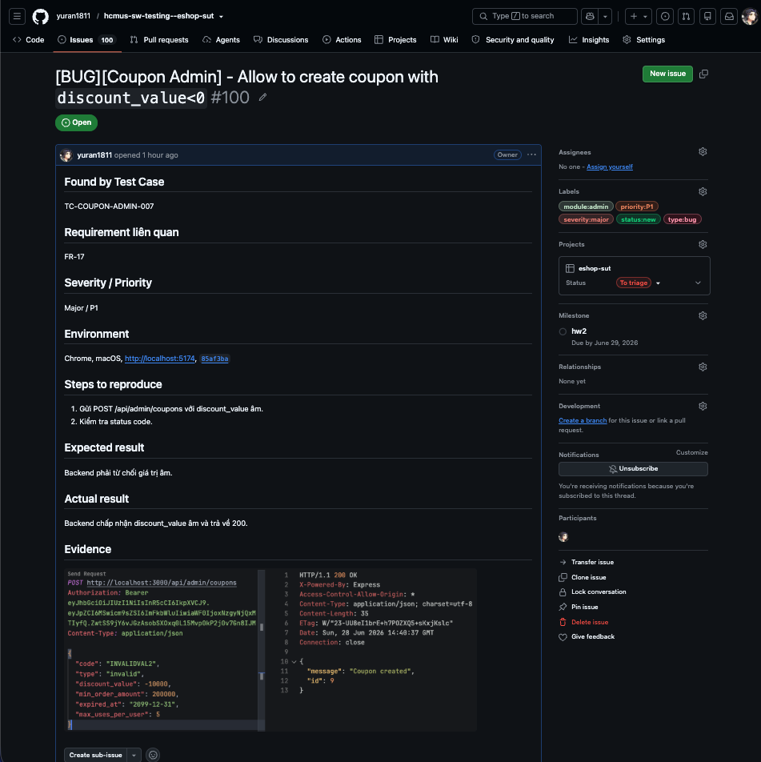

---

#### **BUG-17-04: [BUG][Coupon Admin] - Allow to create coupon with invalid `expired_at`**

- **Issue ID**: #101
- **Severity / Priority**: Major / P1
- **Test Case**: TC-COUPON-ADMIN-009
- **Environment**: Chrome, macOS, http://localhost:5174, 85af3ba875c88283615e22cb108f13e2fccaf0e9
- **Steps to Reproduce**:
  1. Send POST /api/admin/coupons with expired_at = 31-12-2099.
  2. Check the status code.

- **Expected Result**:
  Backend must reject the invalid date format.

- **Actual Result**:
  Backend accepts the invalid date format and returns 200.

- **Evidence**:
  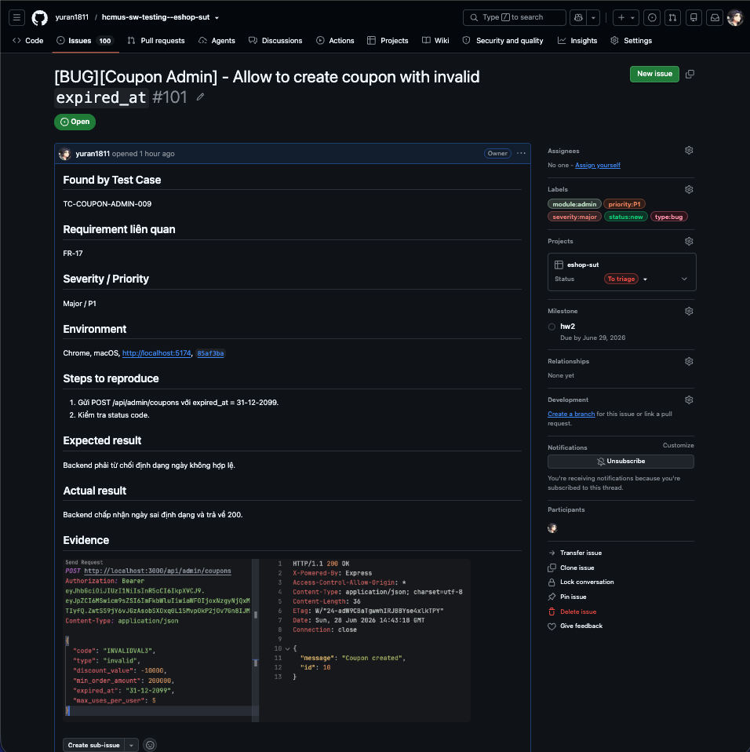

---

#### **BUG-17-05: [BUG][Coupon Admin] - Allow to create coupon with `min_order_amount<0`**

- **Issue ID**: #102
- **Severity / Priority**: Major / P1
- **Test Case**: TC-COUPON-ADMIN-010
- **Environment**: Chrome, macOS, http://localhost:5174, 85af3ba875c88283615e22cb108f13e2fccaf0e9
- **Steps to Reproduce**:
  1. Send POST /api/admin/coupons with min_order_amount = -1.
  2. Check the status code.

- **Expected Result**:
  Backend must reject negative values.

- **Actual Result**:
  Backend accepts negative min_order_amount and returns 200.

- **Evidence**:
  

---

#### **BUG-17-06: [BUG][Coupon Admin] - Allow to create coupon with `max_uses_per_user=0`**

- **Issue ID**: #103
- **Severity / Priority**: Major / P1
- **Test Case**: TC-COUPON-ADMIN-011
- **Environment**: Chrome, macOS, http://localhost:5174, 85af3ba875c88283615e22cb108f13e2fccaf0e9
- **Steps to Reproduce**:
  1. Send POST /api/admin/coupons with max_uses_per_user = 0.
  2. Check the status code.

- **Expected Result**:
  Backend must reject the value 0.

- **Actual Result**:
  Backend accepts max_uses_per_user = 0 and returns 200.

- **Evidence**:
  

---

#### **BUG-17-07: [BUG][Coupon Admin] - Allow to create coupon with `max_uses_per_user<0`**

- **Issue ID**: #104
- **Severity / Priority**: Major / P1
- **Test Case**: TC-COUPON-ADMIN-012
- **Environment**: Chrome, macOS, http://localhost:5174, 85af3ba875c88283615e22cb108f13e2fccaf0e9
- **Steps to Reproduce**:
  1. Send POST /api/admin/coupons with a negative max_uses_per_user.
  2. Check the status code.

- **Expected Result**:
  Backend must reject negative values.

- **Actual Result**:
  Backend accepts negative max_uses_per_user and returns 200.

- **Evidence**:
  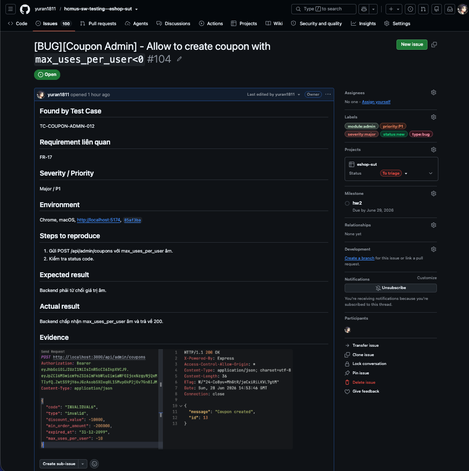

---

#### **BUG-17-08: [BUG][Coupon Admin] - Delete non-exist coupon still get status `200`**

- **Issue ID**: #105
- **Severity / Priority**: Major / P1
- **Test Case**: TC-COUPON-ADMIN-014
- **Environment**: Chrome, macOS, http://localhost:5174, 85af3ba875c88283615e22cb108f13e2fccaf0e9
- **Steps to Reproduce**:
  1. Send DELETE /api/admin/coupons/999999.
  2. Check the status code.

- **Expected Result**:
  Must return 4xx (e.g., 404 Not Found) when the coupon does not exist.

- **Actual Result**:
  API returns 200 instead of 404/4xx.

- **Evidence**:
  

---

#### **BUG-17-09: [BUG][Coupon Admin] - Non-admin user can create coupon**

- **Issue ID**: #106
- **Severity / Priority**: Major / P1
- **Test Case**: TC-COUPON-ADMIN-017
- **Environment**: Chrome, macOS, http://localhost:5174, 85af3ba875c88283615e22cb108f13e2fccaf0e9
- **Steps to Reproduce**:
  1. Log in with a user role account.
  2. Send POST /api/admin/coupons.

- **Expected Result**:
  Non-admin must receive 403 Forbidden.

- **Actual Result**:
  Authorization middleware is missing and request returns 200.

- **Evidence**:
  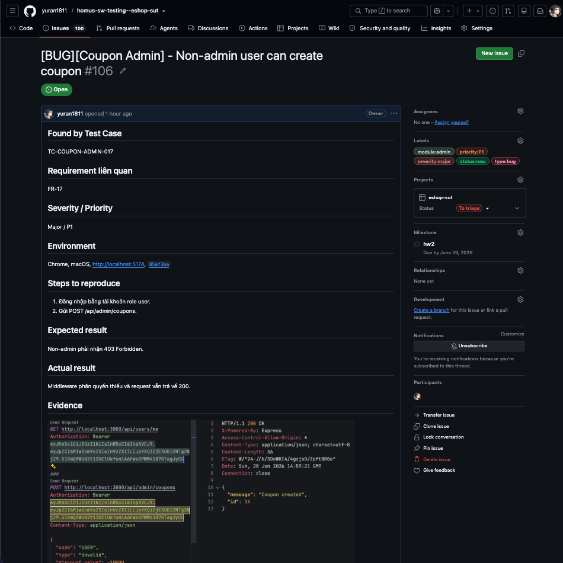

---

#### **BUG-17-10: [BUG][Coupon Admin] - Allow to create coupon without `code` field**

- **Issue ID**: #109
- **Severity / Priority**: Major / P1
- **Test Case**: TC-COUPON-ADMIN-025
- **Environment**: Chrome, macOS, http://localhost:5174, 85af3ba875c88283615e22cb108f13e2fccaf0e9
- **Steps to Reproduce**:
  1. Send POST /api/admin/coupons without the code field.
  2. Check the status code.

- **Expected Result**:
  Missing required fields must be rejected.

- **Actual Result**:
  Backend accepts the request and returns 200.

- **Evidence**:
  

---

## FR-20

### Domain Testing

#### **Domain Testing Process:**

1. **Identify input variables:** For the mobile cart feature, the key input variables and interactions affecting cart logic are:
   - `add_quantity`: Quantity added to cart from the product detail page.
   - `edit_quantity`: Quantity edited directly in the quantity input field on the cart page.
   - `auth_state`: Authentication state (logged in) when the user clicks the checkout button.
2. **Determine domain rules and Equivalence Partitioning:**
   - Partition valid and invalid equivalence classes for each variable (as detailed in the tables below).
3. **Select representative values:** Select specific representative values (e.g., `2`, `0`, `-1`, `1.5`, `""`, `"abc"`) for both adding and editing quantities, and the login state (logged in / guest).
4. **Establish test cases:** Use the Single Fault Assumption to combine values, designing a total of 17 test cases (TC-CART-MOBILE-001 to TC-CART-MOBILE-017).

#### **Input Domain Analysis:**

##### **Variable 1: add_quantity (Quantity added from product detail page)**

| Partition Code | Partition Type | Partition Description        | Representative Value |
| :------------- | :------------- | :--------------------------- | :------------------- |
| EP-AQ-1        | Valid          | Positive integer >= 1        | `2`                  |
| EP-AQ-2        | Invalid        | Value is 0                   | `0`                  |
| EP-AQ-3        | Invalid        | Negative integer             | `-1`                 |
| EP-AQ-4        | Invalid        | Decimal number               | `1.5`                |
| EP-AQ-5        | Invalid        | Input field left blank       | `""`                 |
| EP-AQ-6        | Invalid        | Non-numeric character string | `"abc"`              |

##### **Variable 2: edit_quantity (Quantity edited directly in the cart)**

| Partition Code | Partition Type | Partition Description        | Representative Value |
| :------------- | :------------- | :--------------------------- | :------------------- |
| EP-EQ-1        | Valid          | Positive integer >= 1        | `2`                  |
| EP-EQ-2        | Invalid        | Value is 0                   | `0`                  |
| EP-EQ-3        | Invalid        | Negative integer             | `-1`                 |
| EP-EQ-4        | Invalid        | Decimal number               | `1.5`                |
| EP-EQ-5        | Invalid        | Input field left blank       | `""`                 |
| EP-EQ-6        | Invalid        | Non-numeric character string | `"abc"`              |

##### **Variable 3: auth_state (Authentication state during checkout)**

| Partition Code | Partition Type | Partition Description                     | Representative Value     |
| :------------- | :------------- | :---------------------------------------- | :----------------------- |
| EP-AUTH-1      | Valid          | User is logged in (has a valid JWT token) | Logged into test account |
| EP-AUTH-2      | Invalid        | Unauthenticated guest user                | Not logged in            |

#### **List of Test Cases Designed by Domain Testing:**

| Test Case ID       | Test Case Description                                          | Tested Partition(s)    | Expected Result                                                              |
| :----------------- | :------------------------------------------------------------- | :--------------------- | :--------------------------------------------------------------------------- |
| TC-CART-MOBILE-001 | Add product from Home screen (default quantity = 1)            | EP-AQ-1 (default)      | Successfully add product with quantity 1                                     |
| TC-CART-MOBILE-002 | Add product from detail page with valid quantity (2)           | EP-AQ-1                | Successfully add product with quantity 2                                     |
| TC-CART-MOBILE-003 | Add product from detail page with quantity = 0                 | EP-AQ-2                | Reject or automatically normalize quantity to 1                              |
| TC-CART-MOBILE-004 | Add product from detail page with negative quantity (-1)       | EP-AQ-3                | Reject or automatically normalize quantity to 1                              |
| TC-CART-MOBILE-005 | Add product from detail page with decimal quantity (1.5)       | EP-AQ-4                | Reject or automatically normalize quantity to 1                              |
| TC-CART-MOBILE-006 | Add product from detail page with empty quantity               | EP-AQ-5                | Reject or automatically normalize quantity to 1                              |
| TC-CART-MOBILE-007 | Add product from detail page with non-numeric quantity ("abc") | EP-AQ-6                | Reject or automatically normalize quantity to 1                              |
| TC-CART-MOBILE-008 | Edit quantity directly in cart to valid quantity (2)           | EP-EQ-1                | Successfully update product quantity in cart to 2                            |
| TC-CART-MOBILE-009 | Edit quantity directly in cart to 0                            | EP-EQ-2                | Reject or automatically normalize quantity to 1 (or prompt confirm deletion) |
| TC-CART-MOBILE-010 | Edit quantity directly in cart to negative quantity (-1)       | EP-EQ-3                | Reject or automatically normalize quantity to 1                              |
| TC-CART-MOBILE-011 | Edit quantity directly in cart to decimal quantity (1.5)       | EP-EQ-4                | Reject or automatically normalize to a valid integer                         |
| TC-CART-MOBILE-012 | Edit quantity directly in cart to empty                        | EP-EQ-5                | Reject or automatically normalize quantity to 1                              |
| TC-CART-MOBILE-013 | Edit quantity directly in cart to non-numeric quantity ("abc") | EP-EQ-6                | Reject or automatically normalize quantity to 1                              |
| TC-CART-MOBILE-014 | Click "Remove" button to remove product from cart              | Click remove operation | Display confirm deletion dialog; clicking yes removes item from cart         |
| TC-CART-MOBILE-015 | Click "← Continue Shopping" link                               | Click link operation   | Redirect to Home page                                                        |
| TC-CART-MOBILE-016 | Unauthenticated user clicks checkout button                    | EP-AUTH-2              | Block checkout, display warning, and redirect to login page                  |
| TC-CART-MOBILE-017 | Authenticated user clicks checkout button                      | EP-AUTH-1              | Successfully redirect to Checkout page                                       |

### Boundary Value Analysis (BVA)

#### **Boundary Value Analysis (BVA) Process:**

1. **Identify boundary variables:** Quantity input fields have a strict minimum boundary of >= 1:
   - `add_quantity`: Strict minimum >= 1.
   - `edit_quantity`: Strict minimum >= 1.
2. **Identify boundary test points (3-value BVA):**
   - With a minimum boundary of $min = 1$ and a step size of $1$:
     - **OFF** (min - 1) = `0` (Rejected or automatically normalized to 1).
     - **ON** (min) = `1` (Accepted).
     - **IN** (min + 1) = `2` (Accepted).
3. **Map and supplement test cases:**
   - The OFF boundary points are already tested in domain testing (`TC-CART-MOBILE-003` and `TC-CART-MOBILE-009`).
   - Add test cases `TC-CART-MOBILE-018` and `TC-CART-MOBILE-019` for `add_quantity` boundary (ON, IN).
   - Add test cases `TC-CART-MOBILE-020` and `TC-CART-MOBILE-021` for `edit_quantity` boundary (ON, IN).

#### **Boundary Value Analysis Table:**

##### **Boundary B1: add_quantity (Closed minimum boundary >= 1)**

| Boundary Test Point | Test Value | Expected Result               | Linked Test Case   |
| :------------------ | :--------- | :---------------------------- | :----------------- |
| OFF (min - 1)       | `0`        | Automatically normalized to 1 | TC-CART-MOBILE-003 |
| ON (min)            | `1`        | Accepted quantity = 1         | TC-CART-MOBILE-018 |
| IN (min + 1)        | `2`        | Accepted quantity = 2         | TC-CART-MOBILE-019 |

##### **Boundary B2: edit_quantity (Closed minimum boundary >= 1)**

| Boundary Test Point | Test Value | Expected Result               | Linked Test Case   |
| :------------------ | :--------- | :---------------------------- | :----------------- |
| OFF (min - 1)       | `0`        | Automatically normalized to 1 | TC-CART-MOBILE-009 |
| ON (min)            | `1`        | Updated quantity = 1 in cart  | TC-CART-MOBILE-020 |
| IN (min + 1)        | `2`        | Updated quantity = 2 in cart  | TC-CART-MOBILE-021 |

#### **List of Test Cases Designed by BVA:**

| Test Case ID       | Test Case Description                          | Tested Boundary | Boundary Point | Value | Expected Result                                    |
| :----------------- | :--------------------------------------------- | :-------------- | :------------- | :---- | :------------------------------------------------- |
| TC-CART-MOBILE-003 | Add product from detail page with quantity = 0 | B1              | OFF            | 0     | Rejected or automatically normalized to quantity 1 |
| TC-CART-MOBILE-018 | Add product from detail page with quantity = 1 | B1              | ON             | 1     | Successfully added quantity 1                      |
| TC-CART-MOBILE-019 | Add product from detail page with quantity = 2 | B1              | IN             | 2     | Successfully added quantity 2                      |
| TC-CART-MOBILE-009 | Edit quantity directly in cart to 0            | B2              | OFF            | 0     | Rejected or automatically normalized to quantity 1 |
| TC-CART-MOBILE-020 | Edit quantity directly in cart to 1            | B2              | ON             | 1     | Successfully updated quantity in cart to 1         |
| TC-CART-MOBILE-021 | Edit quantity directly in cart to 2            | B2              | IN             | 2     | Successfully updated quantity in cart to 2         |

### AI Gap Analysis

The Mobile Cart feature (FR-20) requires specific mobile interface testing (mobile viewport, responsive layout) and quantity synchronization. Gaps in the AI's testing for this feature include:

- **Omitting Mobile-Specific Features:** Initially, the AI designed mobile cart test scenarios identical to the desktop cart (FR-07). It missed testing elements unique to or behaving differently on mobile, such as a sticky checkout button, minimized cart drawer/modal, and swipe-to-delete behaviors.
- **Incorrect Assessment of Badge Count Logic:** The AI failed to identify the system's logic error in calculating the cart badge quantity (the badge counted the number of unique product items instead of the sum of their quantities). The AI's original test case merely asserted "badge updated successfully" without verifying that the badge count must equal the total quantity.
- **Lack of Mobile UI Boundary Interaction Testing:** The AI did not design test cases for directly inputting invalid characters using a mobile virtual keyboard (where users might be restricted to numeric input but can still copy-paste special characters).

**Root cause:** The AI lacks visual perception of mobile layouts (mobile viewports) and touch/swipe interactions. It only tested pure logical data flows, thereby missing critical bugs related to the application's actual rendering and responsive behavior.

### Bug Report

| Bug ID    | Title                                                                                       | Severity   | Detecting Test Case                                                            | GitHub Link                                                                       |
| :-------- | :------------------------------------------------------------------------------------------ | :--------- | :----------------------------------------------------------------------------- | :-------------------------------------------------------------------------------- |
| BUG-20-01 | [BUG][Cart Mobile] - Edit quantity directly in cart cause bad quantity counting             | Major / P1 | TC-CART-MOBILE-008, TC-CART-MOBILE-011, TC-CART-MOBILE-020, TC-CART-MOBILE-021 | [Issue #114](https://github.com/yuran1811/hcmus-sw-testing--eshop-sut/issues/114) |
| BUG-20-02 | [BUG][Cart Mobile] - No confirm dialog on removing item from cart                           | Minor / P2 | TC-CART-MOBILE-014                                                             | [Issue #115](https://github.com/yuran1811/hcmus-sw-testing--eshop-sut/issues/115) |
| BUG-20-03 | [BUG][Cart Mobile] - Total label not display correctly                                      | Minor / P2 | TC-CART-MOBILE-022                                                             | [Issue #116](https://github.com/yuran1811/hcmus-sw-testing--eshop-sut/issues/116) |
| BUG-20-04 | [BUG][Cart Mobile] - Cart Badge count the number of different items, not the total quantity | Major / P1 | TC-CART-MOBILE-023                                                             | [Issue #117](https://github.com/yuran1811/hcmus-sw-testing--eshop-sut/issues/117) |
| BUG-20-05 | [BUG][Cart Mobile] - No illustration on empty state                                         | Minor / P2 | TC-CART-MOBILE-024                                                             | [Issue #118](https://github.com/yuran1811/hcmus-sw-testing--eshop-sut/issues/118) |

---

#### **BUG-20-01: [BUG][Cart Mobile] - Edit quantity directly in cart cause bad quantity counting**

- **Issue ID**: #114
- **Severity / Priority**: Major / P1
- **Test Case**: TC-CART-MOBILE-008, TC-CART-MOBILE-011, TC-CART-MOBILE-020, TC-CART-MOBILE-021
- **Environment**: Chrome, macOS, http://localhost:8081, 85af3ba875c88283615e22cb108f13e2fccaf0e9
- **Steps to Reproduce**:
  1. Add a product to the cart on mobile.
  2. Edit quantity directly in the cart to values like 1, 2, or other valid integers.
  3. Observe the navbar badge and the quantity in the cart.

- **Expected Result**:
  The badge and quantity must correctly reflect the total quantity of products.

- **Actual Result**:
  The system miscalculates the quantity after direct edits.

- **Evidence**:
  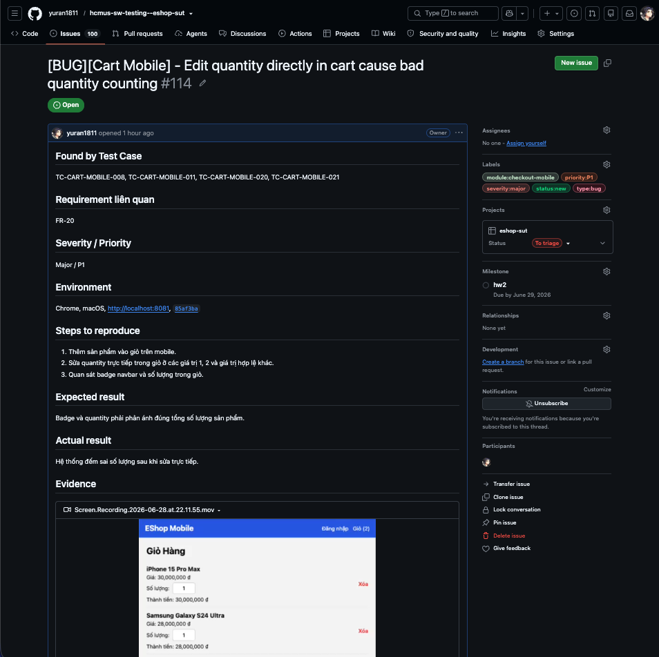

---

#### **BUG-20-02: [BUG][Cart Mobile] - No confirm dialog on removing item from cart**

- **Issue ID**: #115
- **Severity / Priority**: Minor / P2
- **Test Case**: TC-CART-MOBILE-014
- **Environment**: Chrome, macOS, http://localhost:8081, 85af3ba875c88283615e22cb108f13e2fccaf0e9
- **Steps to Reproduce**:
  1. Open the cart on mobile.
  2. Click the "Remove" button for a product.

- **Expected Result**:
  Must display a confirmation dialog before deleting.

- **Actual Result**:
  The product disappears immediately with no confirmation dialog.

- **Evidence**:
  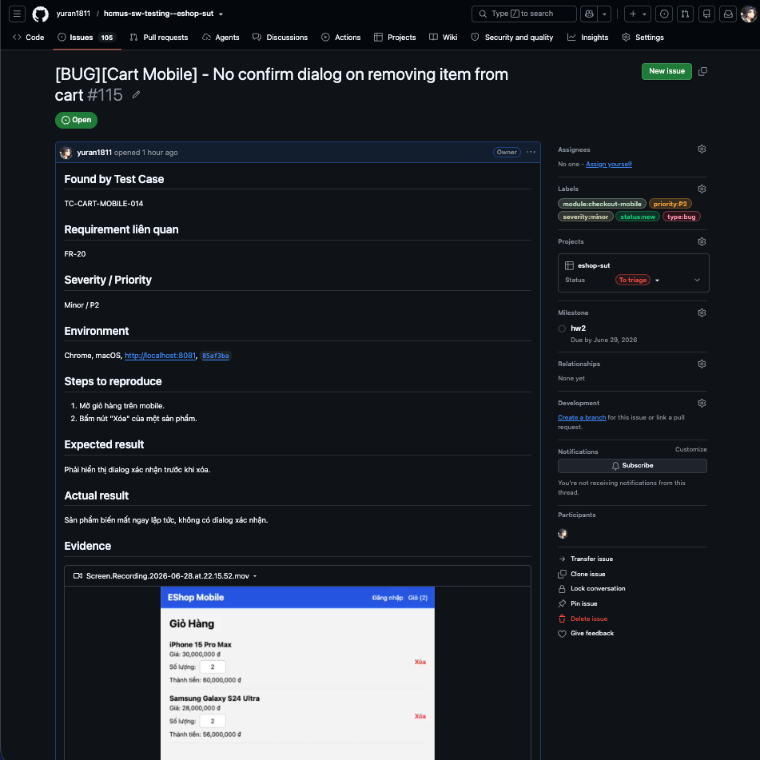

---

#### **BUG-20-03: [BUG][Cart Mobile] - Total label not display correctly**

- **Issue ID**: #116
- **Severity / Priority**: Minor / P2
- **Test Case**: TC-CART-MOBILE-022
- **Environment**: Chrome, macOS, http://localhost:8081, 85af3ba875c88283615e22cb108f13e2fccaf0e9
- **Steps to Reproduce**:
  1. Open the cart on mobile with a valid product.
  2. Observe the price, subtotal, and total label.

- **Expected Result**:
  Currency display must be consistent; label must be "Tổng cộng" (Total).

- **Actual Result**:
  The label displays as "Tổng tạm tính" (Subtotal).

- **Evidence**:
  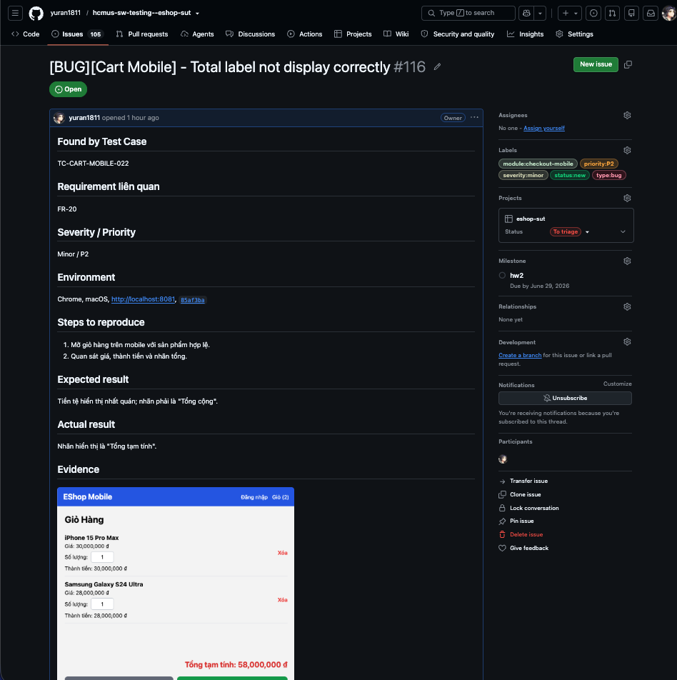

---

#### **BUG-20-04: [BUG][Cart Mobile] - Cart Badge count the number of different items, not the total quantity**

- **Issue ID**: #117
- **Severity / Priority**: Major / P1
- **Test Case**: TC-CART-MOBILE-023
- **Environment**: Chrome, macOS, http://localhost:8081, 85af3ba875c88283615e22cb108f13e2fccaf0e9
- **Steps to Reproduce**:
  1. Add 1 product with quantity = 2.
  2. Add another product with quantity = 1.
  3. Observe the navbar badge.

- **Expected Result**:
  The badge must display the total quantity of all items.

- **Actual Result**:
  The badge counts unique product items instead of total quantity.

- **Evidence**:
  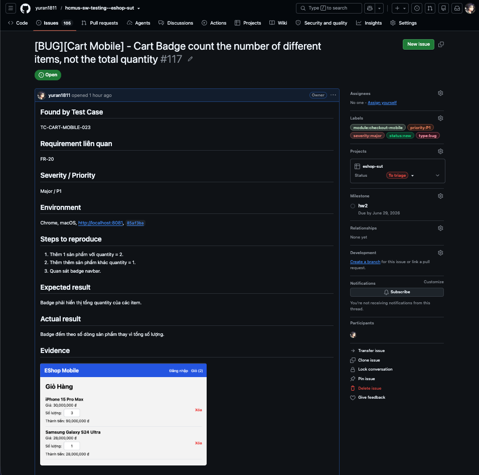

---

#### **BUG-20-05: [BUG][Cart Mobile] - No illustration on empty state**

- **Issue ID**: #118
- **Severity / Priority**: Minor / P2
- **Test Case**: TC-CART-MOBILE-024
- **Environment**: Chrome, macOS, http://localhost:8081, 85af3ba875c88283615e22cb108f13e2fccaf0e9
- **Steps to Reproduce**:
  1. Open an empty cart on mobile.
  2. Observe the empty state area.

- **Expected Result**:
  The empty state must feature an illustration or icon.

- **Actual Result**:
  Only text and a link are present, with no illustration.

- **Evidence**:
  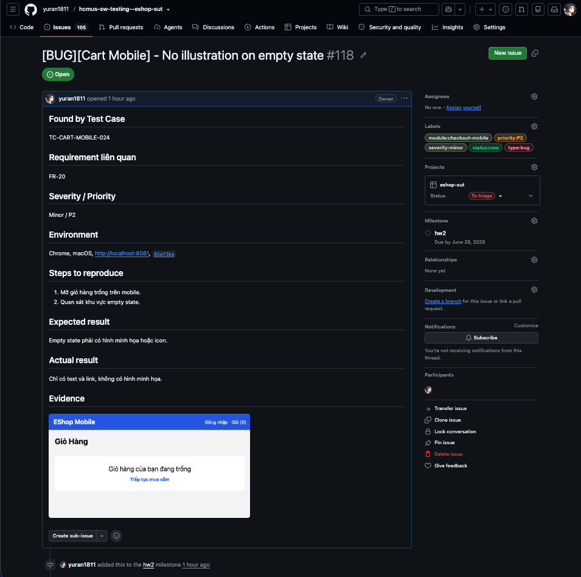

---
