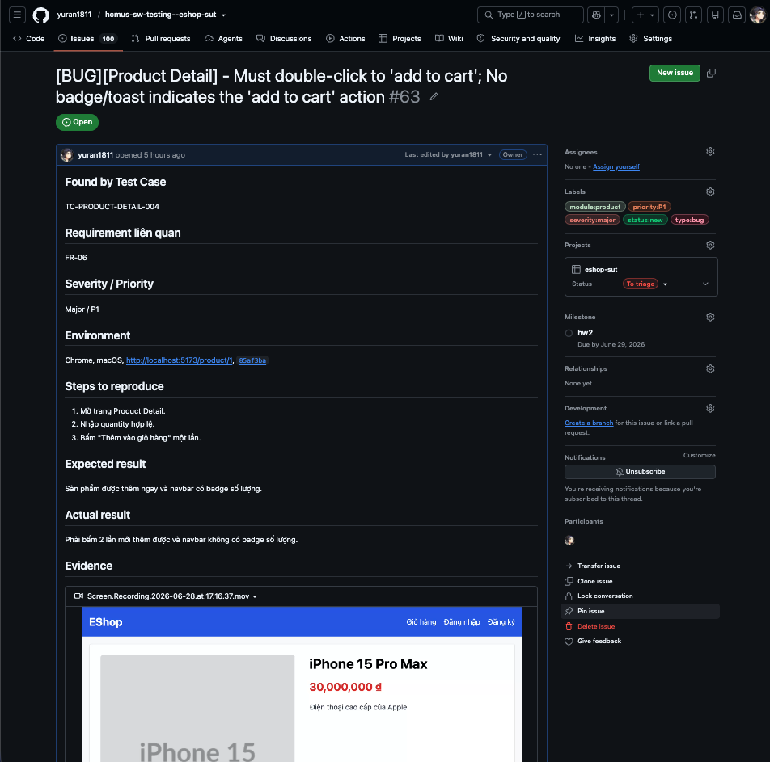
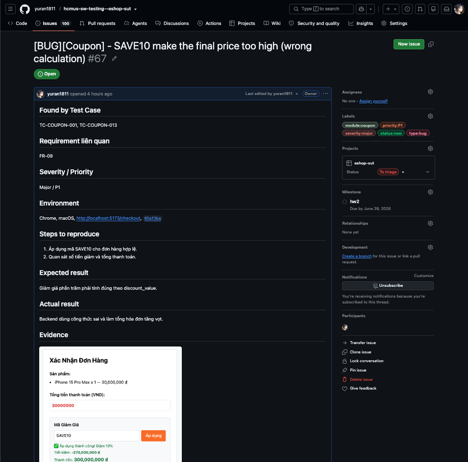
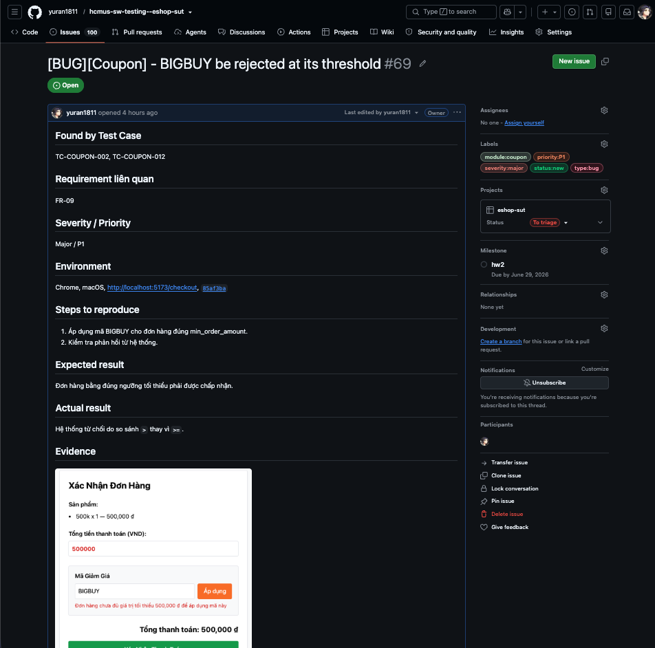
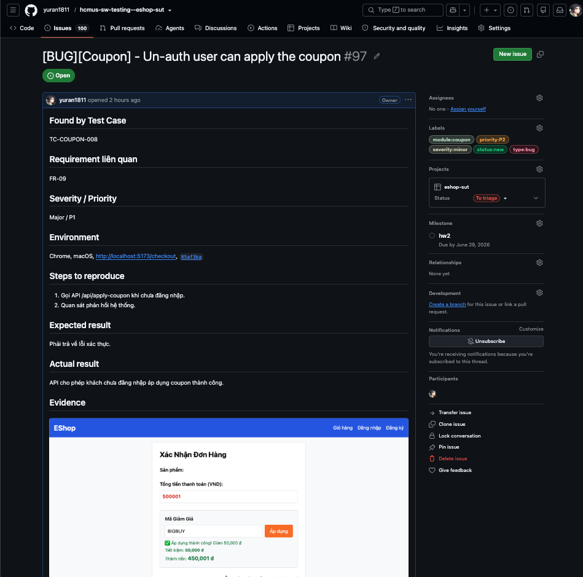
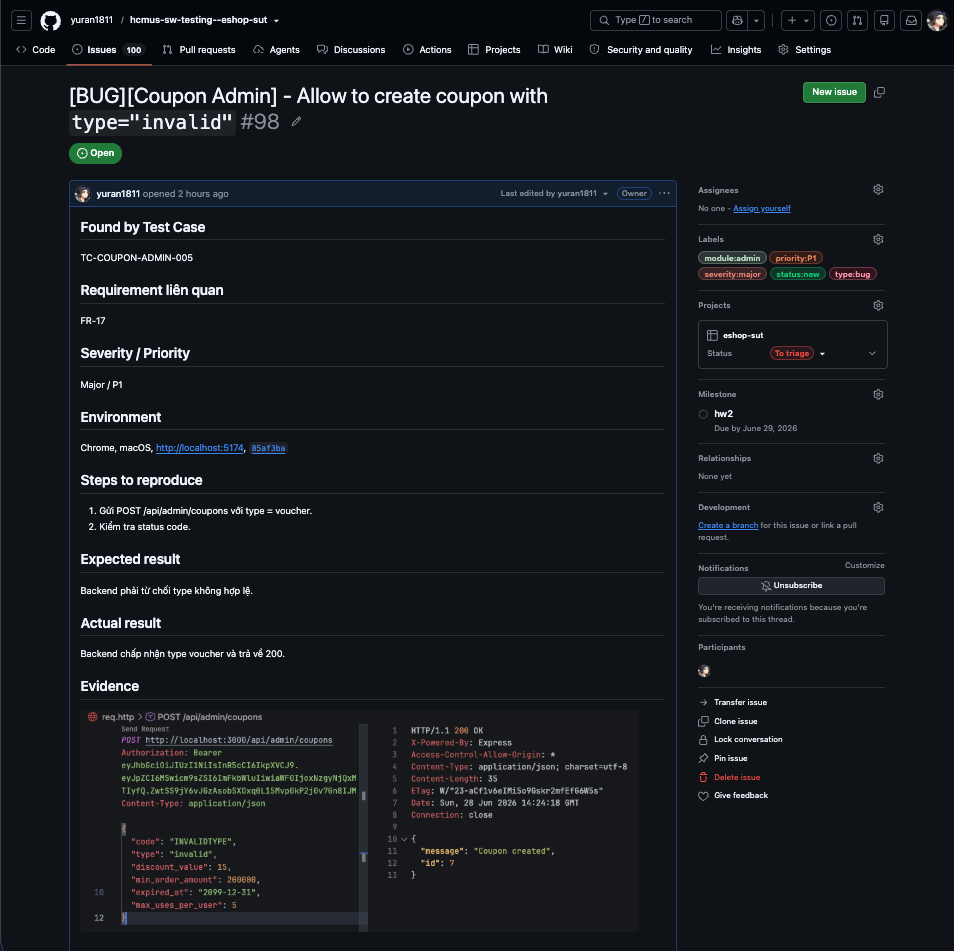
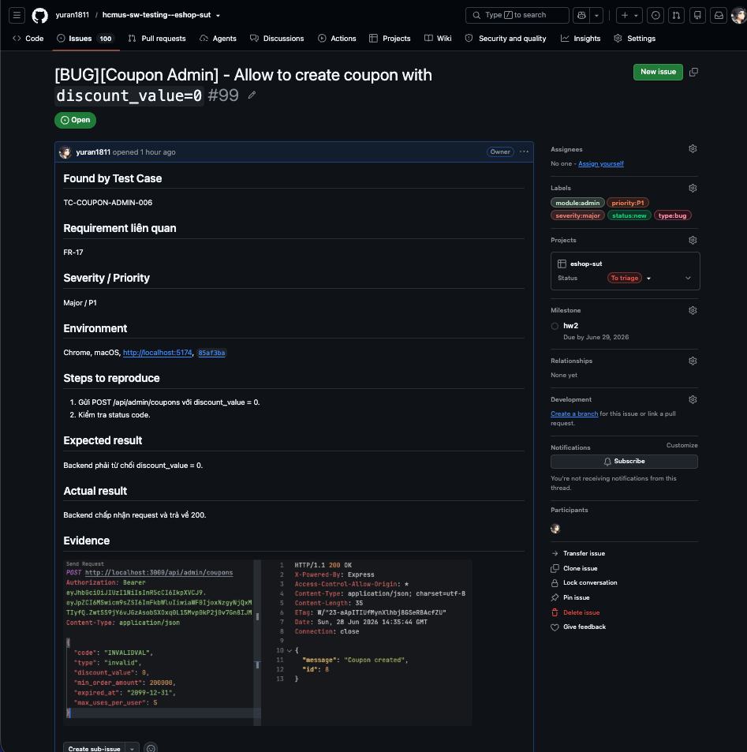
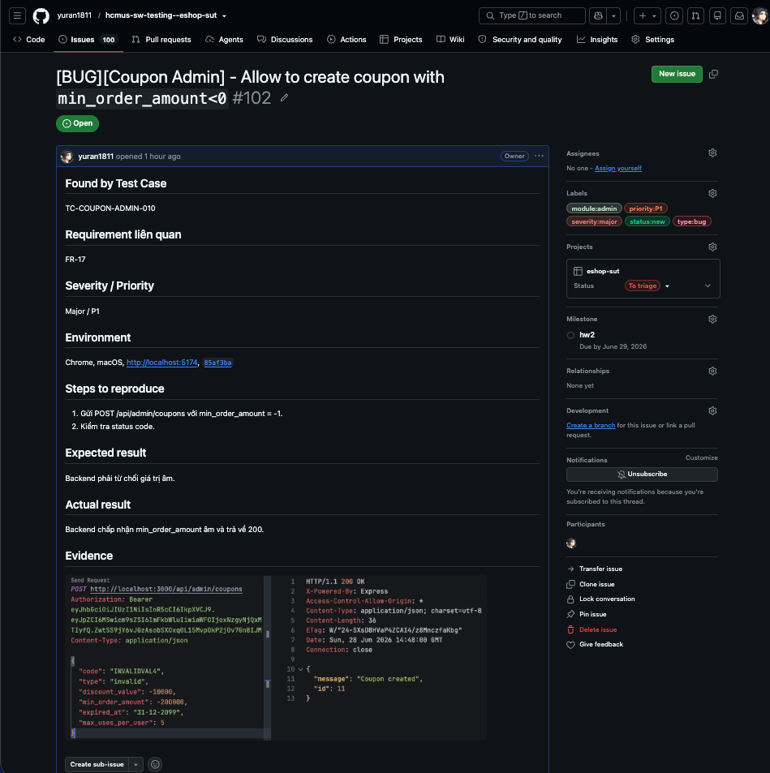
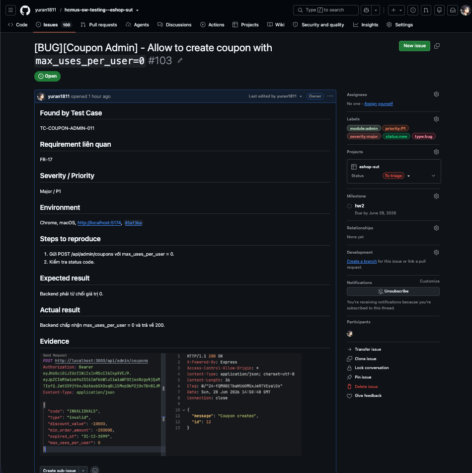
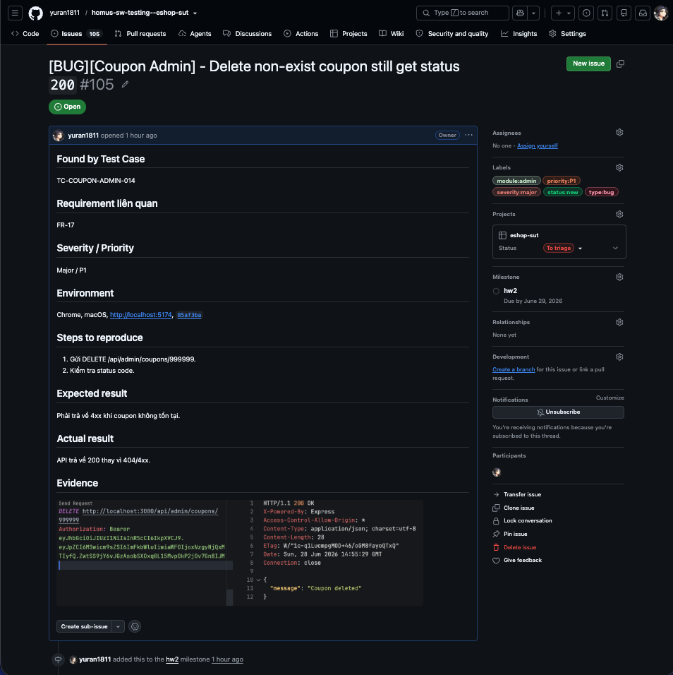
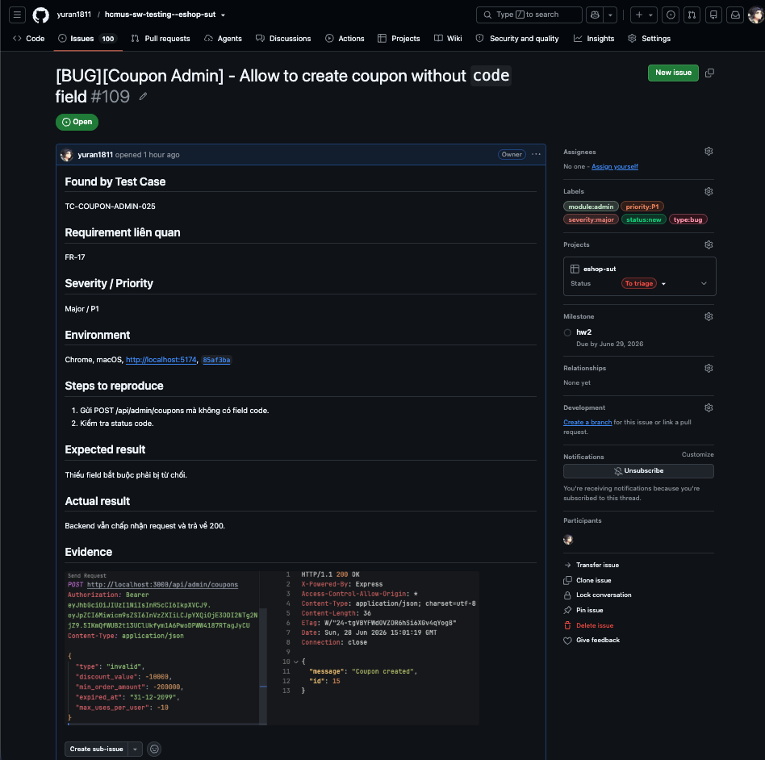

# Bug Report - HW02 Domain Testing on EShop

Báo cáo chi tiết các lỗi phát hiện được trong quá trình thực hiện kiểm thử hộp đen sử dụng kỹ thuật Phân hoạch tương đương (Domain Testing) và Phân tích giá trị biên (Boundary Value Analysis).

## 1. Overview Summary

| Bug ID | Feature / FR | Tên Lỗi (Title)                                                                                               | Mức Độ (Severity) | Test Case                                                                                                             | Link GitHub                                                                       |
| :----- | :----------- | :------------------------------------------------------------------------------------------------------------ | :---------------- | :-------------------------------------------------------------------------------------------------------------------- | :-------------------------------------------------------------------------------- |
| BUG-01 | FR-06        | [BUG][Product Detail] - Missing Category Name                                                                 | Major / P1        | TC-PRODUCT-DETAIL-001                                                                                                 | [Issue #62](https://github.com/yuran1811/hcmus-sw-testing--eshop-sut/issues/62)   |
| BUG-02 | FR-06        | [BUG][Product Detail] - Must double-click to 'add to cart'; No badge/toast indicates the 'add to cart' action | Major / P1        | TC-PRODUCT-DETAIL-004                                                                                                 | [Issue #63](https://github.com/yuran1811/hcmus-sw-testing--eshop-sut/issues/63)   |
| BUG-03 | FR-06        | [BUG][Product Detail] - Product with invalid quantity still be added to cart                                  | Major / P1        | TC-PRODUCT-DETAIL-005 / TC-PRODUCT-DETAIL-006 / TC-PRODUCT-DETAIL-007 / TC-PRODUCT-DETAIL-008 / TC-PRODUCT-DETAIL-009 | [Issue #64](https://github.com/yuran1811/hcmus-sw-testing--eshop-sut/issues/64)   |
| BUG-04 | FR-06        | [BUG][Product Detail] - Un-auth user can add to cart                                                          | Major / P1        | TC-PRODUCT-DETAIL-012                                                                                                 | [Issue #65](https://github.com/yuran1811/hcmus-sw-testing--eshop-sut/issues/65)   |
| BUG-05 | FR-06        | [BUG][Product Detail] - Missing breadcrumb                                                                    | Minor / P2        | TC-PRODUCT-DETAIL-013                                                                                                 | [Issue #66](https://github.com/yuran1811/hcmus-sw-testing--eshop-sut/issues/66)   |
| BUG-06 | FR-09        | [BUG][Coupon] - SAVE10 make the final price too high (wrong calculation)                                      | Major / P1        | TC-COUPON-001, TC-COUPON-013                                                                                          | [Issue #67](https://github.com/yuran1811/hcmus-sw-testing--eshop-sut/issues/67)   |
| BUG-07 | FR-09        | [BUG][Coupon] - BIGBUY be rejected at its threshold                                                           | Major / P1        | TC-COUPON-002, TC-COUPON-012                                                                                          | [Issue #69](https://github.com/yuran1811/hcmus-sw-testing--eshop-sut/issues/69)   |
| BUG-08 | FR-09        | [BUG][Coupon] - Un-auth user can apply the coupon                                                             | Major / P1        | TC-COUPON-008                                                                                                         | [Issue #97](https://github.com/yuran1811/hcmus-sw-testing--eshop-sut/issues/97)   |
| BUG-09 | FR-17        | [BUG][Coupon Admin] - Allow to create coupon with `type="invalid"`                                            | Major / P1        | TC-COUPON-ADMIN-005                                                                                                   | [Issue #98](https://github.com/yuran1811/hcmus-sw-testing--eshop-sut/issues/98)   |
| BUG-10 | FR-17        | [BUG][Coupon Admin] - Allow to create coupon with `discount_value=0`                                          | Major / P1        | TC-COUPON-ADMIN-006                                                                                                   | [Issue #99](https://github.com/yuran1811/hcmus-sw-testing--eshop-sut/issues/99)   |
| BUG-11 | FR-17        | [BUG][Coupon Admin] - Allow to create coupon with `discount_value<0`                                          | Major / P1        | TC-COUPON-ADMIN-007                                                                                                   | [Issue #100](https://github.com/yuran1811/hcmus-sw-testing--eshop-sut/issues/100) |
| BUG-12 | FR-17        | [BUG][Coupon Admin] - Allow to create coupon with invalid `expired_at`                                        | Major / P1        | TC-COUPON-ADMIN-009                                                                                                   | [Issue #101](https://github.com/yuran1811/hcmus-sw-testing--eshop-sut/issues/101) |
| BUG-13 | FR-17        | [BUG][Coupon Admin] - Allow to create coupon with `min_order_amount<0`                                        | Major / P1        | TC-COUPON-ADMIN-010                                                                                                   | [Issue #102](https://github.com/yuran1811/hcmus-sw-testing--eshop-sut/issues/102) |
| BUG-14 | FR-17        | [BUG][Coupon Admin] - Allow to create coupon with `max_uses_per_user=0`                                       | Major / P1        | TC-COUPON-ADMIN-011                                                                                                   | [Issue #103](https://github.com/yuran1811/hcmus-sw-testing--eshop-sut/issues/103) |
| BUG-15 | FR-17        | [BUG][Coupon Admin] - Allow to create coupon with `max_uses_per_user<0`                                       | Major / P1        | TC-COUPON-ADMIN-012                                                                                                   | [Issue #104](https://github.com/yuran1811/hcmus-sw-testing--eshop-sut/issues/104) |
| BUG-16 | FR-17        | [BUG][Coupon Admin] - Delete non-exist coupon still get status `200`                                          | Major / P1        | TC-COUPON-ADMIN-014                                                                                                   | [Issue #105](https://github.com/yuran1811/hcmus-sw-testing--eshop-sut/issues/105) |
| BUG-17 | FR-17        | [BUG][Coupon Admin] - Non-admin user can create coupon                                                        | Major / P1        | TC-COUPON-ADMIN-017                                                                                                   | [Issue #106](https://github.com/yuran1811/hcmus-sw-testing--eshop-sut/issues/106) |
| BUG-18 | FR-17        | [BUG][Coupon Admin] - Allow to create coupon without `code` field                                             | Major / P1        | TC-COUPON-ADMIN-025                                                                                                   | [Issue #109](https://github.com/yuran1811/hcmus-sw-testing--eshop-sut/issues/109) |
| BUG-19 | FR-20        | [BUG][Cart Mobile] - Edit quantity directly in cart cause bad quantity counting                               | Major / P1        | TC-CART-MOBILE-008, TC-CART-MOBILE-011, TC-CART-MOBILE-020, TC-CART-MOBILE-021                                        | [Issue #114](https://github.com/yuran1811/hcmus-sw-testing--eshop-sut/issues/114) |
| BUG-20 | FR-20        | [BUG][Cart Mobile] - No confirm dialog on removing item from cart                                             | Minor / P2        | TC-CART-MOBILE-014                                                                                                    | [Issue #115](https://github.com/yuran1811/hcmus-sw-testing--eshop-sut/issues/115) |
| BUG-21 | FR-20        | [BUG][Cart Mobile] - Total label not display correctly                                                        | Minor / P2        | TC-CART-MOBILE-022                                                                                                    | [Issue #116](https://github.com/yuran1811/hcmus-sw-testing--eshop-sut/issues/116) |
| BUG-22 | FR-20        | [BUG][Cart Mobile] - Cart Badge count the number of different items, not the total quantity                   | Major / P1        | TC-CART-MOBILE-023                                                                                                    | [Issue #117](https://github.com/yuran1811/hcmus-sw-testing--eshop-sut/issues/117) |
| BUG-23 | FR-20        | [BUG][Cart Mobile] - No illustration on empty state                                                           | Minor / P2        | TC-CART-MOBILE-024                                                                                                    | [Issue #118](https://github.com/yuran1811/hcmus-sw-testing--eshop-sut/issues/118) |

---

## 2. Detailed Bug Reports

### Feature FR-06

#### **BUG-01 (Issue #62): [BUG][Product Detail] - Missing Category Name**

- **Độ nghiêm trọng / Độ ưu tiên**: Major / P1
- **Requirement liên quan**: FR-06
- **Test Case**: TC-PRODUCT-DETAIL-001
- **Môi trường**: Chrome, macOS, http://localhost:5173/product/1, 85af3ba875c88283615e22cb108f13e2fccaf0e9
- **Link GitHub Issue**: [#62](https://github.com/yuran1811/hcmus-sw-testing--eshop-sut/issues/62)

##### **Các bước tái hiện (Steps to Reproduce)**

1. Mở trang Product Detail với product ID hợp lệ.
2. Quan sát tên danh mục.

##### **Kết quả mong đợi (Expected Result)**

Hiển thị đầy đủ tên danh mục.

##### **Kết quả thực tế (Actual Result)**

Thiếu tên danh mục của sản phẩm.

##### **Minh chứng (Evidence)**

---

#### **BUG-02 (Issue #63): [BUG][Product Detail] - Must double-click to 'add to cart'; No badge/toast indicates the 'add to cart' action**

- **Độ nghiêm trọng / Độ ưu tiên**: Major / P1
- **Requirement liên quan**: FR-06
- **Test Case**: TC-PRODUCT-DETAIL-004
- **Môi trường**: Chrome, macOS, http://localhost:5173/product/1, 85af3ba875c88283615e22cb108f13e2fccaf0e9
- **Link GitHub Issue**: [#63](https://github.com/yuran1811/hcmus-sw-testing--eshop-sut/issues/63)

##### **Các bước tái hiện (Steps to Reproduce)**

1. Mở trang Product Detail.
2. Nhập quantity hợp lệ.
3. Bấm "Thêm vào giỏ hàng" một lần.

##### **Kết quả mong đợi (Expected Result)**

Sản phẩm được thêm ngay và navbar có badge số lượng.

##### **Kết quả thực tế (Actual Result)**

Phải bấm 2 lần mới thêm được và navbar không có badge số lượng.

##### **Minh chứng (Evidence)**

---

#### **BUG-03 (Issue #64): [BUG][Product Detail] - Product with invalid quantity still be added to cart**

- **Độ nghiêm trọng / Độ ưu tiên**: Major / P1
- **Requirement liên quan**: FR-06
- **Test Case**: TC-PRODUCT-DETAIL-005 / TC-PRODUCT-DETAIL-006 / TC-PRODUCT-DETAIL-007 / TC-PRODUCT-DETAIL-008 / TC-PRODUCT-DETAIL-009
- **Môi trường**: Chrome, macOS, http://localhost:5173/product/1, 85af3ba875c88283615e22cb108f13e2fccaf0e9
- **Link GitHub Issue**: [#64](https://github.com/yuran1811/hcmus-sw-testing--eshop-sut/issues/64)

##### **Các bước tái hiện (Steps to Reproduce)**

1. Mở trang Product Detail.
2. Nhập quantity không hợp lệ, ví dụ: `0`, `-1`, `1.5`, `e`, `,`, `.` hoặc các giá trị tương tự; để trống quantity
3. Bấm "Thêm vào giỏ hàng".

##### **Kết quả mong đợi (Expected Result)**

Hệ thống từ chối quantity <= 0, các giá trị không phải số, quantity rỗng, hiển thị lỗi phù hợp.

##### **Kết quả thực tế (Actual Result)**

Quantity không hợp lệ vẫn được chấp nhận và thêm sản phẩm vào giỏ hàng thay vì bị từ chối.

##### **Minh chứng (Evidence)**

---

#### **BUG-04 (Issue #65): [BUG][Product Detail] - Un-auth user can add to cart**

- **Độ nghiêm trọng / Độ ưu tiên**: Major / P1
- **Requirement liên quan**: FR-06
- **Test Case**: TC-PRODUCT-DETAIL-012
- **Môi trường**: Chrome, macOS, http://localhost:5173/product/1, 85af3ba875c88283615e22cb108f13e2fccaf0e9
- **Link GitHub Issue**: [#65](https://github.com/yuran1811/hcmus-sw-testing--eshop-sut/issues/65)

##### **Các bước tái hiện (Steps to Reproduce)**

1. Mở trang Product Detail khi chưa đăng nhập.
2. Nhập quantity hợp lệ.
3. Bấm "Thêm vào giỏ hàng".

##### **Kết quả mong đợi (Expected Result)**

Phải yêu cầu đăng nhập hoặc chuyển hướng sang màn hình đăng nhập.

##### **Kết quả thực tế (Actual Result)**

Khách vãng lai vẫn thêm sản phẩm vào giỏ thành công.

##### **Minh chứng (Evidence)**

---

#### **BUG-05 (Issue #66): [BUG][Product Detail] - Missing breadcrumb**

- **Độ nghiêm trọng / Độ ưu tiên**: Minor / P2
- **Requirement liên quan**: FR-06
- **Test Case**: TC-PRODUCT-DETAIL-013
- **Môi trường**: Chrome, macOS, http://localhost:5173/product/1, 85af3ba875c88283615e22cb108f13e2fccaf0e9
- **Link GitHub Issue**: [#66](https://github.com/yuran1811/hcmus-sw-testing--eshop-sut/issues/66)

##### **Các bước tái hiện (Steps to Reproduce)**

1. Mở trang /product/:id.
2. Quan sát khu vực điều hướng phía trên.

##### **Kết quả mong đợi (Expected Result)**

Hiển thị breadcrumb đầy đủ.

##### **Kết quả thực tế (Actual Result)**

Không có breadcrumb nào trên trang.

##### **Minh chứng (Evidence)**

---

### Feature FR-09

#### **BUG-06 (Issue #67): [BUG][Coupon] - SAVE10 make the final price too high (wrong calculation)**

- **Độ nghiêm trọng / Độ ưu tiên**: Major / P1
- **Requirement liên quan**: FR-09
- **Test Case**: TC-COUPON-001, TC-COUPON-013
- **Môi trường**: Chrome, macOS, http://localhost:5173/checkout, 85af3ba875c88283615e22cb108f13e2fccaf0e9
- **Link GitHub Issue**: [#67](https://github.com/yuran1811/hcmus-sw-testing--eshop-sut/issues/67)

##### **Các bước tái hiện (Steps to Reproduce)**

1. Áp dụng mã SAVE10 cho đơn hàng hợp lệ.
2. Quan sát số tiền giảm và tổng thanh toán.

##### **Kết quả mong đợi (Expected Result)**

Giảm giá phần trăm phải tính đúng theo discount_value.

##### **Kết quả thực tế (Actual Result)**

Backend dùng công thức sai và làm tổng hóa đơn tăng vọt.

##### **Minh chứng (Evidence)**

---

#### **BUG-07 (Issue #69): [BUG][Coupon] - BIGBUY be rejected at its threshold**

- **Độ nghiêm trọng / Độ ưu tiên**: Major / P1
- **Requirement liên quan**: FR-09
- **Test Case**: TC-COUPON-002, TC-COUPON-012
- **Môi trường**: Chrome, macOS, http://localhost:5173/checkout, 85af3ba875c88283615e22cb108f13e2fccaf0e9
- **Link GitHub Issue**: [#69](https://github.com/yuran1811/hcmus-sw-testing--eshop-sut/issues/69)

##### **Các bước tái hiện (Steps to Reproduce)**

1. Áp dụng mã BIGBUY cho đơn hàng đúng min_order_amount.
2. Kiểm tra phản hồi từ hệ thống.

##### **Kết quả mong đợi (Expected Result)**

Đơn hàng bằng đúng ngưỡng tối thiểu phải được chấp nhận.

##### **Kết quả thực tế (Actual Result)**

Hệ thống từ chối do so sánh `>` thay vì `>=`.

##### **Minh chứng (Evidence)**

---

#### **BUG-08 (Issue #97): [BUG][Coupon] - Un-auth user can apply the coupon**

- **Độ nghiêm trọng / Độ ưu tiên**: Major / P1
- **Requirement liên quan**: FR-09
- **Test Case**: TC-COUPON-008
- **Môi trường**: Chrome, macOS, http://localhost:5173/checkout, 85af3ba875c88283615e22cb108f13e2fccaf0e9
- **Link GitHub Issue**: [#97](https://github.com/yuran1811/hcmus-sw-testing--eshop-sut/issues/97)

##### **Các bước tái hiện (Steps to Reproduce)**

1. Gọi API /api/apply-coupon khi chưa đăng nhập.
2. Quan sát phản hồi hệ thống.

##### **Kết quả mong đợi (Expected Result)**

Phải trả về lỗi xác thực.

##### **Kết quả thực tế (Actual Result)**

API cho phép khách chưa đăng nhập áp dụng coupon thành công.

##### **Minh chứng (Evidence)**

---

### Feature FR-17

#### **BUG-09 (Issue #98): [BUG][Coupon Admin] - Allow to create coupon with `type="invalid"`**

- **Độ nghiêm trọng / Độ ưu tiên**: Major / P1
- **Requirement liên quan**: FR-17
- **Test Case**: TC-COUPON-ADMIN-005
- **Môi trường**: Chrome, macOS, http://localhost:5174, 85af3ba875c88283615e22cb108f13e2fccaf0e9
- **Link GitHub Issue**: [#98](https://github.com/yuran1811/hcmus-sw-testing--eshop-sut/issues/98)

##### **Các bước tái hiện (Steps to Reproduce)**

1. Gửi POST /api/admin/coupons với type = voucher.
2. Kiểm tra status code.

##### **Kết quả mong đợi (Expected Result)**

Backend phải từ chối type không hợp lệ.

##### **Kết quả thực tế (Actual Result)**

Backend chấp nhận type voucher và trả về 200.

##### **Minh chứng (Evidence)**

---

#### **BUG-10 (Issue #99): [BUG][Coupon Admin] - Allow to create coupon with `discount_value=0`**

- **Độ nghiêm trọng / Độ ưu tiên**: Major / P1
- **Requirement liên quan**: FR-17
- **Test Case**: TC-COUPON-ADMIN-006
- **Môi trường**: Chrome, macOS, http://localhost:5174, 85af3ba875c88283615e22cb108f13e2fccaf0e9
- **Link GitHub Issue**: [#99](https://github.com/yuran1811/hcmus-sw-testing--eshop-sut/issues/99)

##### **Các bước tái hiện (Steps to Reproduce)**

1. Gửi POST /api/admin/coupons với discount_value = 0.
2. Kiểm tra status code.

##### **Kết quả mong đợi (Expected Result)**

Backend phải từ chối discount_value = 0.

##### **Kết quả thực tế (Actual Result)**

Backend chấp nhận request và trả về 200.

##### **Minh chứng (Evidence)**

---

#### **BUG-11 (Issue #100): [BUG][Coupon Admin] - Allow to create coupon with `discount_value<0`**

- **Độ nghiêm trọng / Độ ưu tiên**: Major / P1
- **Requirement liên quan**: FR-17
- **Test Case**: TC-COUPON-ADMIN-007
- **Môi trường**: Chrome, macOS, http://localhost:5174, 85af3ba875c88283615e22cb108f13e2fccaf0e9
- **Link GitHub Issue**: [#100](https://github.com/yuran1811/hcmus-sw-testing--eshop-sut/issues/100)

##### **Các bước tái hiện (Steps to Reproduce)**

1. Gửi POST /api/admin/coupons với discount_value âm.
2. Kiểm tra status code.

##### **Kết quả mong đợi (Expected Result)**

Backend phải từ chối giá trị âm.

##### **Kết quả thực tế (Actual Result)**

Backend chấp nhận discount_value âm và trả về 200.

##### **Minh chứng (Evidence)**

---

#### **BUG-12 (Issue #101): [BUG][Coupon Admin] - Allow to create coupon with invalid `expired_at`**

- **Độ nghiêm trọng / Độ ưu tiên**: Major / P1
- **Requirement liên quan**: FR-17
- **Test Case**: TC-COUPON-ADMIN-009
- **Môi trường**: Chrome, macOS, http://localhost:5174, 85af3ba875c88283615e22cb108f13e2fccaf0e9
- **Link GitHub Issue**: [#101](https://github.com/yuran1811/hcmus-sw-testing--eshop-sut/issues/101)

##### **Các bước tái hiện (Steps to Reproduce)**

1. Gửi POST /api/admin/coupons với expired_at = 31-12-2099.
2. Kiểm tra status code.

##### **Kết quả mong đợi (Expected Result)**

Backend phải từ chối định dạng ngày không hợp lệ.

##### **Kết quả thực tế (Actual Result)**

Backend chấp nhận ngày sai định dạng và trả về 200.

##### **Minh chứng (Evidence)**

---

#### **BUG-13 (Issue #102): [BUG][Coupon Admin] - Allow to create coupon with `min_order_amount<0`**

- **Độ nghiêm trọng / Độ ưu tiên**: Major / P1
- **Requirement liên quan**: FR-17
- **Test Case**: TC-COUPON-ADMIN-010
- **Môi trường**: Chrome, macOS, http://localhost:5174, 85af3ba875c88283615e22cb108f13e2fccaf0e9
- **Link GitHub Issue**: [#102](https://github.com/yuran1811/hcmus-sw-testing--eshop-sut/issues/102)

##### **Các bước tái hiện (Steps to Reproduce)**

1. Gửi POST /api/admin/coupons với min_order_amount = -1.
2. Kiểm tra status code.

##### **Kết quả mong đợi (Expected Result)**

Backend phải từ chối giá trị âm.

##### **Kết quả thực tế (Actual Result)**

Backend chấp nhận min_order_amount âm và trả về 200.

##### **Minh chứng (Evidence)**

---

#### **BUG-14 (Issue #103): [BUG][Coupon Admin] - Allow to create coupon with `max_uses_per_user=0`**

- **Độ nghiêm trọng / Độ ưu tiên**: Major / P1
- **Requirement liên quan**: FR-17
- **Test Case**: TC-COUPON-ADMIN-011
- **Môi trường**: Chrome, macOS, http://localhost:5174, 85af3ba875c88283615e22cb108f13e2fccaf0e9
- **Link GitHub Issue**: [#103](https://github.com/yuran1811/hcmus-sw-testing--eshop-sut/issues/103)

##### **Các bước tái hiện (Steps to Reproduce)**

1. Gửi POST /api/admin/coupons với max_uses_per_user = 0.
2. Kiểm tra status code.

##### **Kết quả mong đợi (Expected Result)**

Backend phải từ chối giá trị 0.

##### **Kết quả thực tế (Actual Result)**

Backend chấp nhận max_uses_per_user = 0 và trả về 200.

##### **Minh chứng (Evidence)**

---

#### **BUG-15 (Issue #104): [BUG][Coupon Admin] - Allow to create coupon with `max_uses_per_user<0`**

- **Độ nghiêm trọng / Độ ưu tiên**: Major / P1
- **Requirement liên quan**: FR-17
- **Test Case**: TC-COUPON-ADMIN-012
- **Môi trường**: Chrome, macOS, http://localhost:5174, 85af3ba875c88283615e22cb108f13e2fccaf0e9
- **Link GitHub Issue**: [#104](https://github.com/yuran1811/hcmus-sw-testing--eshop-sut/issues/104)

##### **Các bước tái hiện (Steps to Reproduce)**

1. Gửi POST /api/admin/coupons với max_uses_per_user âm.
2. Kiểm tra status code.

##### **Kết quả mong đợi (Expected Result)**

Backend phải từ chối giá trị âm.

##### **Kết quả thực tế (Actual Result)**

Backend chấp nhận max_uses_per_user âm và trả về 200.

##### **Minh chứng (Evidence)**

---

#### **BUG-16 (Issue #105): [BUG][Coupon Admin] - Delete non-exist coupon still get status `200`**

- **Độ nghiêm trọng / Độ ưu tiên**: Major / P1
- **Requirement liên quan**: FR-17
- **Test Case**: TC-COUPON-ADMIN-014
- **Môi trường**: Chrome, macOS, http://localhost:5174, 85af3ba875c88283615e22cb108f13e2fccaf0e9
- **Link GitHub Issue**: [#105](https://github.com/yuran1811/hcmus-sw-testing--eshop-sut/issues/105)

##### **Các bước tái hiện (Steps to Reproduce)**

1. Gửi DELETE /api/admin/coupons/999999.
2. Kiểm tra status code.

##### **Kết quả mong đợi (Expected Result)**

Phải trả về 4xx khi coupon không tồn tại.

##### **Kết quả thực tế (Actual Result)**

API trả về 200 thay vì 404/4xx.

##### **Minh chứng (Evidence)**

---

#### **BUG-17 (Issue #106): [BUG][Coupon Admin] - Non-admin user can create coupon**

- **Độ nghiêm trọng / Độ ưu tiên**: Major / P1
- **Requirement liên quan**: FR-17
- **Test Case**: TC-COUPON-ADMIN-017
- **Môi trường**: Chrome, macOS, http://localhost:5174, 85af3ba875c88283615e22cb108f13e2fccaf0e9
- **Link GitHub Issue**: [#106](https://github.com/yuran1811/hcmus-sw-testing--eshop-sut/issues/106)

##### **Các bước tái hiện (Steps to Reproduce)**

1. Đăng nhập bằng tài khoản role user.
2. Gửi POST /api/admin/coupons.

##### **Kết quả mong đợi (Expected Result)**

Non-admin phải nhận 403 Forbidden.

##### **Kết quả thực tế (Actual Result)**

Middleware phân quyền thiếu và request vẫn trả về 200.

##### **Minh chứng (Evidence)**

---

#### **BUG-18 (Issue #109): [BUG][Coupon Admin] - Allow to create coupon without `code` field**

- **Độ nghiêm trọng / Độ ưu tiên**: Major / P1
- **Requirement liên quan**: FR-17
- **Test Case**: TC-COUPON-ADMIN-025
- **Môi trường**: Chrome, macOS, http://localhost:5174, 85af3ba875c88283615e22cb108f13e2fccaf0e9
- **Link GitHub Issue**: [#109](https://github.com/yuran1811/hcmus-sw-testing--eshop-sut/issues/109)

##### **Các bước tái hiện (Steps to Reproduce)**

1. Gửi POST /api/admin/coupons mà không có field code.
2. Kiểm tra status code.

##### **Kết quả mong đợi (Expected Result)**

Thiếu field bắt buộc phải bị từ chối.

##### **Kết quả thực tế (Actual Result)**

Backend vẫn chấp nhận request và trả về 200.

##### **Minh chứng (Evidence)**

---

### Feature FR-20

#### **BUG-19 (Issue #114): [BUG][Cart Mobile] - Edit quantity directly in cart cause bad quantity counting**

- **Độ nghiêm trọng / Độ ưu tiên**: Major / P1
- **Requirement liên quan**: FR-20
- **Test Case**: TC-CART-MOBILE-008, TC-CART-MOBILE-011, TC-CART-MOBILE-020, TC-CART-MOBILE-021
- **Môi trường**: Chrome, macOS, http://localhost:8081, 85af3ba875c88283615e22cb108f13e2fccaf0e9
- **Link GitHub Issue**: [#114](https://github.com/yuran1811/hcmus-sw-testing--eshop-sut/issues/114)

##### **Các bước tái hiện (Steps to Reproduce)**

1. Thêm sản phẩm vào giỏ trên mobile.
2. Sửa quantity trực tiếp trong giỏ ở các giá trị 1, 2 và giá trị hợp lệ khác.
3. Quan sát badge navbar và số lượng trong giỏ.

##### **Kết quả mong đợi (Expected Result)**

Badge và quantity phải phản ánh đúng tổng số lượng sản phẩm.

##### **Kết quả thực tế (Actual Result)**

Hệ thống đếm sai số lượng sau khi sửa trực tiếp.

##### **Minh chứng (Evidence)**

---

#### **BUG-20 (Issue #115): [BUG][Cart Mobile] - No confirm dialog on removing item from cart**

- **Độ nghiêm trọng / Độ ưu tiên**: Minor / P2
- **Requirement liên quan**: FR-20
- **Test Case**: TC-CART-MOBILE-014
- **Môi trường**: Chrome, macOS, http://localhost:8081, 85af3ba875c88283615e22cb108f13e2fccaf0e9
- **Link GitHub Issue**: [#115](https://github.com/yuran1811/hcmus-sw-testing--eshop-sut/issues/115)

##### **Các bước tái hiện (Steps to Reproduce)**

1. Mở giỏ hàng trên mobile.
2. Bấm nút "Xóa" của một sản phẩm.

##### **Kết quả mong đợi (Expected Result)**

Phải hiển thị dialog xác nhận trước khi xóa.

##### **Kết quả thực tế (Actual Result)**

Sản phẩm biến mất ngay lập tức, không có dialog xác nhận.

##### **Minh chứng (Evidence)**

---

#### **BUG-21 (Issue #116): [BUG][Cart Mobile] - Total label not display correctly**

- **Độ nghiêm trọng / Độ ưu tiên**: Minor / P2
- **Requirement liên quan**: FR-20
- **Test Case**: TC-CART-MOBILE-022
- **Môi trường**: Chrome, macOS, http://localhost:8081, 85af3ba875c88283615e22cb108f13e2fccaf0e9
- **Link GitHub Issue**: [#116](https://github.com/yuran1811/hcmus-sw-testing--eshop-sut/issues/116)

##### **Các bước tái hiện (Steps to Reproduce)**

1. Mở giỏ hàng trên mobile với sản phẩm hợp lệ.
2. Quan sát giá, thành tiền và nhãn tổng.

##### **Kết quả mong đợi (Expected Result)**

Tiền tệ hiển thị nhất quán; nhãn phải là "Tổng cộng".

##### **Kết quả thực tế (Actual Result)**

Nhãn hiển thị là "Tổng tạm tính".

##### **Minh chứng (Evidence)**

---

#### **BUG-22 (Issue #117): [BUG][Cart Mobile] - Cart Badge count the number of different items, not the total quantity**

- **Độ nghiêm trọng / Độ ưu tiên**: Major / P1
- **Requirement liên quan**: FR-20
- **Test Case**: TC-CART-MOBILE-023
- **Môi trường**: Chrome, macOS, http://localhost:8081, 85af3ba875c88283615e22cb108f13e2fccaf0e9
- **Link GitHub Issue**: [#117](https://github.com/yuran1811/hcmus-sw-testing--eshop-sut/issues/117)

##### **Các bước tái hiện (Steps to Reproduce)**

1. Thêm 1 sản phẩm với quantity = 2.
2. Thêm thêm sản phẩm khác quantity = 1.
3. Quan sát badge navbar.

##### **Kết quả mong đợi (Expected Result)**

Badge phải hiển thị tổng quantity của các item.

##### **Kết quả thực tế (Actual Result)**

Badge đếm theo số dòng sản phẩm thay vì tổng số lượng.

##### **Minh chứng (Evidence)**

---

#### **BUG-23 (Issue #118): [BUG][Cart Mobile] - No illustration on empty state**

- **Độ nghiêm trọng / Độ ưu tiên**: Minor / P2
- **Requirement liên quan**: FR-20
- **Test Case**: TC-CART-MOBILE-024
- **Môi trường**: Chrome, macOS, http://localhost:8081, 85af3ba875c88283615e22cb108f13e2fccaf0e9
- **Link GitHub Issue**: [#118](https://github.com/yuran1811/hcmus-sw-testing--eshop-sut/issues/118)

##### **Các bước tái hiện (Steps to Reproduce)**

1. Mở giỏ hàng trống trên mobile.
2. Quan sát khu vực empty state.

##### **Kết quả mong đợi (Expected Result)**

Empty state phải có hình minh họa hoặc icon.

##### **Kết quả thực tế (Actual Result)**

Chỉ có text và link, không có hình minh họa.

##### **Minh chứng (Evidence)**

---
