# Báo cáo lỗi — Task 1

Thời điểm thực hiện: 2026-07-30T02:02:12.546Z. Mọi lỗi dưới đây đều đã được tái hiện trên SUT EShop cục bộ.

## BUG-CART-01 — Cart page lacks the required page heading and breadcrumb

| Thuộc tính | Giá trị |
| --- | --- |
| Mức độ nghiêm trọng | **Nghiêm trọng** |
| Màn hình | Web khách hàng /cart |
| GitHub Issue | [Xem issue](https://github.com/yuran1811/hcmus-sw-testing--hw/issues/2) |
| Hạng mục bị ảnh hưởng | CART-GUI-002, CART-GUI-003, CART-GUI-045 |

**Các bước tái hiện**

1. Khởi động backend đã nạp dữ liệu và frontend tương ứng.
2. Mở Web khách hàng tại `/cart`.
3. Thực hiện các thao tác của CART-GUI-002, CART-GUI-003 và CART-GUI-045.
4. Quan sát hành vi thực tế bên dưới.

**Kết quả mong đợi:** Giao diện đáp ứng kỳ vọng của checklist liên kết và các yêu cầu FR/IA áp dụng.

**Kết quả thực tế:** Trang không có thẻ `h1`; tiêu đề được hiển thị bằng `h2`. `/cart` không có breadcrumb và cấu trúc hỗ trợ tiếp cận cũng thiếu `h1` của trang.

**Bằng chứng:** [CART-GUI-002](evidence/task1/CART-GUI-002.png), [CART-GUI-003](evidence/task1/CART-GUI-003.png), [CART-GUI-045](evidence/task1/CART-GUI-045.png)

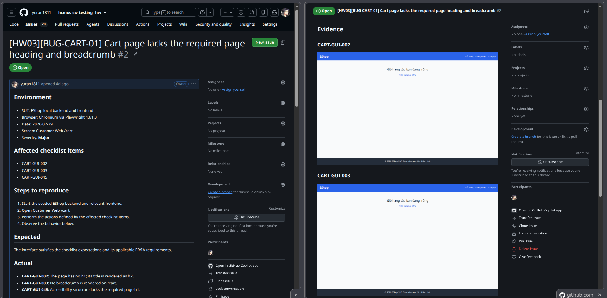

## BUG-CART-02 — Cart navigation has no active state or quantity badge

| Thuộc tính | Giá trị |
| --- | --- |
| Mức độ nghiêm trọng | **Major** |
| Màn hình | Customer Web header and /cart |
| GitHub Issue | [Open issue](https://github.com/yuran1811/hcmus-sw-testing--hw/issues/3) |
| Hạng mục bị ảnh hưởng | CART-GUI-004, CART-GUI-005 |

**Steps to reproduce**

1. Start the seeded backend and relevant frontend.
2. Open Customer Web header and /cart.
3. Perform the actions described by CART-GUI-004, CART-GUI-005.
4. Observe the actual behavior recorded below.

**Expected:** The interface satisfies the linked checklist expectations and applicable FR/IA requirements.

**Actual:** The Cart link has only a hover style and no active state. The navigation has no cart quantity badge.

**Evidence:** [CART-GUI-004](evidence/task1/CART-GUI-004.png), [CART-GUI-005](evidence/task1/CART-GUI-005.png)

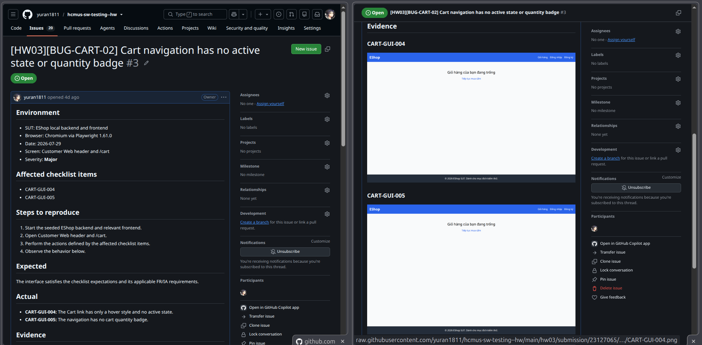

## BUG-CART-05 — Empty cart state has no icon or illustration

| Thuộc tính | Giá trị |
| --- | --- |
| Mức độ nghiêm trọng | **Minor** |
| Màn hình | Customer Web /cart |
| GitHub Issue | [Open issue](https://github.com/yuran1811/hcmus-sw-testing--hw/issues/4) |
| Hạng mục bị ảnh hưởng | CART-GUI-010 |

**Steps to reproduce**

1. Start the seeded backend and relevant frontend.
2. Open Customer Web /cart.
3. Perform the actions described by CART-GUI-010.
4. Observe the actual behavior recorded below.

**Expected:** The interface satisfies the linked checklist expectations and applicable FR/IA requirements.

**Actual:** Empty state has no icon or illustration.

**Evidence:** [CART-GUI-010](evidence/task1/CART-GUI-010.png)

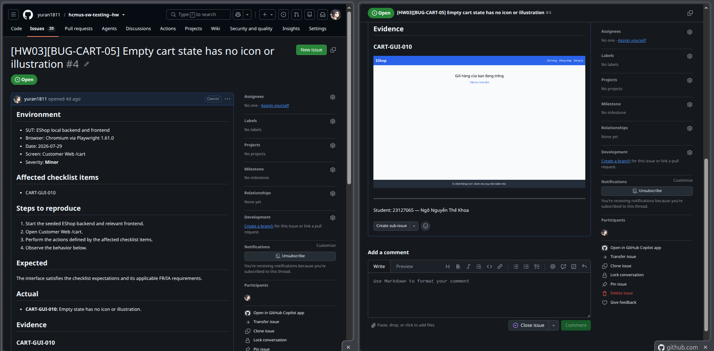

## BUG-CART-06 — Cart focus indicator is not visibly exposed

| Thuộc tính | Giá trị |
| --- | --- |
| Mức độ nghiêm trọng | **Major** |
| Màn hình | Customer Web /cart |
| GitHub Issue | [Open issue](https://github.com/yuran1811/hcmus-sw-testing--hw/issues/5) |
| Hạng mục bị ảnh hưởng | CART-GUI-043 |

**Steps to reproduce**

1. Start the seeded backend and relevant frontend.
2. Open Customer Web /cart.
3. Perform the actions described by CART-GUI-043.
4. Observe the actual behavior recorded below.

**Expected:** The interface satisfies the linked checklist expectations and applicable FR/IA requirements.

**Actual:** Focus indicator is removed or imperceptible.

**Evidence:** [CART-GUI-043](evidence/task1/CART-GUI-043.png)

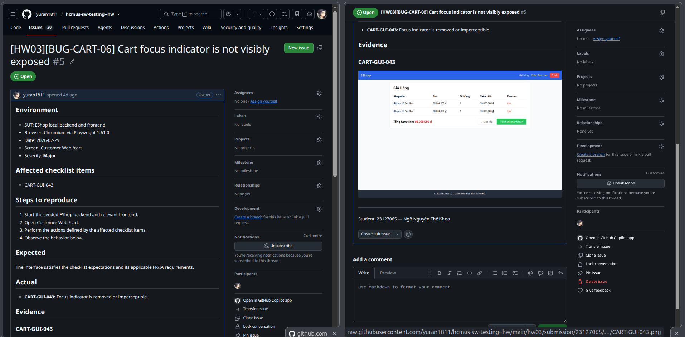

## BUG-CART-09 — Cart table uses the wrong unit-price column label

| Thuộc tính | Giá trị |
| --- | --- |
| Mức độ nghiêm trọng | **Minor** |
| Màn hình | Customer Web /cart |
| GitHub Issue | [Open issue](https://github.com/yuran1811/hcmus-sw-testing--hw/issues/6) |
| Hạng mục bị ảnh hưởng | CART-GUI-015 |

**Steps to reproduce**

1. Start the seeded backend and relevant frontend.
2. Open Customer Web /cart.
3. Perform the actions described by CART-GUI-015.
4. Observe the actual behavior recorded below.

**Expected:** The interface satisfies the linked checklist expectations and applicable FR/IA requirements.

**Actual:** The table uses “Giá” instead of the required “Đơn giá”.

**Evidence:** [CART-GUI-015](evidence/task1/CART-GUI-015.png)

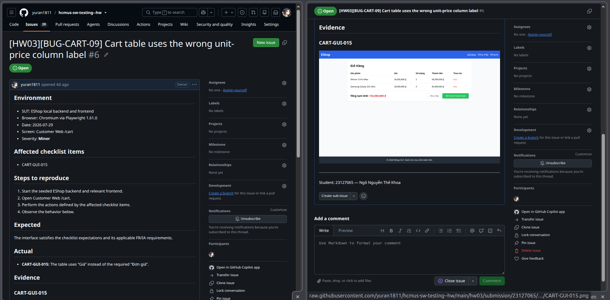

## BUG-CART-11 — Cart total is labeled Tổng tạm tính instead of Tổng cộng

| Thuộc tính | Giá trị |
| --- | --- |
| Mức độ nghiêm trọng | **Major** |
| Màn hình | Customer Web /cart |
| GitHub Issue | [Open issue](https://github.com/yuran1811/hcmus-sw-testing--hw/issues/7) |
| Hạng mục bị ảnh hưởng | CART-GUI-020 |

**Steps to reproduce**

1. Start the seeded backend and relevant frontend.
2. Open Customer Web /cart.
3. Perform the actions described by CART-GUI-020.
4. Observe the actual behavior recorded below.

**Expected:** The interface satisfies the linked checklist expectations and applicable FR/IA requirements.

**Actual:** The value is correct but the label is “Tổng tạm tính”, contrary to FR-07.

**Evidence:** [CART-GUI-020](evidence/task1/CART-GUI-020.png)

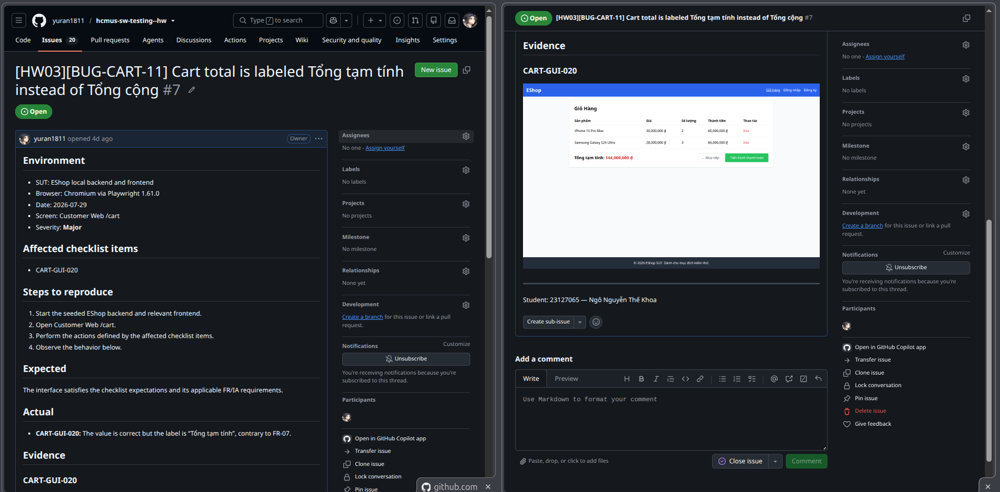

## BUG-CART-12 — Adding the same product creates duplicate cart rows

| Thuộc tính | Giá trị |
| --- | --- |
| Mức độ nghiêm trọng | **Major** |
| Màn hình | Customer Web product detail and /cart |
| GitHub Issue | [Open issue](https://github.com/yuran1811/hcmus-sw-testing--hw/issues/8) |
| Hạng mục bị ảnh hưởng | CART-GUI-021 |

**Steps to reproduce**

1. Start the seeded backend and relevant frontend.
2. Open Customer Web product detail and /cart.
3. Perform the actions described by CART-GUI-021.
4. Observe the actual behavior recorded below.

**Expected:** The interface satisfies the linked checklist expectations and applicable FR/IA requirements.

**Actual:** Adding the same product creates a duplicate row.

**Evidence:** [CART-GUI-021](evidence/task1/CART-GUI-021.png)

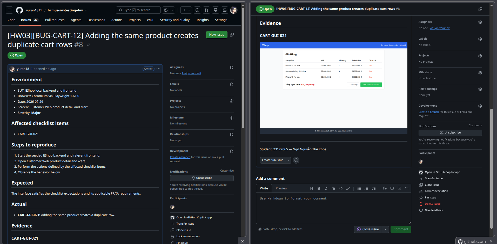

## BUG-CART-13 — Cart provides no controls for changing item quantity

| Thuộc tính | Giá trị |
| --- | --- |
| Mức độ nghiêm trọng | **Blocker** |
| Màn hình | Customer Web /cart |
| GitHub Issue | [Open issue](https://github.com/yuran1811/hcmus-sw-testing--hw/issues/9) |
| Hạng mục bị ảnh hưởng | CART-GUI-022, CART-GUI-023, CART-GUI-024, CART-GUI-025 |

**Steps to reproduce**

1. Start the seeded backend and relevant frontend.
2. Open Customer Web /cart.
3. Perform the actions described by CART-GUI-022, CART-GUI-023, CART-GUI-024, CART-GUI-025.
4. Observe the actual behavior recorded below.

**Expected:** The interface satisfies the linked checklist expectations and applicable FR/IA requirements.

**Actual:** No +/− quantity controls are rendered. The + control is absent, so quantity cannot be increased in the cart. The − control is absent, so quantity cannot be decreased in the cart. The required decrement boundary cannot be exercised because the control is absent.

**Evidence:** [CART-GUI-022](evidence/task1/CART-GUI-022.png), [CART-GUI-023](evidence/task1/CART-GUI-023.png), [CART-GUI-024](evidence/task1/CART-GUI-024.png), [CART-GUI-025](evidence/task1/CART-GUI-025.png)

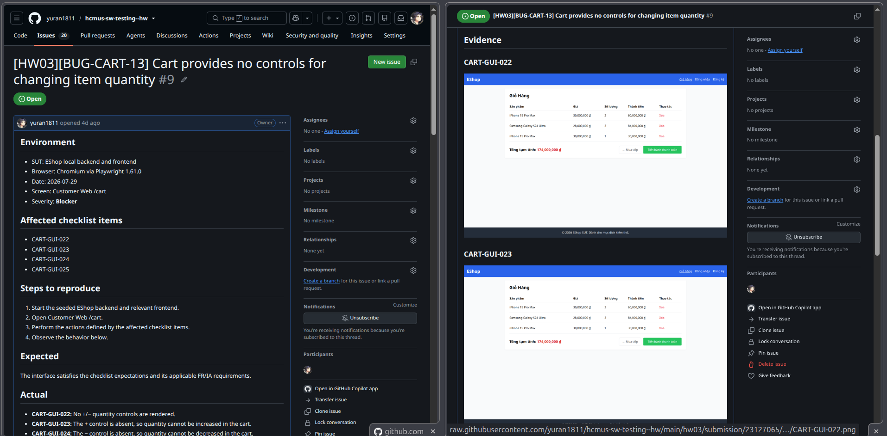

## BUG-CART-16 — Removing a cart item bypasses the required confirmation dialog

| Thuộc tính | Giá trị |
| --- | --- |
| Mức độ nghiêm trọng | **Major** |
| Màn hình | Customer Web /cart |
| GitHub Issue | [Open issue](https://github.com/yuran1811/hcmus-sw-testing--hw/issues/10) |
| Hạng mục bị ảnh hưởng | CART-GUI-028, CART-GUI-029, CART-GUI-032 |

**Steps to reproduce**

1. Start the seeded backend and relevant frontend.
2. Open Customer Web /cart.
3. Perform the actions described by CART-GUI-028, CART-GUI-029, CART-GUI-032.
4. Observe the actual behavior recorded below.

**Expected:** The interface satisfies the linked checklist expectations and applicable FR/IA requirements.

**Actual:** The row was removed immediately without confirmation. No Cancel action exists because no confirmation dialog is shown. No confirmation dialog exists, so focus trapping and restoration are absent.

**Evidence:** [CART-GUI-028](evidence/task1/CART-GUI-028.png), [CART-GUI-029](evidence/task1/CART-GUI-029.png), [CART-GUI-032](evidence/task1/CART-GUI-032.png)

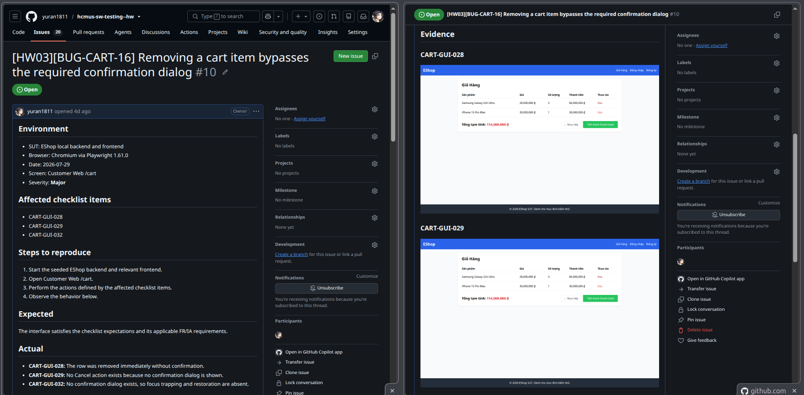

## BUG-CART-20 — Cart table overflows the 320px mobile viewport

| Thuộc tính | Giá trị |
| --- | --- |
| Mức độ nghiêm trọng | **Major** |
| Màn hình | Customer Web /cart at 320x568 |
| GitHub Issue | [Open issue](https://github.com/yuran1811/hcmus-sw-testing--hw/issues/11) |
| Hạng mục bị ảnh hưởng | CART-GUI-038 |

**Steps to reproduce**

1. Start the seeded backend and relevant frontend.
2. Open Customer Web /cart at 320x568.
3. Perform the actions described by CART-GUI-038.
4. Observe the actual behavior recorded below.

**Expected:** The interface satisfies the linked checklist expectations and applicable FR/IA requirements.

**Actual:** The fixed-width table forces unintended horizontal page overflow at 320px.

**Evidence:** [CART-GUI-038](evidence/task1/CART-GUI-038.png)

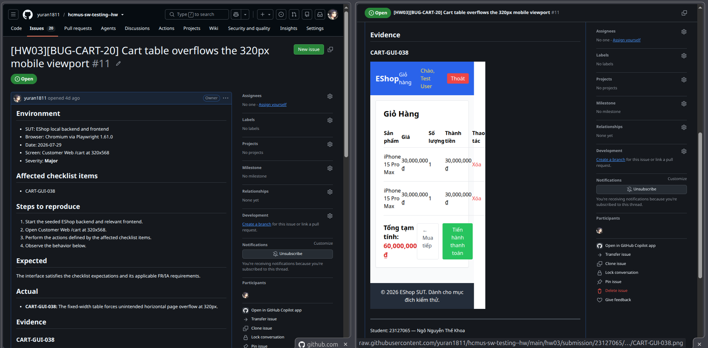

## BUG-CART-21 — Repeated cart action controls do not identify their product

| Thuộc tính | Giá trị |
| --- | --- |
| Mức độ nghiêm trọng | **Major** |
| Màn hình | Customer Web /cart |
| GitHub Issue | [Open issue](https://github.com/yuran1811/hcmus-sw-testing--hw/issues/12) |
| Hạng mục bị ảnh hưởng | CART-GUI-044 |

**Steps to reproduce**

1. Start the seeded backend and relevant frontend.
2. Open Customer Web /cart.
3. Perform the actions described by CART-GUI-044.
4. Observe the actual behavior recorded below.

**Expected:** The interface satisfies the linked checklist expectations and applicable FR/IA requirements.

**Actual:** Repeated controls do not identify their associated product.

**Evidence:** [CART-GUI-044](evidence/task1/CART-GUI-044.png)

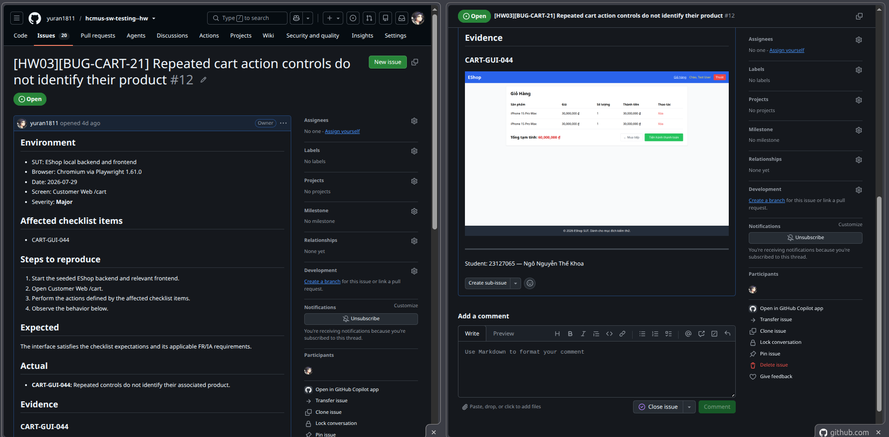

## BUG-CART-24 — Customer frontend declares English instead of Vietnamese document language

| Thuộc tính | Giá trị |
| --- | --- |
| Mức độ nghiêm trọng | **Minor** |
| Màn hình | Customer Web document |
| GitHub Issue | [Open issue](https://github.com/yuran1811/hcmus-sw-testing--hw/issues/13) |
| Hạng mục bị ảnh hưởng | CART-GUI-048 |

**Steps to reproduce**

1. Start the seeded backend and relevant frontend.
2. Open Customer Web document.
3. Perform the actions described by CART-GUI-048.
4. Observe the actual behavior recorded below.

**Expected:** The interface satisfies the linked checklist expectations and applicable FR/IA requirements.

**Actual:** The document does not declare lang=vi.

**Evidence:** [CART-GUI-048](evidence/task1/CART-GUI-048.png)

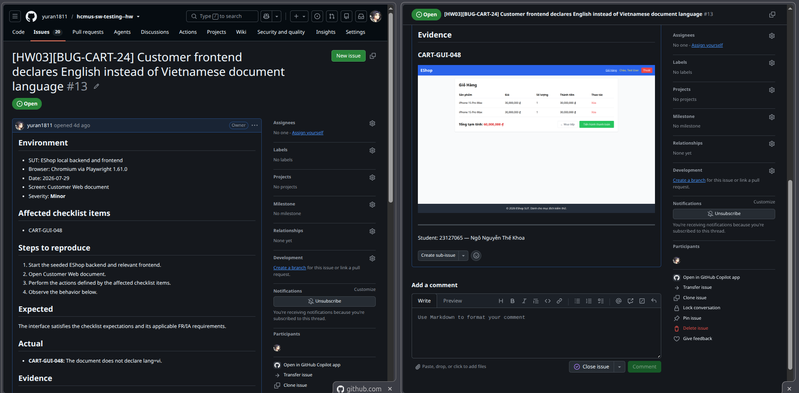

## BUG-COUPON-03 — Coupon screen title uses the wrong heading level

| Thuộc tính | Giá trị |
| --- | --- |
| Mức độ nghiêm trọng | **Minor** |
| Màn hình | Admin Coupon |
| GitHub Issue | [Open issue](https://github.com/yuran1811/hcmus-sw-testing--hw/issues/14) |
| Hạng mục bị ảnh hưởng | COUPON-GUI-005 |

**Steps to reproduce**

1. Start the seeded backend and relevant frontend.
2. Open Admin Coupon.
3. Perform the actions described by COUPON-GUI-005.
4. Observe the actual behavior recorded below.

**Expected:** The interface satisfies the linked checklist expectations and applicable FR/IA requirements.

**Actual:** The screen title is h2 while the only h1 describes the whole admin shell.

**Evidence:** [COUPON-GUI-005](evidence/task1/COUPON-GUI-005.png)

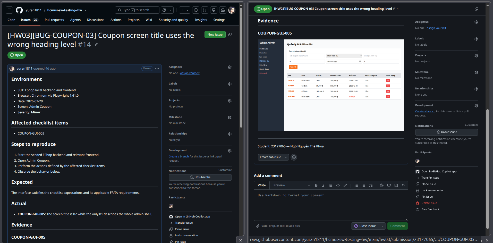

## BUG-COUPON-04 — Admin navigation mixes English and Vietnamese labels

| Thuộc tính | Giá trị |
| --- | --- |
| Mức độ nghiêm trọng | **Minor** |
| Màn hình | Admin shell |
| GitHub Issue | [Open issue](https://github.com/yuran1811/hcmus-sw-testing--hw/issues/15) |
| Hạng mục bị ảnh hưởng | COUPON-GUI-006 |

**Steps to reproduce**

1. Start the seeded backend and relevant frontend.
2. Open Admin shell.
3. Perform the actions described by COUPON-GUI-006.
4. Observe the actual behavior recorded below.

**Expected:** The interface satisfies the linked checklist expectations and applicable FR/IA requirements.

**Actual:** The admin shell mixes English “Dashboard” with Vietnamese labels.

**Evidence:** [COUPON-GUI-006](evidence/task1/COUPON-GUI-006.png)

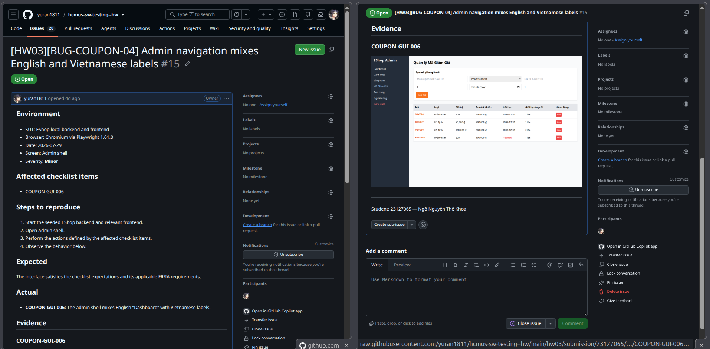

## BUG-COUPON-08 — Empty coupon table has no explanatory state

| Thuộc tính | Giá trị |
| --- | --- |
| Mức độ nghiêm trọng | **Minor** |
| Màn hình | Admin Coupon |
| GitHub Issue | [Open issue](https://github.com/yuran1811/hcmus-sw-testing--hw/issues/16) |
| Hạng mục bị ảnh hưởng | COUPON-GUI-015 |

**Steps to reproduce**

1. Start the seeded backend and relevant frontend.
2. Open Admin Coupon.
3. Perform the actions described by COUPON-GUI-015.
4. Observe the actual behavior recorded below.

**Expected:** The interface satisfies the linked checklist expectations and applicable FR/IA requirements.

**Actual:** An empty coupon table renders with no explanatory state.

**Evidence:** [COUPON-GUI-015](evidence/task1/COUPON-GUI-015.png)

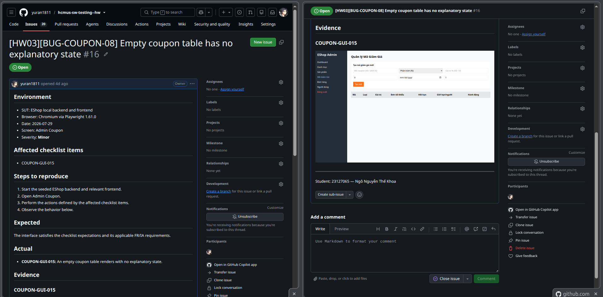

## BUG-COUPON-09 — Coupon form lacks visible labels and required markers

| Thuộc tính | Giá trị |
| --- | --- |
| Mức độ nghiêm trọng | **Major** |
| Màn hình | Admin Coupon form |
| GitHub Issue | [Open issue](https://github.com/yuran1811/hcmus-sw-testing--hw/issues/17) |
| Hạng mục bị ảnh hưởng | COUPON-GUI-016 |

**Steps to reproduce**

1. Start the seeded backend and relevant frontend.
2. Open Admin Coupon form.
3. Perform the actions described by COUPON-GUI-016.
4. Observe the actual behavior recorded below.

**Expected:** The interface satisfies the linked checklist expectations and applicable FR/IA requirements.

**Actual:** The form uses placeholders and HTML required attributes but no visible labels or * indicators.

**Evidence:** [COUPON-GUI-016](evidence/task1/COUPON-GUI-016.png)

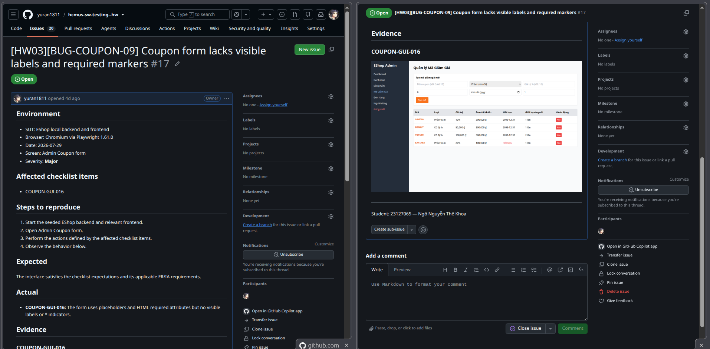

## BUG-COUPON-11 — Coupon form omits discount and expiry boundary validation

| Thuộc tính | Giá trị |
| --- | --- |
| Mức độ nghiêm trọng | **Major** |
| Màn hình | Admin Coupon form |
| GitHub Issue | [Open issue](https://github.com/yuran1811/hcmus-sw-testing--hw/issues/18) |
| Hạng mục bị ảnh hưởng | COUPON-GUI-019, COUPON-GUI-020, COUPON-GUI-022 |

**Steps to reproduce**

1. Start the seeded backend and relevant frontend.
2. Open Admin Coupon form.
3. Perform the actions described by COUPON-GUI-019, COUPON-GUI-020, COUPON-GUI-022.
4. Observe the actual behavior recorded below.

**Expected:** The interface satisfies the linked checklist expectations and applicable FR/IA requirements.

**Actual:** Discount input has no positive min constraint. Percent discount has no 100% upper bound. Expiry date has no minimum and accepts past dates.

**Evidence:** [COUPON-GUI-019](evidence/task1/COUPON-GUI-019.png), [COUPON-GUI-020](evidence/task1/COUPON-GUI-020.png), [COUPON-GUI-022](evidence/task1/COUPON-GUI-022.png)

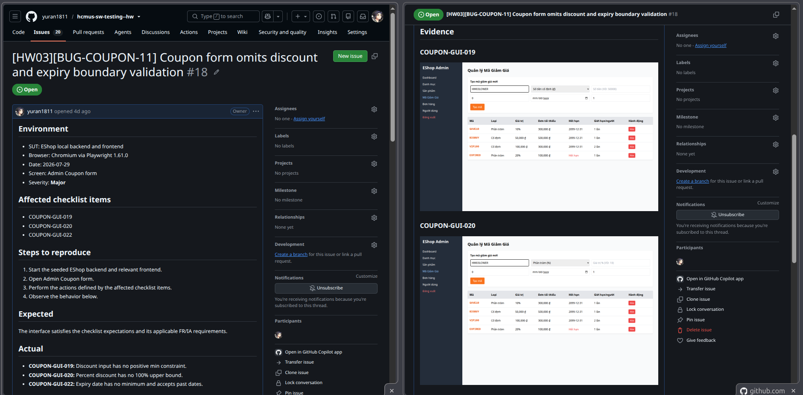

## BUG-COUPON-12 — Duplicate coupon exposes a SQLite error in a browser alert

| Thuộc tính | Giá trị |
| --- | --- |
| Mức độ nghiêm trọng | **Major** |
| Màn hình | Admin Coupon form |
| GitHub Issue | [Open issue](https://github.com/yuran1811/hcmus-sw-testing--hw/issues/19) |
| Hạng mục bị ảnh hưởng | COUPON-GUI-024, COUPON-GUI-025 |

**Steps to reproduce**

1. Start the seeded backend and relevant frontend.
2. Open Admin Coupon form.
3. Perform the actions described by COUPON-GUI-024, COUPON-GUI-025.
4. Observe the actual behavior recorded below.

**Expected:** The interface satisfies the linked checklist expectations and applicable FR/IA requirements.

**Actual:** Duplicate code exposes a technical alert: Lỗi: SQLITE_CONSTRAINT: UNIQUE constraint failed: coupons.code Errors are delivered through a browser alert rather than above the submit button.

**Evidence:** [COUPON-GUI-024](evidence/task1/COUPON-GUI-024.png), [COUPON-GUI-025](evidence/task1/COUPON-GUI-025.png)

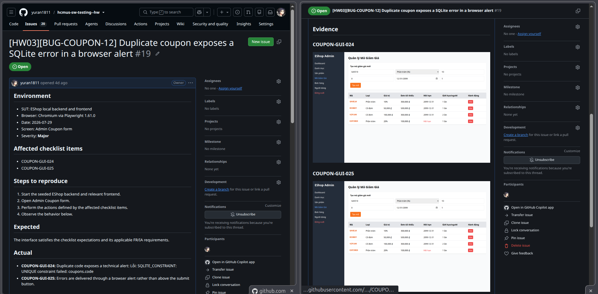

## BUG-COUPON-14 — Coupon deletion has no confirmation dialog

| Thuộc tính | Giá trị |
| --- | --- |
| Mức độ nghiêm trọng | **Major** |
| Màn hình | Admin Coupon table |
| GitHub Issue | [Open issue](https://github.com/yuran1811/hcmus-sw-testing--hw/issues/20) |
| Hạng mục bị ảnh hưởng | COUPON-GUI-027, COUPON-GUI-028, COUPON-GUI-030 |

**Steps to reproduce**

1. Start the seeded backend and relevant frontend.
2. Open Admin Coupon table.
3. Perform the actions described by COUPON-GUI-027, COUPON-GUI-028, COUPON-GUI-030.
4. Observe the actual behavior recorded below.

**Expected:** The interface satisfies the linked checklist expectations and applicable FR/IA requirements.

**Actual:** Coupon is deleted immediately without confirmation. No Cancel action exists because there is no dialog. No confirmation dialog exists, so keyboard dialog behavior is absent.

**Evidence:** [COUPON-GUI-027](evidence/task1/COUPON-GUI-027.png), [COUPON-GUI-028](evidence/task1/COUPON-GUI-028.png), [COUPON-GUI-030](evidence/task1/COUPON-GUI-030.png)

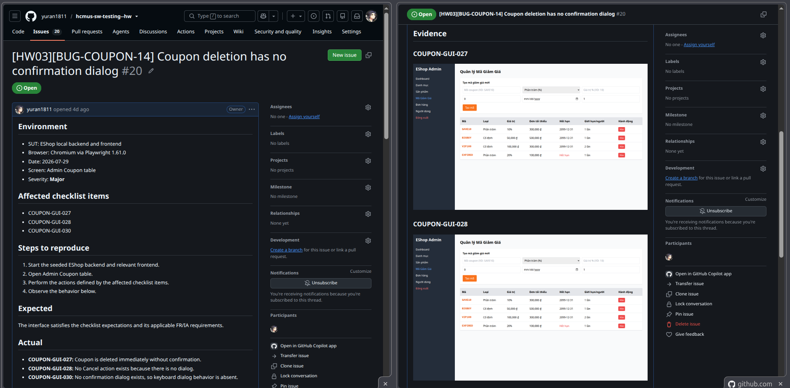

## BUG-COUPON-17 — Coupon delete buttons have ambiguous accessible names

| Thuộc tính | Giá trị |
| --- | --- |
| Mức độ nghiêm trọng | **Major** |
| Màn hình | Admin Coupon table |
| GitHub Issue | [Open issue](https://github.com/yuran1811/hcmus-sw-testing--hw/issues/21) |
| Hạng mục bị ảnh hưởng | COUPON-GUI-034 |

**Steps to reproduce**

1. Start the seeded backend and relevant frontend.
2. Open Admin Coupon table.
3. Perform the actions described by COUPON-GUI-034.
4. Observe the actual behavior recorded below.

**Expected:** The interface satisfies the linked checklist expectations and applicable FR/IA requirements.

**Actual:** All row actions have the ambiguous accessible name “Xóa”.

**Evidence:** [COUPON-GUI-034](evidence/task1/COUPON-GUI-034.png)

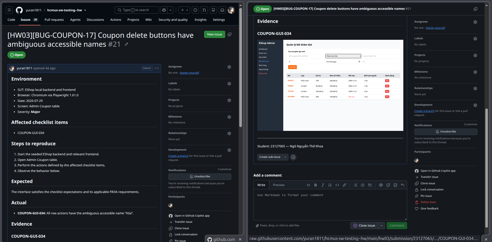
