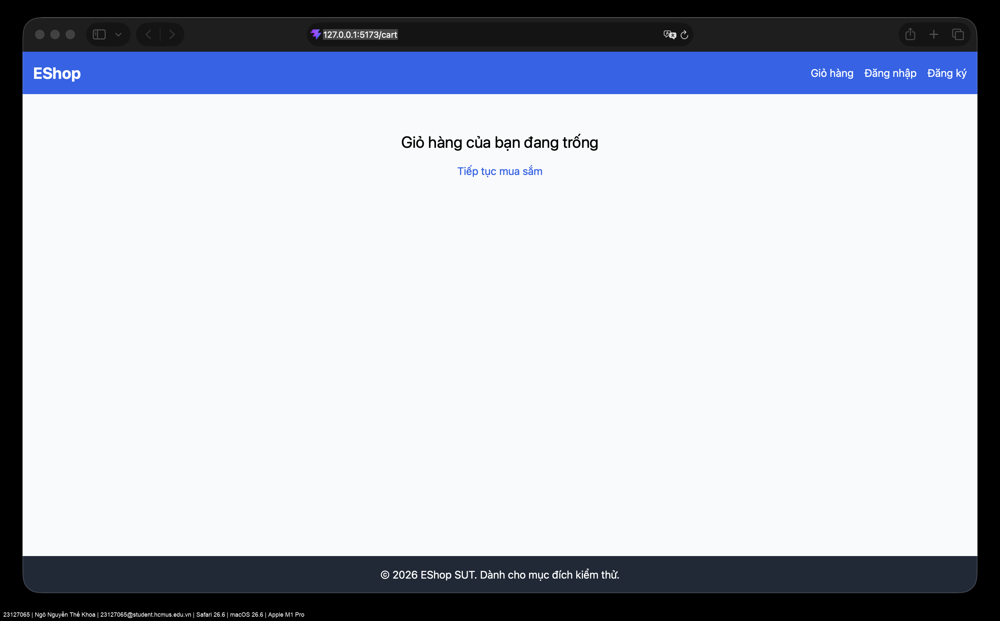
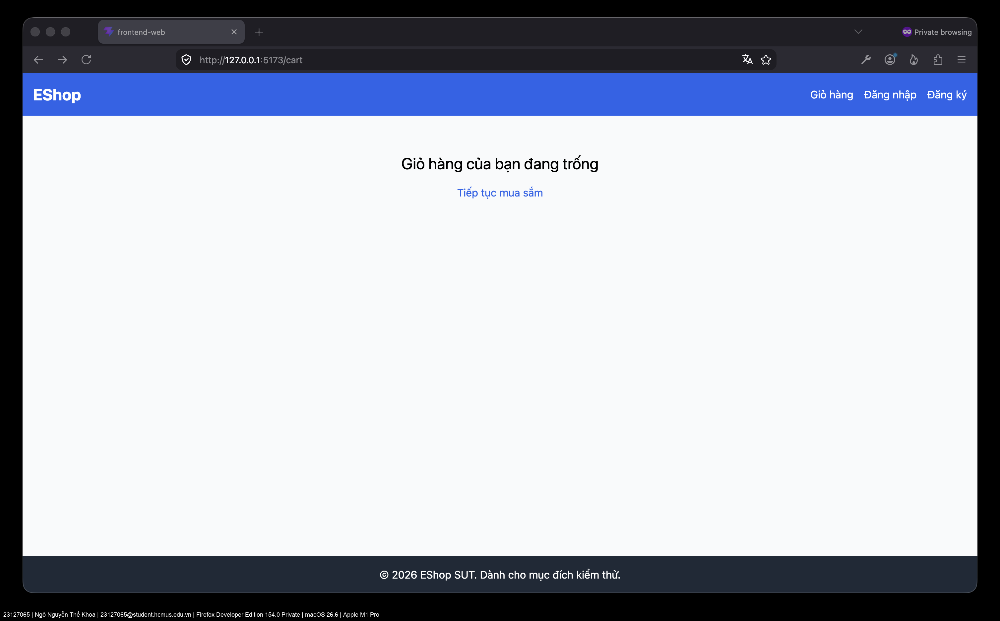
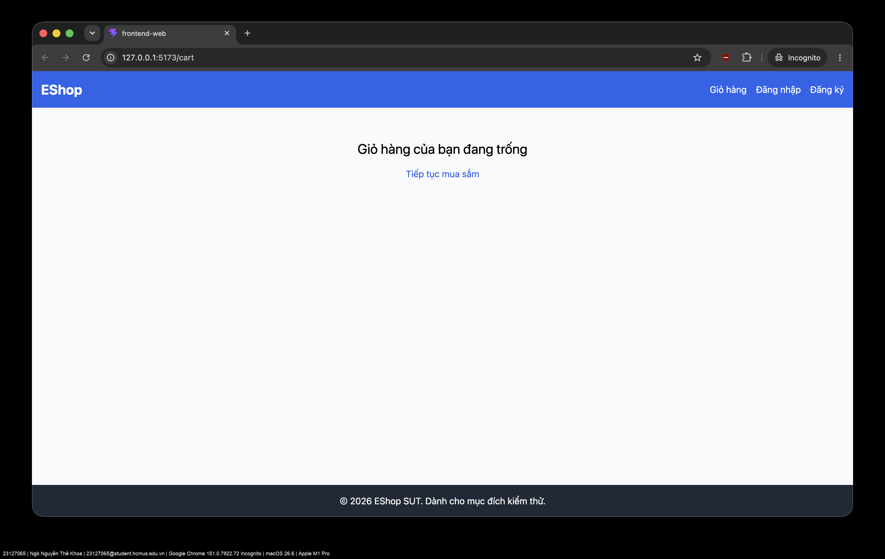

# Task 3 — Cross-Browser Execution of Task 1

## Scope and environment

The complete Task 1 checklist was executed three times against the local EShop SUT: all 50 Customer Cart checks and all 35 Admin Coupon checks. Each run used a fresh browser context. The backend database was backed up before the run and restored after all matrices completed.

| Matrix | Browser / engine | Mode | Executed | Passed | Failed |
| --- | --- | --- | ---: | ---: | ---: |
| Chrome | Google Chrome 151.0.7922.72, Playwright Chrome channel | Isolated anonymous context | 85 | 52 | 33 |
| Firefox | Firefox 151.0, Playwright | Isolated anonymous context | 85 | 52 | 33 |
| WebKit | WebKit 26.5, Playwright Safari-compatible engine | Isolated anonymous context | 85 | 52 | 33 |
| **Total** | **3 browser engines** |  | **255** | **156** | **99** |

The status for every one of the 85 checklist IDs is identical in all three matrices. The 33 failures are reproducible existing Task 1 defects, not cross-browser-only findings. Every browser-specific failure screenshot is a native headed-browser-window capture under `evidence/task3/`, with visible browser chrome and local URL, plus `23127065 | Ngô Nguyễn Thế Khoa | 23127065@student.hcmus.edu.vn`, browser/engine, macOS, and Apple M1 Pro labels.

## Results and reproducibility

| Artifact | Contents |
| --- | --- |
| [Chrome results](tests/test-runs/task3-chrome-results.json) | 85 structured results; Google Chrome channel |
| [Firefox results](tests/test-runs/task3-firefox-results.json) | 85 structured results; Firefox |
| [WebKit results](tests/test-runs/task3-webkit-results.json) | 85 structured results; Safari-compatible WebKit |
| `evidence/task3/chrome/` | 33 labeled Chrome failure screenshots |
| `evidence/task3/firefox/` | 33 labeled Firefox failure screenshots |
| `evidence/task3/webkit/` | 33 labeled WebKit failure screenshots |

No run was blocked. The counts reconcile as `85 = 52 passed + 33 failed` for each matrix.

## Real browser evidence

Safari, Firefox Developer Edition (private), and Google Chrome (Incognito) were also opened on the **Apple M1 Pro** Mac at `http://127.0.0.1:5173/cart`. These are native browser-window captures: their browser chrome visibly shows the local URL, and each contains the required student-email, browser, operating-system, and device label. This visual evidence confirms the same anonymous Cart entry state in the actual installed browsers; the full Safari-compatible matrix above is run with Playwright WebKit, not SafariDriver.

| Browser | Evidence |
| --- | --- |
| Safari 26.6 |  |
| Firefox Developer Edition 154.0 |  |
| Google Chrome 151.0.7922.72 Incognito |  |
