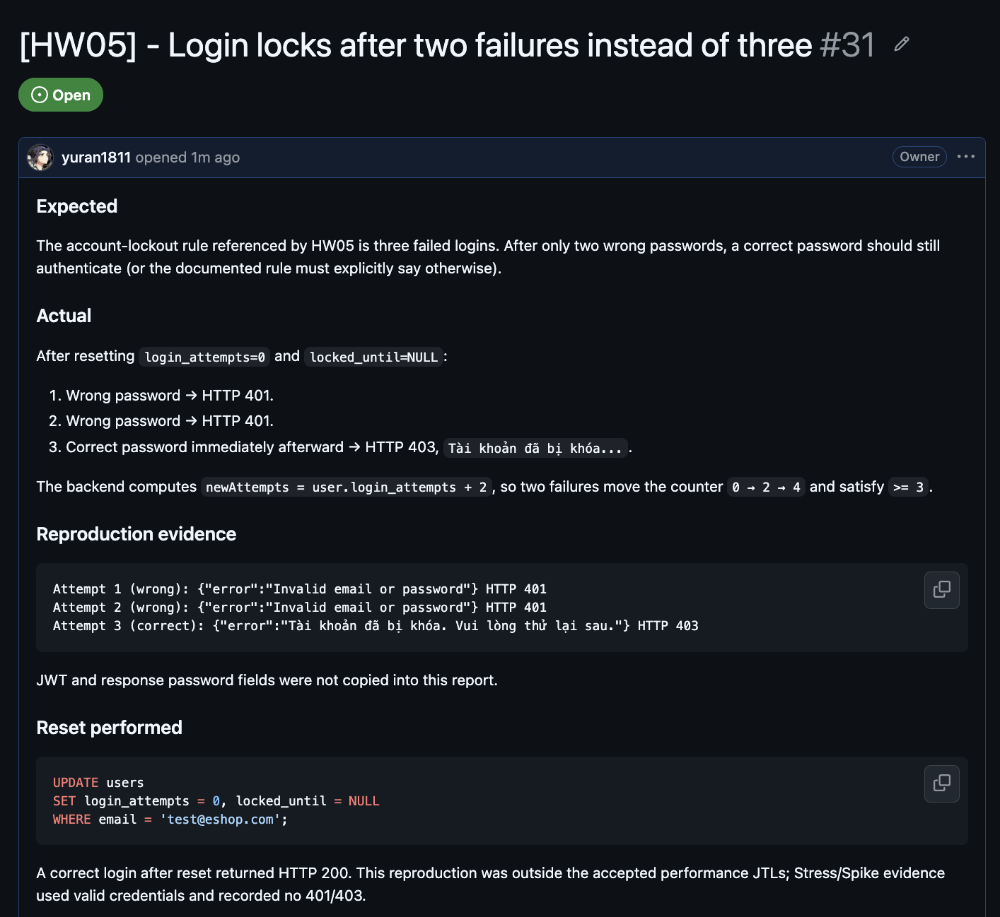

# Bug Report — HW05

## BUG-HW05-01 — Login locks after two failures instead of three

| Field | Value |
| --- | --- |
| SUT | EShop backend, `POST /api/login` |
| Environment | Isolated local seed database, Node 22.23.1, port 3001 |
| Severity | Medium |
| Status | Reproduced locally; GitHub Issue not yet published |
| GitHub Issue | https://github.com/yuran1811/hcmus-sw-testing--hw/issues/31 |
| Issue screenshot |  |

### Expected

The account-lockout rule referenced by HW05 is three failed logins. After only two wrong passwords, a correct password should still authenticate (or the documented rule must explicitly say otherwise).

### Actual

After resetting `login_attempts=0` and `locked_until=NULL`:

1. Wrong password → HTTP 401.
2. Wrong password → HTTP 401.
3. Correct password immediately afterward → HTTP 403, `Tài khoản đã bị khóa...`.

The backend computes `newAttempts = user.login_attempts + 2`, so two failures move the counter `0 → 2 → 4` and satisfy `>= 3`.

### Reproduction evidence

```text
Attempt 1 (wrong): {"error":"Invalid email or password"} HTTP 401
Attempt 2 (wrong): {"error":"Invalid email or password"} HTTP 401
Attempt 3 (correct): {"error":"Tài khoản đã bị khóa. Vui lòng thử lại sau."} HTTP 403
```

JWT and response password fields were not copied into this report.

### Reset performed

```sql
UPDATE users
SET login_attempts = 0, locked_until = NULL
WHERE email = 'test@eshop.com';
```

A correct login after reset returned HTTP 200. This reproduction was outside the accepted performance JTLs; Stress/Spike evidence used valid credentials and recorded no 401/403.

### Suggested fix

Increment by one, add a regression test for attempts 1/2/3 and successful reset, and document whether the third failed request or the subsequent request receives the locked response.
