# Genuine API defects

**Student ID:** 23127065  
**Student Name:** NGÔ NGUYỄN THẾ KHOA (Ngo Nguyen The Khoa)  
**Class:** 23KTPM3  
**Course:** CS423 / CSC13003 – Software Testing  

Every issue below was reproduced against SUT commit `d97f995247a4a31ac91e8c6664da6fbf58b5fbd5` on 2026-08-08. Raw responses and assertion details are in `newman/results/*.json`, `*.xml`, and the HTML reports.

## BUG-API-001 – Login does not validate credential input domains

- Severity: Medium
- Evidence: `LOGIN-002`, `004`–`009`, `012`–`017`, `020`, `021`, `035`, `036`, `040`
- Expected: malformed, missing, null, wrong-type, empty, and oversized credentials return `400`.
- Actual: the endpoint treats them as authentication failures and returns `401`.
- Impact: client defects and hostile input cannot be distinguished from valid authentication failures; required domain validation is absent.
- GitHub issue: <https://github.com/yuran1811/hcmus-sw-testing--hw/issues/32>
- Screenshot: 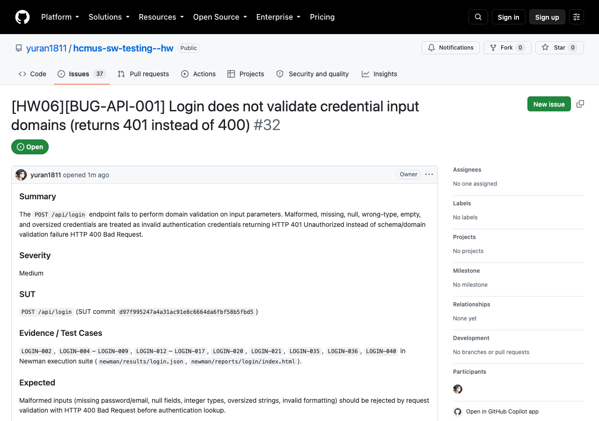
- Test failure evidence: 

## BUG-API-002 – Account locks after two failed attempts instead of three

- Severity: High
- Evidence: `LOGIN-027`; expected `200`, observed `403` after exactly two pre-failures.
- Expected: the third failed attempt triggers lockout; a correct credential after two failures remains allowed.
- Actual: internal attempts increase by two per failure, so the second failure crosses the threshold.
- GitHub issue: <https://github.com/yuran1811/hcmus-sw-testing--hw/issues/33>
- Screenshot: 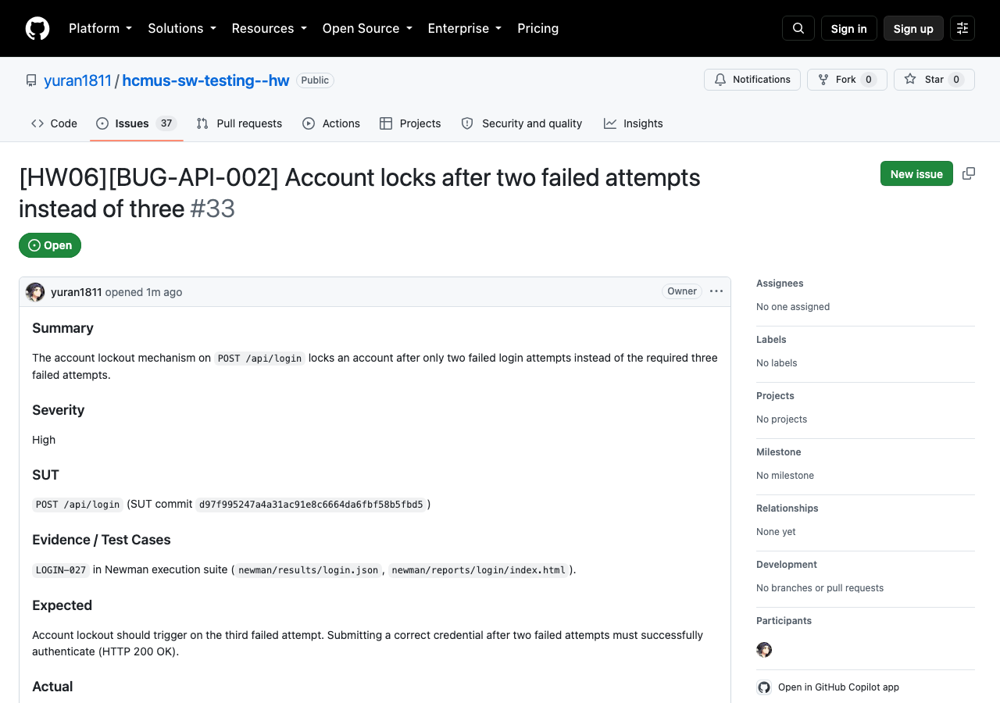
- Test failure evidence: 

## BUG-API-003 – Login response exposes the plaintext password

- Severity: Critical
- Evidence: `LOGIN-032` (`body.user.password` exists).
- Expected: credential material is never returned.
- Actual: the complete database user row, including `password`, is returned in the success body.
- GitHub issue: <https://github.com/yuran1811/hcmus-sw-testing--hw/issues/34>
- Screenshot: 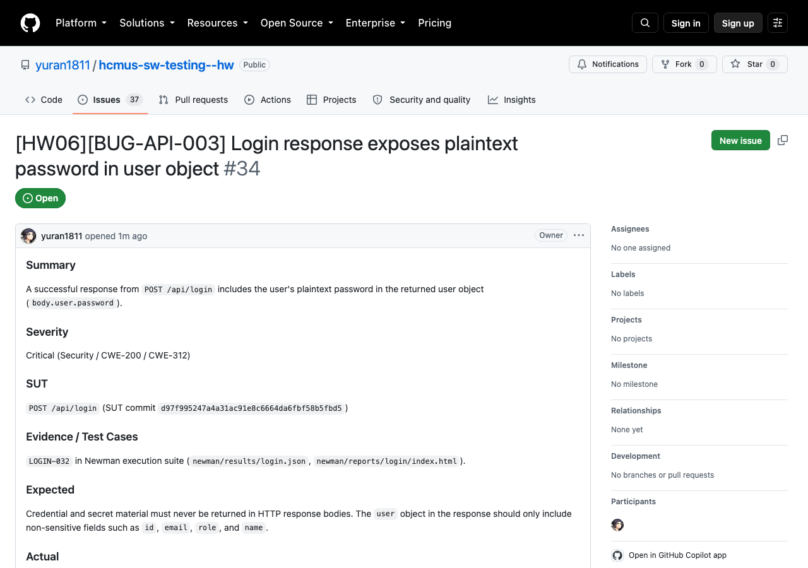
- Test failure evidence: 

## BUG-API-004 – Checkout accepts invalid totals and addresses

- Severity: Critical
- Evidence: `CHECKOUT-004`–`015`, `017`–`024`, `030`, `031`, `038`, `040`.
- Expected: non-positive, non-integer, non-numeric, null/missing totals and invalid addresses return `400`.
- Actual: orders are created with `200`, including negative totals and absent addresses.
- GitHub issue: <https://github.com/yuran1811/hcmus-sw-testing--hw/issues/35>
- Screenshot: 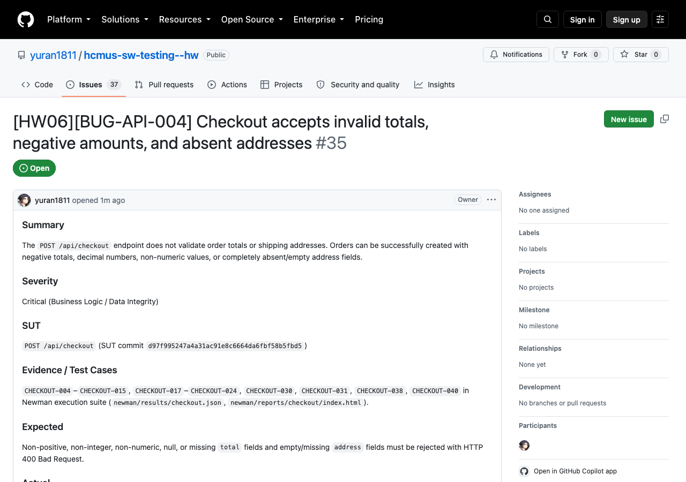
- Test failure evidence: 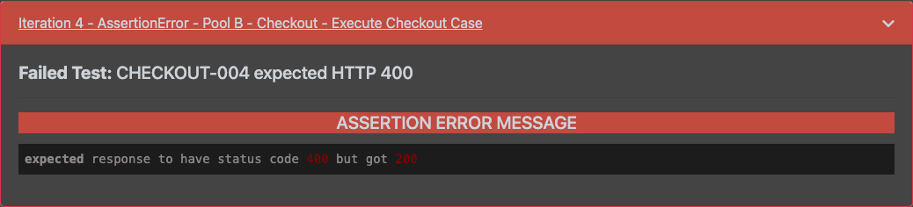

## BUG-API-005 – Checkout creates orders for an empty cart and trusts client totals

- Severity: Critical
- Evidence: `CHECKOUT-036`, `CHECKOUT-037`.
- Expected: empty-cart checkout is rejected and the server computes the total from server-side cart/product data.
- Actual: a caller can create an order with no cart and an arbitrary total such as `1`.
- GitHub issue: <https://github.com/yuran1811/hcmus-sw-testing--hw/issues/36>
- Screenshot: 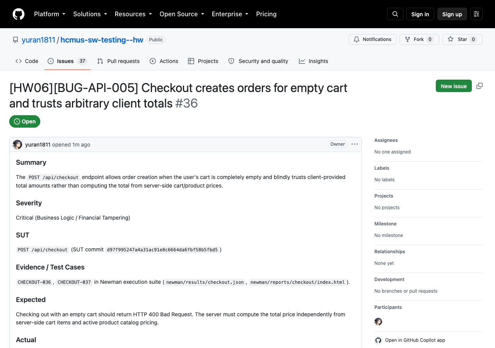
- Test failure evidence: 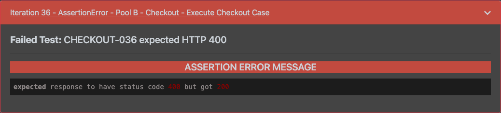

## BUG-API-006 – Canceled order can transition to delivered

- Severity: High
- Evidence: `ORDER-021`; expected `400`, observed `200`.
- Expected: `canceled` is terminal.
- Actual: `canceled → delivered` is explicitly accepted.
- GitHub issue: <https://github.com/yuran1811/hcmus-sw-testing--hw/issues/37>
- Screenshot: 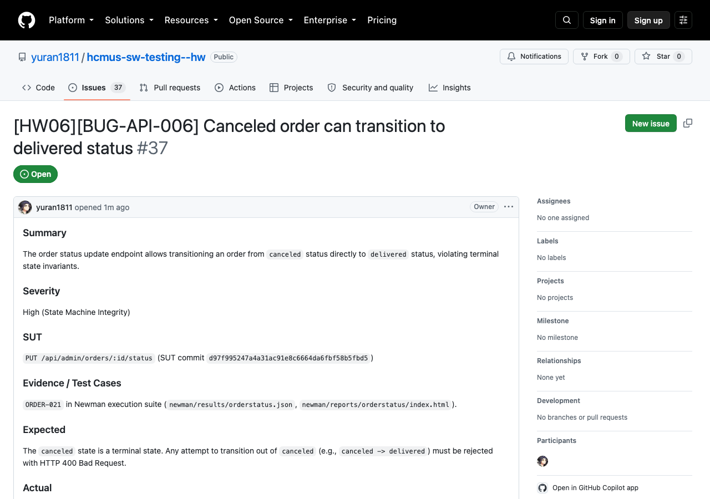
- Test failure evidence: 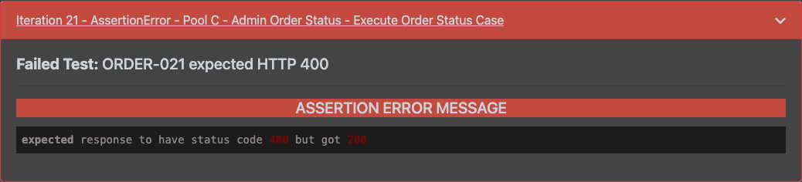

## BUG-API-007 – Admin order-state endpoint lacks role authorization

- Severity: Critical
- Evidence: `ORDER-036`, `ORDER-037`, `ORDER-040`.
- Expected: a normal-user token receives `403` before resource/state evaluation.
- Actual: a normal user can change pending orders (`200`), and receives state-based `400` for a delivered order, proving that role authorization is never enforced.
- GitHub issue: <https://github.com/yuran1811/hcmus-sw-testing--hw/issues/38>
- Screenshot: 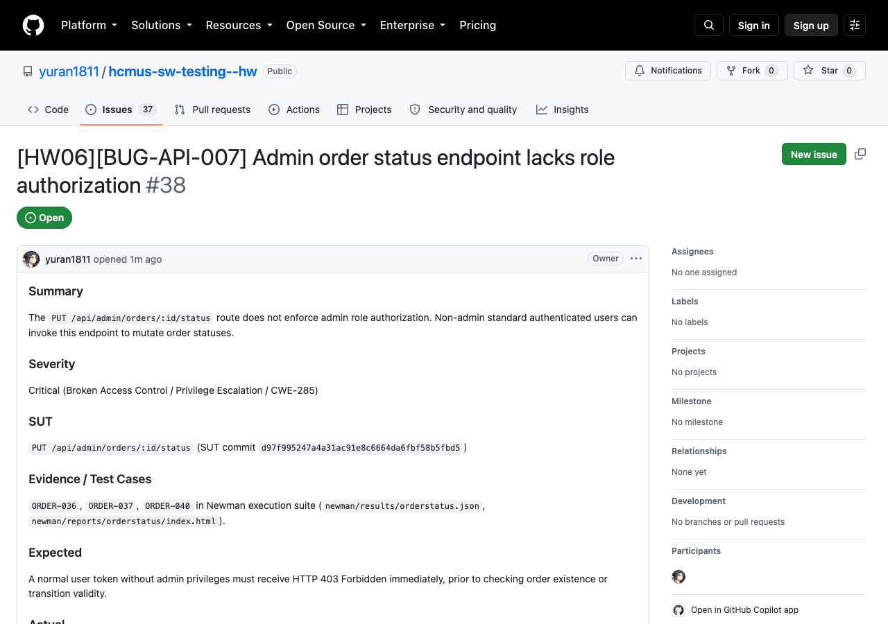
- Test failure evidence: 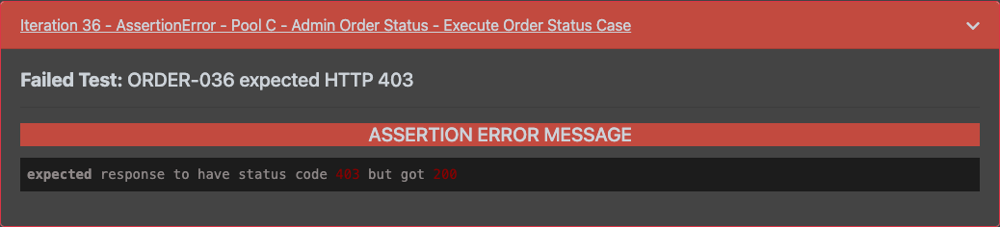
