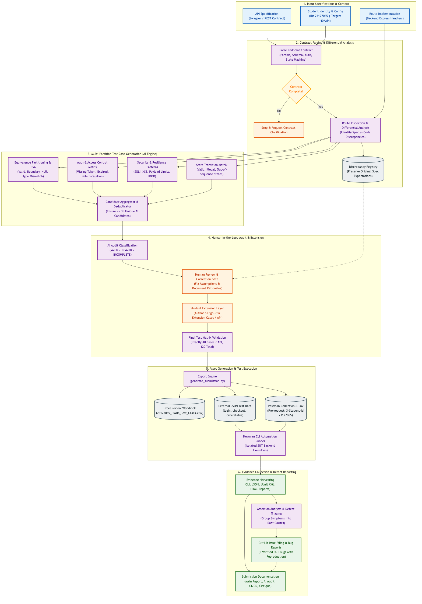

# HW06 – API Testing Report

**Student ID:** 23127065
**Public repository:** <https://github.com/yuran1811/hcmus-sw-testing--hw>

## 1. Scope and endpoint selection

The selected endpoints satisfy all three pools and exercise different risk profiles.

| Pool | Feature | Endpoint | Primary risks |
|---|---|---|---|
| A | FR-02 login | `POST /api/login` | credential partitions, enumeration, lockout, sensitive response data |
| B | FR-08 checkout | `POST /api/checkout` | authentication, total/address integrity, empty cart, schema |
| C | FR-18 admin order state | `PUT /api/admin/orders/:id/status` | role escalation, IDOR, legal/illegal transitions, terminal states |

The API specification was compared with the real Express routes in `backend/server.js`; the implementation was used for executable setup while the specification and course rules remained authoritative for expected results. This matters because the real backend intentionally contains defects, including a role check absent from the admin route and a canceled-to-delivered transition present only in code.

## 2. Step-by-step AI-assisted method

The work was intentionally decomposed instead of asking AI for “all API tests” in one prompt.

1. Extract the eight-page assignment and turn each mandatory artifact into an audit checklist.
2. Inspect the published API specification and real routes; select one API from each pool.
3. Query current Postman/Newman documentation with Context7 for collection pre-request headers, environment/data variables, JSON schema checks, reporters, and CI exit behavior.
4. Build domain partitions for every request field, then add authentication/authorization, injection, schema, and state-transition dimensions.
5. Generate 35 candidate cases per endpoint and label each `VALID`, `INVALID`, or `INCOMPLETE` with reasoning and a corrected final expectation.
6. Draft five additional high-risk cases per endpoint. These remain marked `Student-extension draft (HUMAN REQUIRED)` until the student personally reviews/rewrites them.
7. Export the reviewed matrix to Excel and external JSON; generate a Postman v2.1 collection with a collection-level anti-cheat header script.
8. Run three isolated data-driven Newman folders against a freshly seeded copy of the exact SUT revision. Preserve, classify, and report failures rather than changing assertions to pass.

The complete prompt/output record and declaration are in Appendix A and `AI_Audit_Report.md`.

## 3. Test design and human audit

The workbook `test-cases/23127065_HW06_Test_Cases.xlsx` is the source of truth. It has one sheet per API plus a summary sheet. Each test row records ID, origin, initial AI audit label, audit reason, technique, requirement/security/state trace, preconditions, request body, authentication mode, expected status, extra schema assertion, and final expectation.

| API | AI candidates | Initial VALID | Initial INVALID | Initial INCOMPLETE | Extension drafts | Final executable rows |
|---|---:|---:|---:|---:|---:|---:|
| Login | 35 | 34 | 1 | 0 | 5 | 40 |
| Checkout | 35 | 33 | 1 | 1 | 5 | 40 |
| Order status | 35 | 35 | 0 | 0 | 5 | 40 |
| **Total** | **105** | **102** | **2** | **1** | **15** | **120** |

Examples of correction include replacing syntactically broken JSON with a transport-valid empty object (`LOGIN-035`), rejecting an AI assumption that checkout should trust a body `user_id` (`CHECKOUT-034`), and removing an unspecified idempotency expectation (`CHECKOUT-035`). The matrix retains the original label/reason so the audit is visible rather than overwritten.

## 4. API 1 – Login pipeline

### Generated coverage

The 35 AI candidates cover valid login; whitespace/case behavior; missing, null, empty, numeric, malformed, and oversized email/password values; SQL/XSS payloads; unknown accounts; extra fields; account lockout transitions; JSON content type; generic authentication errors; success schema; and sensitive response fields.

The five extension drafts add whitespace-only credentials, duplicate JSON keys, a prototype-pollution-shaped field, a large irrelevant field, and an explicit anti-cheat-header assertion. AI tends to miss these because ordinary prompts focus on business values rather than parser ambiguity, object-merging hazards, or evidence rules that are external to the API contract.

### Execution and findings

Newman ran 40 primary iterations, 91 total requests including setup, and 90 assertions. Seventy assertions passed and 20 failed. The failures map to three genuine defects:

- `BUG-API-001`: malformed credential domains receive `401` instead of validation `400`.
- `BUG-API-002`: a correct password is blocked after only two failed attempts.
- `BUG-API-003`: successful login returns the plaintext password in `user`.

Raw evidence: `newman/results/login-cli.txt`, `login.json`, `login.xml`, and `newman/reports/login/index.html`.

## 5. API 2 – Checkout pipeline

### Generated coverage

The 35 AI candidates cover positive boundaries, zero/negative/decimal/oversized totals, numeric and nonnumeric strings, null/missing/wrong types, address partitions, injection/XSS, mass-assignment-shaped fields, missing/malformed/tampered tokens, admin-token behavior, empty/array bodies, and success schema/content type.

The five extension drafts focus on business invariants that field-by-field generation missed: rejecting checkout with no cart, refusing a client-supplied total inconsistent with cart contents, an extreme negative value, ignoring a foreign `user_id`, and numeric parser overflow. AI misses these when the prompt/spec models checkout as an isolated request instead of a server-owned pricing workflow.

### Execution and findings

Newman ran 40 primary iterations, 78 total requests including authentication setup, and 91 assertions. Sixty-five assertions passed and 26 failed. The failures consolidate into:

- `BUG-API-004`: checkout accepts invalid totals, addresses, and body shapes.
- `BUG-API-005`: checkout creates an order for an empty cart and trusts an arbitrary client total.

Authentication checks themselves behaved as observed: missing token returned `401`, and malformed/tampered JWTs returned `403`.

Raw evidence: `newman/results/checkout-cli.txt`, `checkout.json`, `checkout.xml`, and `newman/reports/checkout/index.html`.

## 6. API 3 – Admin order-state pipeline

### Generated coverage

The matrix enumerates all five states: `pending`, `confirmed`, `shipping`, `delivered`, and `canceled`. It covers allowed transitions, forbidden skips/backtracking/repeats, terminal-state behavior, invalid enum/type/missing status, nonexistent order, missing/malformed authentication, success schema, injection, role escalation, and IDOR.

The five extension drafts target a normal user changing an admin-managed order, cross-user mutation, exact success schema, status injection, and authorization precedence on a delivered order. AI often misses authorization precedence because a state-machine prompt evaluates transition validity before asking which principal may invoke the transition.

### Execution and findings

Newman ran 40 primary iterations, 197 total requests including login/order/state setup, and 86 assertions. Eighty-two assertions passed and four failed:

- `BUG-API-006`: `canceled → delivered` returns `200` although canceled is terminal.
- `BUG-API-007`: normal-user tokens reach and mutate the admin endpoint; authorization is not enforced.

Raw evidence: `newman/results/orderstatus-cli.txt`, `orderstatus.json`, `orderstatus.xml`, and `newman/reports/orderstatus/index.html`.

## 7. Postman and Newman features used

| Feature | Concrete use/evidence |
|---|---|
| Collection/folders | One v2.1 collection with three endpoint folders |
| Collection pre-request script | Upserts and logs `X-Student-Id: 23127065` on every primary request |
| Request pre-request scripts | Register isolated login users; fetch JWTs; create/advance orders |
| Collection/environment/local variables | `studentId`, `baseUrl`, request-scoped `order_id` |
| Data-driven runs | One external JSON file per API, 40 iterations each |
| Automated tests | status, header, content type, response shape, sensitive-field checks |
| CLI and multiple reporters | CLI transcript, JSON, JUnit XML, htmlextra HTML |
| CI/CD | GitHub Actions workflow with green and intentional-red modes |

Context7 was used to verify current Postman and Newman best practices: `pm.request.headers.upsert` approach, `pm.environment` variables, JSON schema assertions, data-driven runs with external JSON files, multiple reporters, and CI exit semantics. Relevant official documentation: [Postman pre-request scripts](https://learning.postman.com/docs/tests-and-scripts/write-scripts/pre-request-scripts/), [Postman request API](https://learning.postman.com/docs/tests-and-scripts/write-scripts/postman-sandbox-reference/pm-request/), and [Newman](https://github.com/postmanlabs/newman).

Detailed operational steps, environment variables, collection runner data configuration, and the required `X-Student-Id: 23127065` header console evidence are documented in `evidence/postman/Postman_GUI_Guide.md`.

## 8. CI/CD

The repository workflow `.github/workflows/hw06-api-tests.yml` checks out the exact SUT commit, seeds and starts the API, and runs the pinned local Newman installation. Manual input `pass` executes one known-good case per API. `intentional-failure` executes one deliberately impossible `418` assertion so the red pipeline is unambiguous and not confused with a product defect. Both upload JUnit evidence.

Both modes were executed and verified on GitHub Actions:
- **Pass mode run (Green ✅):** [`Run #32390866536`](https://github.com/yuran1811/hcmus-sw-testing--hw/actions/runs/32390866536) on commit [`0f85a59`](https://github.com/yuran1811/hcmus-sw-testing--hw/commit/0f85a591cbbe8caee92a7fbda4c6bb2a316447e1)
- **Intentional failure mode run (Red ❌):** [`Run #32390874323`](https://github.com/yuran1811/hcmus-sw-testing--hw/actions/runs/32390874323) on commit [`0f85a59`](https://github.com/yuran1811/hcmus-sw-testing--hw/commit/0f85a591cbbe8caee92a7fbda4c6bb2a316447e1)

Detailed run logs, JUnit artifact uploads, and evidence screenshots are documented in `ci/CI_CD_Report.md`.

## 9. Defect reporting

Fifty failed assertions were consolidated by root cause into seven genuine defects rather than filed as 50 duplicates. Detailed analysis, test trace, expected vs. actual outcomes, and embedded screenshots are in `Bug_Report.md`. All seven issues were created on GitHub and verified:

| Bug ID | Title | Severity | GitHub Issue |
|---|---|---|---|
| `BUG-API-001` | Login does not validate credential input domains | Medium | [#32](https://github.com/yuran1811/hcmus-sw-testing--hw/issues/32) |
| `BUG-API-002` | Account locks after two failed attempts instead of three | High | [#33](https://github.com/yuran1811/hcmus-sw-testing--hw/issues/33) |
| `BUG-API-003` | Login response exposes plaintext password in user object | Critical | [#34](https://github.com/yuran1811/hcmus-sw-testing--hw/issues/34) |
| `BUG-API-004` | Checkout accepts invalid totals, negative amounts, and absent addresses | Critical | [#35](https://github.com/yuran1811/hcmus-sw-testing--hw/issues/35) |
| `BUG-API-005` | Checkout creates orders for empty cart and trusts arbitrary client totals | Critical | [#36](https://github.com/yuran1811/hcmus-sw-testing--hw/issues/36) |
| `BUG-API-006` | Canceled order can transition to delivered status | High | [#37](https://github.com/yuran1811/hcmus-sw-testing--hw/issues/37) |
| `BUG-API-007` | Admin order status endpoint lacks role authorization | Critical | [#38](https://github.com/yuran1811/hcmus-sw-testing--hw/issues/38) |

## 10. Agent Skill design and implementation

The reusable skill is in [`agent-skill/generate-api-tests/`](agent-skill/generate-api-tests/). Its executable generator exports exactly 35 AI cases plus five extension drafts per endpoint, Excel review sheets, JSON data, Postman collection, environment, and CI samples. It was validated by running the generator and executing its output against an isolated SUT backend.

### Architecture and Design Diagram
The architecture and workflow diagram for the `generate-api-tests` skill is defined in [`design/23127065-api-test-generator.mmd`](agent-skill/generate-api-tests/design/23127065-api-test-generator.mmd) and rendered below:

### Algorithm and Pseudocode
The comprehensive end-to-end pseudocode is documented in [`design/pseudocode.md`](agent-skill/generate-api-tests/design/pseudocode.md), covering contract ingestion, differential analysis, multi-partition test generation, human audit classification (`VALID`, `INVALID`, `INCOMPLETE`), student extensions, Postman/Newman artifact compilation, and defect triaging.

Demonstration video: `TODO(HUMAN): unlisted video URL`.

## 11. Limitations and reproducibility

- The SUT database was freshly seeded in an isolated temporary copy; the original neighboring checkout was not mutated.
- The committed environment uses port 3000. Local evidence used port 31065 because port 3000 was already occupied; Newman received an explicit `--env-var` override.
- The external repository is public, but new artifacts, GitHub issues, and Actions runs do not exist publicly until the student pushes/publishes them.
- AI-produced audit judgments and extension drafts are not substitutes for the required student review.
- Failing tests are requirement evidence and must not be weakened to produce a green full-suite report.

## Appendix A – AI declaration and audit summary

AI was used openly for rubric extraction, documentation retrieval, code/spec comparison, candidate generation, test implementation, report drafting, and local execution analysis. It was not used to fabricate a self-drawn diagram, personal critique, signature, group coordination, screenshots, GitHub issues, CI links, or video. The complete interaction table and declaration are in `AI_Audit_Report.md`; the student must review and sign it before submission.
