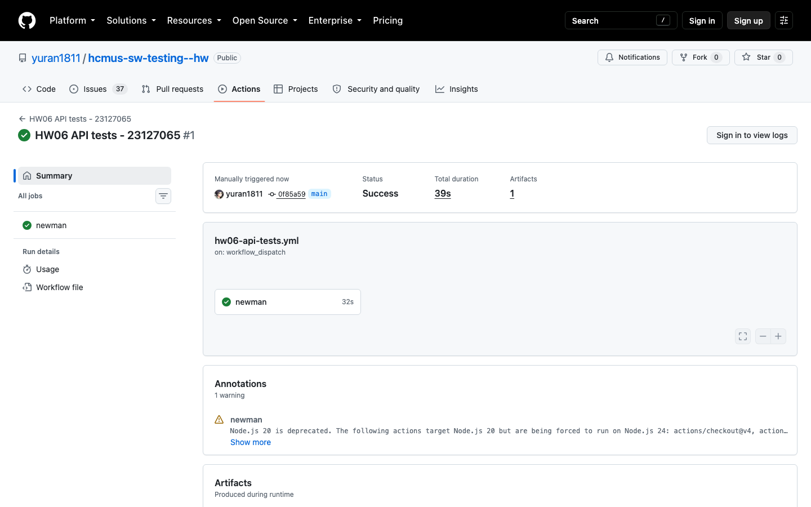
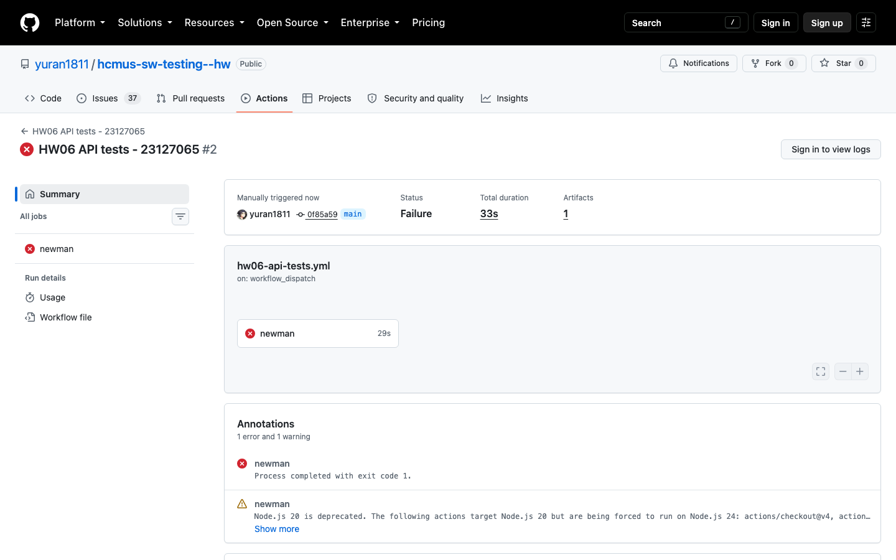

# CI/CD report

Workflow: repository root `.github/workflows/hw06-api-tests.yml`.

The manual workflow checks out this submission and the exact public SUT revision, installs Node 22 and pinned Newman dependencies, seeds SQLite, starts the backend, waits for `/api/products`, and runs Postman data through Newman. JUnit results are uploaded even when an assertion fails.

Two modes are provided:

- `pass`: runs one known-good case for each of the three API folders. Expected result: green workflow.
- `intentional-failure`: runs `CI-DEMO-FAIL-001`, which deliberately expects HTTP `418` from valid login. Expected result: red workflow with exactly one intentional assertion failure.

Local pre-publication verification on 2026-08-08 confirmed that `pass` produces three green samples (three assertions each) and `intentional-failure` exits `1` with exactly one failed assertion out of three. GitHub-hosted evidence is still required below.

## Published GitHub Actions runs

| Evidence | Commit | Run URL | Status | Screenshot |
|---|---|---|---|---|
| All-pass sample | [`0f85a59`](https://github.com/yuran1811/hcmus-sw-testing--hw/commit/0f85a591cbbe8caee92a7fbda4c6bb2a316447e1) | [#32390866536](https://github.com/yuran1811/hcmus-sw-testing--hw/actions/runs/32390866536) | Passed (Green ✅) |  |
| One-failure sample | [`0f85a59`](https://github.com/yuran1811/hcmus-sw-testing--hw/commit/0f85a591cbbe8caee92a7fbda4c6bb2a316447e1) | [#32390874323](https://github.com/yuran1811/hcmus-sw-testing--hw/actions/runs/32390874323) | Failed (Red ❌) |  |

Both runs executed on GitHub Actions runners with live SQLite seed, API backend initialization, data-driven Newman executions, and JUnit artifact uploads.
